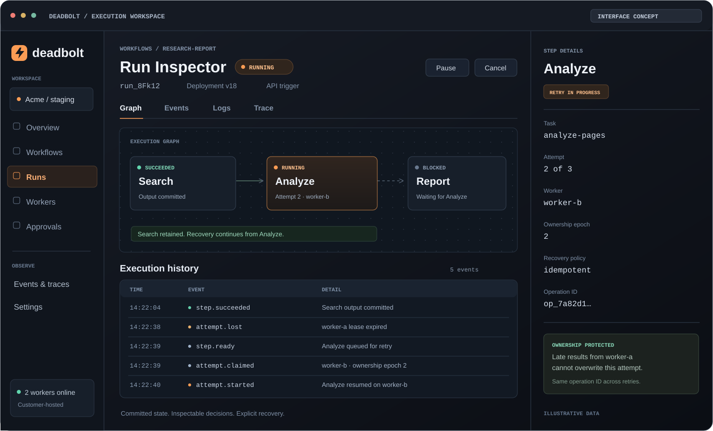
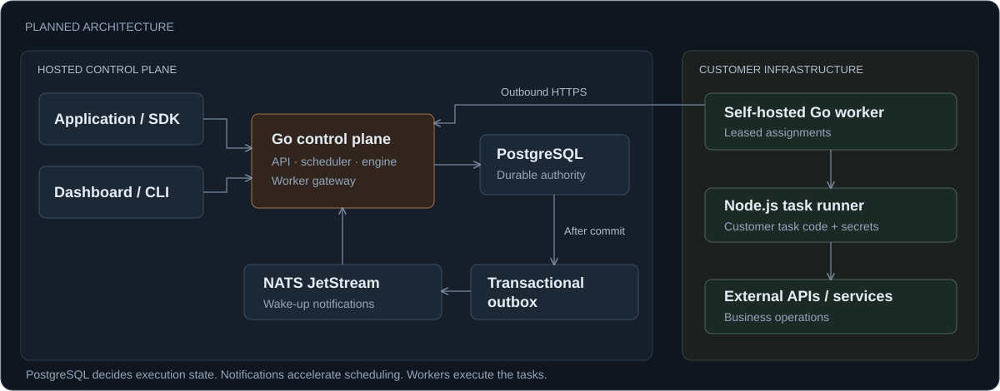
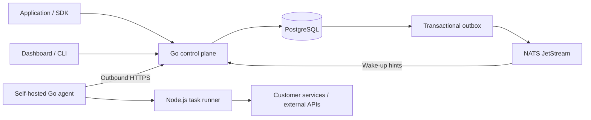

<p align="center">
  
</p>

<h1 align="center">tf-low</h1>

<p align="center">
  <strong>Durable workflows. Observable recovery.</strong><br />
  Write the business logic. Keep every step accounted for.
</p>

<p align="center">
  <a href="docs/blueprint.md"></a>
  
  
</p>

<p align="center">
  
  
  
  
  
  
  
</p>

<p align="center">
  <a href="#the-product">Overview</a> ·
  <a href="#how-it-works">Architecture</a> ·
  <a href="#developer-experience">Developer experience</a> ·
  <a href="#roadmap">Roadmap</a> ·
  <a href="docs/blueprint.md">Engineering blueprint</a> ·
  <a href="docs/developer-guide.md">Developer guide</a>
</p>

<p align="center">
  
  <br /><sub>Run Inspector — interface concept illustrating the planned recovery experience, not a running application.</sub>
</p>

> **Repository status:** the product and engineering blueprint is established; M0 contract implementation is in progress. The architecture, stack, interface concept, and SDK example below describe the intended product. There is no installable SDK, released CLI, or production service yet.

## The product

**Deadbolt is infrastructure for running multi-step workflows reliably.** Developers define tasks and their dependencies; the runtime persists progress, coordinates workers, and makes recovery visible.

It is built around a practical question: **when a workflow stops, can you explain what happened and safely decide what happens next?**

Consider a document-processing pipeline:

```text
Search sources → Analyze content → Generate report
      ✓                ↻                 ·
                 worker recovery
```

If the worker processing **Analyze** disappears, the runtime retains the committed **Search** result. Analyze is retried on a compatible worker when its recovery policy permits it; Report waits for the result. If an external side effect has an unknown outcome, the workflow can wait for reconciliation instead of retrying blindly.

The initial audience is backend and AI engineers building SaaS background workflows. Research pipelines, document processing, and human-reviewed automation are the first use cases. AI is an optional workload, not a requirement.

## What the product covers

| Capability              | Intended behavior                                                     | Scope                      |
| ----------------------- | --------------------------------------------------------------------- | -------------------------- |
| Durable progress        | Persist each completed step and continue from committed boundaries    | MVP                        |
| Worker recovery         | Detect expired leases, fence stale owners, and reassign eligible work | MVP                        |
| Explicit retry safety   | Choose `safe`, `idempotent`, or `reconcile` for every task            | MVP                        |
| Versioned execution     | Pin each run to an immutable deployment and compatible worker bundle  | MVP                        |
| Run inspection          | Inspect status, attempts, events, results, and recovery reasons       | MVP; expanded in V1        |
| Workflow composition    | Express parallel dependencies and structured conditional branches     | V1                         |
| Human and time controls | Pause/resume, approvals, delays, and durable recurring schedules      | V1                         |
| Application integration | Trigger and read runs through an API; receive signed webhooks         | API in MVP; webhooks in V1 |

Scope labels describe the delivery plan, not currently shipped features.

## How it works

Deadbolt separates orchestration from execution. The hosted **control plane** decides what can run and records what happened. **Self-hosted workers** execute customer code on customer infrastructure.



<details>
<summary>Architecture diagram source</summary>



</details>

- **Declarative workflows.** TypeScript definitions compile to a validated DAG. The engine reads persisted graph state; it does not replay arbitrary JavaScript workflow functions.
- **PostgreSQL is authoritative.** State changes, execution events, and outbox intents commit together. NATS accelerates notification; database reconciliation keeps work discoverable if notifications disappear.
- **Ownership is temporary.** A worker receives a renewable lease and an ownership epoch. Late results from an expired owner cannot overwrite a newer attempt.
- **Deployments are immutable.** A new deployment affects new runs. Existing runs retain their original manifest and bundle identity.
- **Execution stays with the customer.** Workers connect outbound over HTTPS. Task code and task secrets remain on customer infrastructure; run inputs, outputs, and execution metadata pass through the control plane.

### Reliability contract

Durability is a precise contract, not a promise that every external API call succeeds.

| Guarantee                                     | Boundary                                                     |
| --------------------------------------------- | ------------------------------------------------------------ |
| Committed successful steps are retained       | An unfinished task attempt can restart from the beginning    |
| Task execution is at-least-once               | External side effects need idempotency or reconciliation     |
| Stale ownership cannot update execution state | Fencing cannot undo an external request already sent         |
| Waiting is stored durably                     | Approval and timer waits do not keep a task process alive    |
| Cancellation stops future admitted work       | It does not automatically reverse completed business effects |

## Developer experience

The intended workflow is local-first:

1. **Define** named TypeScript tasks and a declarative workflow.
2. **Run locally** with the CLI and a Docker Compose development stack.
3. **Register** an immutable deployment manifest with the control plane.
4. **Distribute** the matching bundle to customer-managed workers, then activate the deployment.
5. **Trigger** a run from the application with an idempotency key.
6. **Inspect** progress, recovery, and results through the API and dashboard.

In this model, `runtime deploy` registers the manifest. It does not upload customer code for execution on platform servers.

<details>
<summary><strong>Preview the workflow definition</strong></summary>

The following is the planned SDK contract, not an installable package or runnable quickstart. The named tasks must be defined in the same deployment bundle.

```ts
import { defineWorkflow, input, output } from "@runtime/sdk";

export const research = defineWorkflow({
  name: "research-report",
  inputSchema: {
    type: "object",
    properties: { query: { type: "string" } },
    required: ["query"],
    additionalProperties: false,
  },
  nodes: [
    {
      id: "search",
      type: "task",
      task: "search-web",
      input: { query: input("/query") },
    },
    {
      id: "analyze",
      type: "task",
      task: "analyze-pages",
      after: ["search"],
      input: { pages: output("search", "/pages") },
    },
    {
      id: "report",
      type: "task",
      task: "generate-report",
      after: ["analyze"],
      input: { analysis: output("analyze", "/analysis") },
    },
  ],
  output: { reportUrl: output("report", "/reportUrl") },
  outputSchema: {
    type: "object",
    properties: { reportUrl: { type: "string" } },
    required: ["reportUrl"],
    additionalProperties: false,
  },
});
```

A task defines its handler, input/output schemas, timeout, retry policy, and required recovery mode. Stable operation IDs identify logical invocations across attempts.

</details>

## Technology decisions

The selected implementation stack follows the blueprint:

| Layer                     | Technology                             | Responsibility                                                  |
| ------------------------- | -------------------------------------- | --------------------------------------------------------------- |
| Control plane, agent, CLI | Go                                     | API, scheduling, ownership, worker lifecycle, developer tooling |
| Task execution            | TypeScript / Node.js                   | Customer task handlers and SDK                                  |
| Durable state             | PostgreSQL                             | Runs, steps, attempts, leases, timers, history, and outbox      |
| Notifications             | NATS JetStream                         | Internal wake-up hints with duplicate-safe consumers            |
| Dashboard                 | React, Vite, TanStack Router/Query     | Run inspection and operational controls                         |
| Interface                 | Tailwind CSS, shadcn/ui, React Flow    | Accessible UI and workflow visualization                        |
| Artifacts                 | S3-compatible object storage           | Large outputs with scoped access and integrity checks           |
| Telemetry                 | OpenTelemetry, Prometheus, Tempo, Loki | Metrics, traces, and operator diagnostics                       |
| Delivery                  | Docker Compose, GitHub Actions         | Reproducible environments and verified releases                 |

The initial control plane is a modular Go application. Redis, Kubernetes, managed cloud execution, and multi-region orchestration are outside the initial scope.

## Roadmap

Each milestone must demonstrate a working capability and pass its acceptance gate. None is marked complete by the presence of documentation alone.

| Milestone                   | Outcome                                                                   | Acceptance focus                                        |
| --------------------------- | ------------------------------------------------------------------------- | ------------------------------------------------------- |
| **M0 · Foundation**         | Contracts, repository, local stack, CI, and staging delivery              | Reproducible setup, schema/auth checks, traceable build |
| **M1 · First execution**    | SDK → API → worker → persisted result → inspector                         | Real end-to-end execution and tenant isolation          |
| **M2 · Durable MVP**        | Retry, recovery, fencing, reconciliation, timeout, and cancellation       | Kill-worker recovery without repeating committed steps  |
| **M3 · Composition**        | Parallel tasks, branching, joins, pause/resume                            | Correct dependencies and concurrent control actions     |
| **M4 · Human & time**       | Approvals, delays, recurring schedules                                    | Durable waits, unique decisions, restart-safe timers    |
| **M5 · Developer platform** | Complete CLI/onboarding, version lifecycle, webhooks, and settings        | A usable developer journey without hidden setup         |
| **M6 · V1 readiness**       | Capacity, security, observability, restore drills, and release acceptance | Evidence across the full failure matrix                 |

Testing, migrations, Docker, CI/CD, security, and observability grow with every milestone. Later expansion includes Python workers, dynamic workflow composition, and managed execution when validated requirements justify them.

## Start here

This repository contains the blueprint, collaboration guide, and M0 executable Go/TypeScript contracts. See the [clean-clone workspace setup](docs/workspace-setup.md) to build and validate the contracts. To explore the design:

```bash
git clone https://github.com/Ryanakml/Deadbolt.git
cd Deadbolt
```

Read the [Product & Engineering Blueprint](docs/blueprint.md) for the full design: execution semantics, data model, failure recovery, security, operations, and milestone gates. The blueprint uses **Runtime Cloud** as its original working name; **Deadbolt** is the repository and product identity used here. The `runtime` CLI and `@runtime/sdk` names remain the planned interfaces defined by that blueprint.

A runnable installation guide will be added alongside the actual CLI, SDK, and development stack. The dependency-ordered execution plan is tracked in [GitHub milestones](https://github.com/Ryanakml/Deadbolt/milestones) and [issues](https://github.com/Ryanakml/Deadbolt/issues). Read the [Developer Guide](docs/developer-guide.md) for the two-person execution plan, parallel-work boundaries, review workflow, and acceptance rules.

## Contributing & questions

Maintained by [Ryanakml](https://github.com/Ryanakml).

Start with the [Developer Guide](docs/developer-guide.md) before claiming implementation work.

Use [GitHub Issues](https://github.com/Ryanakml/Deadbolt/issues) for questions, reproducible design problems, and scoped proposals. Reference the relevant blueprint section or invariant. Fundamental architecture changes should update the blueprint and decision record before implementation issues depend on them.

Do not include API keys, task secrets, or private customer payloads in issues or examples.

## License

No `LICENSE` file is included yet. Licensing will be specified before a software release.
