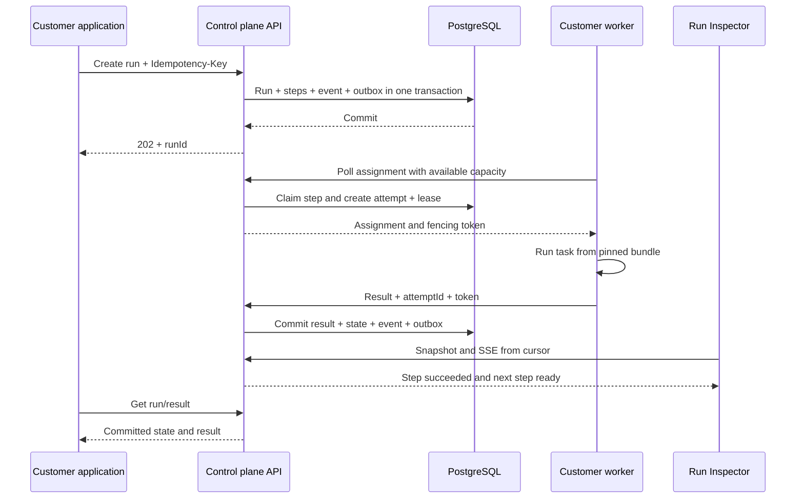
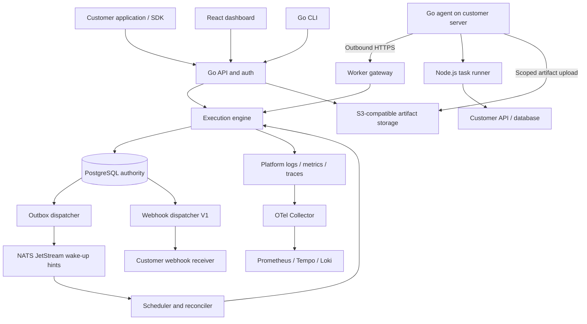
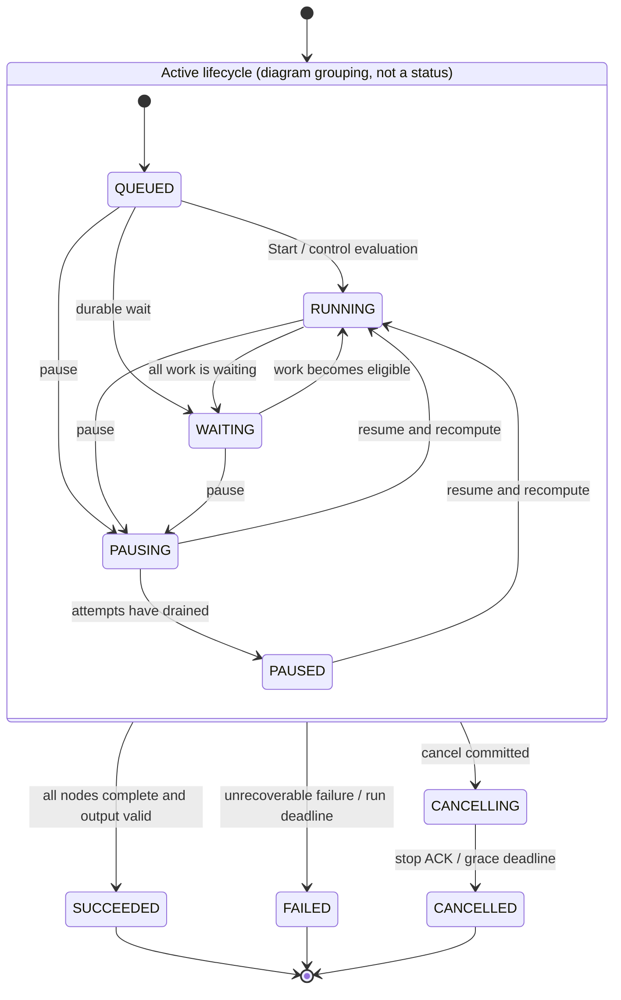
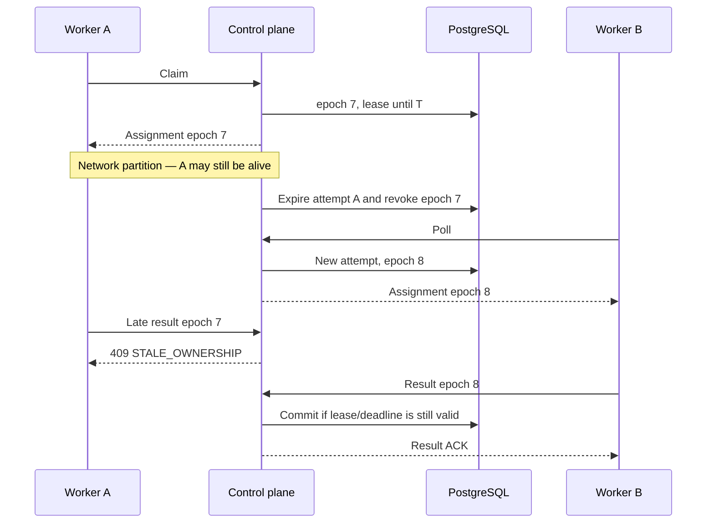
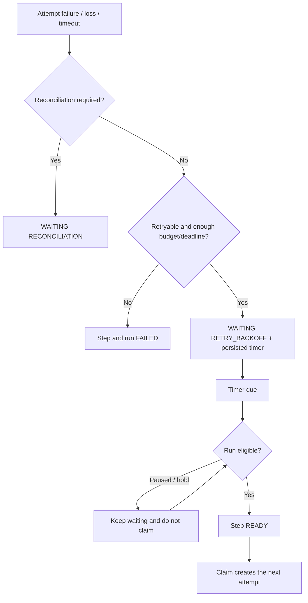
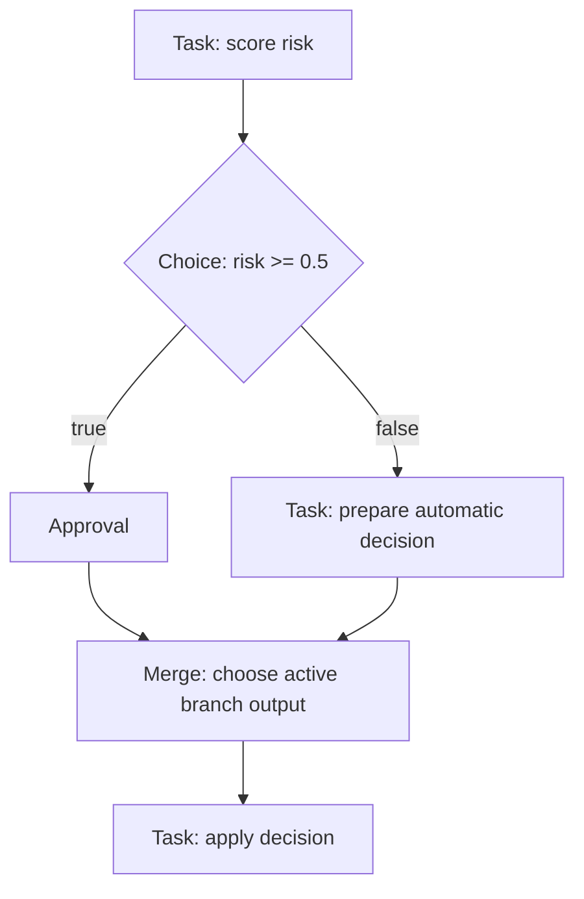
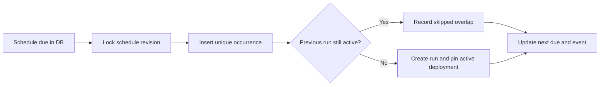
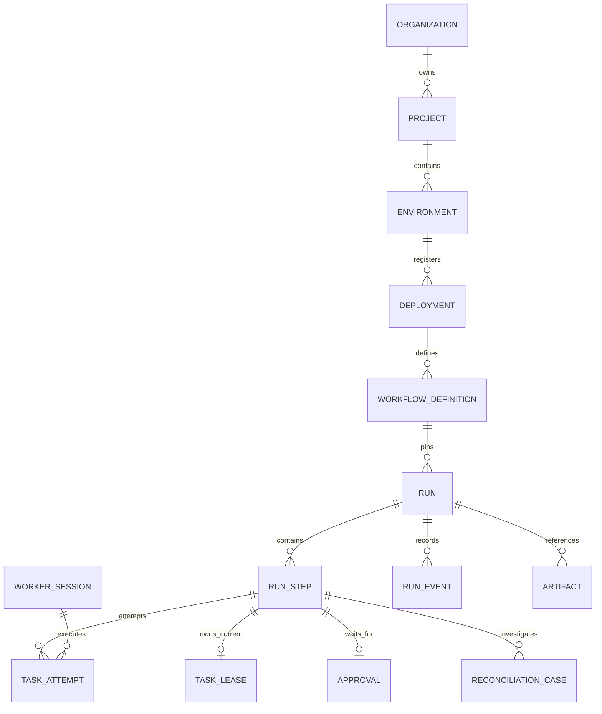
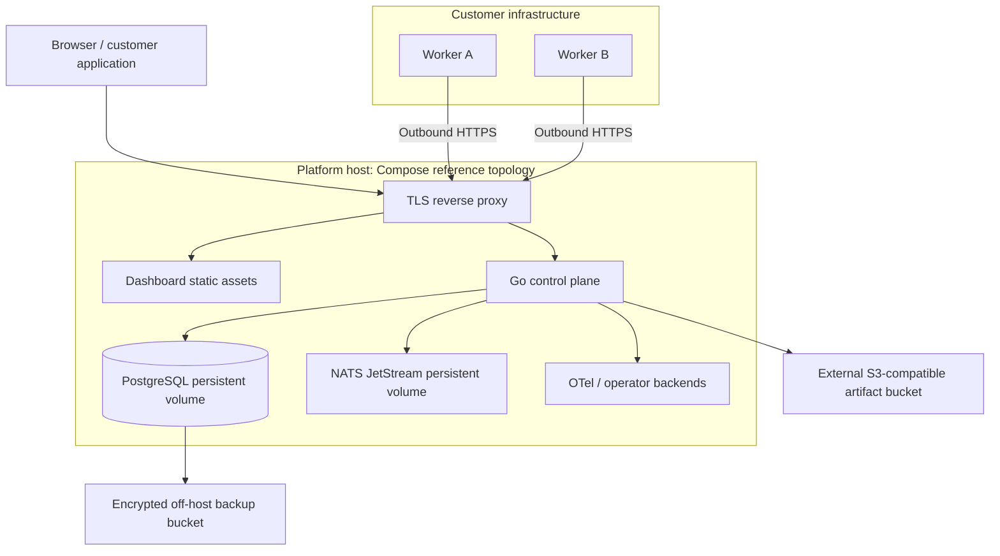
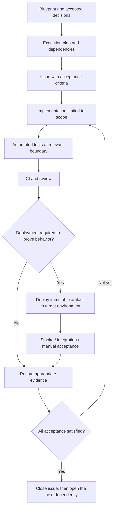

# Runtime Cloud — Product & Engineering Blueprint v1.0

> **Status:** pre-development design baseline, September 10, 2026. This document defines the product and engineering contract; it is not a claim that the system has already been built, tested, or is production-ready.
>
> **Product promise:** developers define the work and its flow. Runtime Cloud durably stores progress, coordinates workers, and recovers execution according to inspectable rules. Work already recorded as successful is not automatically repeated. External side effects still require idempotency or reconciliation.
>
> **Key decisions:** hosted control plane, customer-hosted workers, TypeScript tasks, workflows represented as declarative DAGs, PostgreSQL as the authority, and a single-region control plane for MVP/V1. Arbitrary JavaScript function replay and execution of customer code on platform servers are out of scope.

## How to use this blueprint

Read Sections 1–9 to understand the product and one complete execution. Sections 10–23 explain the runtime contract, developer platform, and user experience. Sections 24–30 explain security, operations, release scope, and build order. Sections 31–34 provide rules for deriving an execution plan, the decision register, experiments, and consistency checks.

The word **must** indicates an acceptance requirement. **Default** is built-in behavior that is still tested; configuration changes are allowed only within documented limits. **Target** is a goal that must be measured before it becomes a service promise. **Later** means it is outside MVP/V1 and must not appear as if it were already available in the SDK or onboarding.

Decisions in this document are the source of truth. The execution plan organizes the work required to implement them; it must not silently change the contract. Fundamental changes must update the blueprint, decision record, affected contracts, and tests before the implementation issue proceeds.

---

## 1. The product we are building

Runtime Cloud is developer infrastructure for **durable workflow execution**: running a sequence of work whose progress remains known even when a process dies, a request times out, a worker moves, or a workflow waits for a human decision.

Example workload:

```text
Receive research request
→ find sources
→ extract content
→ analyze
→ request approval
→ generate report
→ notify the customer application
```

Developers still write the business logic: how to find sources, call a model, or compose a report. The platform handles execution recording, scheduling, retries, timeouts, worker coordination, waiting, and failure diagnosis.

Durable does not mean every job is guaranteed to succeed. External APIs can keep failing, inputs can be invalid, and customers can cancel a run. Durable means committed decisions and progress are not lost merely because a process restarts, and the system always has an explicit next action: continue, wait, retry, fail, cancel, or request reconciliation.

We do not promise exactly-once arbitrary external side effects. We also do not provide a visual no-code builder, general-purpose application hosting, an LLM gateway, or a replacement for the entire observability stack.

### 1.1 Initial users and their main problem

The initial user is a backend/AI engineer on a small SaaS team who can already run Node.js workers but is starting to struggle with multi-step background workflows. The primary use case is **document/research processing that may require approval**, with HTTP/AI tasks that are partly safe to repeat.

Problems they experience:

- Application requests finish sooner than the background work.
- They do not know which step completed when a worker restarts.
- Retries can duplicate side effects.
- Errors are scattered across logs without a clear relationship to a specific execution.
- Approval is stored separately from the process waiting for it.
- A new deployment can accidentally change the behavior of old runs.

Platform engineering, data pipelines, billing, media processing, and agent orchestration are expansion directions. Billing is not the first demo because financial side effects require idempotency integrations and reconciliation procedures that have genuinely been proven.

### 1.2 Product value to be proven

From a single Run Inspector, a developer must be able to answer: where did this job stop, why, who is currently working on it, when will the system try again, and what action is safe to take?

V1 onboarding evaluation target: an engineer who understands TypeScript can run the local example and then connect two staging workers within 30 minutes using the documentation. Measure time-to-first-successful-run and time-to-first-recovered-run in user testing; these numbers are product targets, not results already achieved.

We do not claim superiority over other products without evaluation. The differentiation we are pursuing is an inspectable declarative model, customer-owned compute, and clear recovery diagnosis. Validation with initial users is still required before investing in cloud execution.

## 2. Promise boundaries and responsibility model

| Party             | Responsible for                                                                                                                              |
| ----------------- | -------------------------------------------------------------------------------------------------------------------------------------------- |
| Runtime Cloud     | Committed state, schedules, ownership, retry policy, history, platform tenant isolation, API, and dashboard                                  |
| Customer          | Task correctness, access to external APIs, worker capacity, required code versions, side-effect idempotency, and backups of customer systems |
| External provider | API behavior and the idempotency/retention guarantees they document                                                                          |

A task may execute more than once. Two processes may even temporarily perform the same work during a network partition. The platform only accepts results from currently valid ownership; this does not automatically cancel external requests made by an older process.

Uncommitted progress may be lost. There is no instruction-pointer recovery in the middle of a task function. If a task is safe to repeat, the next attempt starts that function from the beginning. For long-running work, the developer splits it into smaller tasks with durable outputs or manages application-level checkpointss themselves.

Inputs and outputs pass through the control plane even though code and secrets remain on customer workers. Customer-hosted execution does not mean all data stays inside the customer network. This must be visible in onboarding and data-handling documentation.

## 3. Release scope and initial decisions

| Dimension        | Foundation / MVP                                          | V1 / Flagship                                                         | Later                                              |
| ---------------- | --------------------------------------------------------- | --------------------------------------------------------------------- | -------------------------------------------------- |
| Customer compute | Two self-hosted workers                                   | Mature worker pools and lifecycle                                     | Managed cloud workers                              |
| SDK              | TypeScript, tasks, and static DAG                         | Choice/merge, approval, delay, schedules                              | Python, dynamic map, loop, child workflow          |
| Flow             | Linear task DAG                                           | Parallel and structured conditional DAG                               | Arbitrary workflow-code replay if proven necessary |
| Reliability      | Outbox, lease, fencing, retry, timeout, reconciliation    | Full control actions and operational hardening                        | Cross-zone/region HA                               |
| UI               | Runs, step/attempt/event, worker, recovery                | Onboarding, approvals, versions, schedules, failure explorer          | Advanced analytics                                 |
| Developer tools  | Local stack, register manifest, start worker, run/inspect | Complete CLI and SDK documentation                                    | Hosted builds/artifact distribution                |
| Task secrets     | Local on customer workers                                 | Remain local on customer workers                                      | Managed task secret service                        |
| Platform         | One region, Compose reference deployment                  | Hardened single-region private/public beta according to release gates | Kubernetes, Firecracker, multi-region              |

Foundation is build infrastructure. MVP means the core value has been proven end-to-end. V1 means the product and operational experience is complete for the stated scope. V1 does not automatically mean enterprise-ready or highly available.

Fundamental security is not deferred for prioritization. There is no hosted beta where tenant isolation, transport encryption, or authorization is intentionally unfinished.

## 4. Developer journey

### 4.1 Local-first

1. The developer installs compatible versions of the CLI and TypeScript SDK.
2. `runtime init` creates an example project, schema, task, workflow, and non-secret configuration.
3. `runtime dev` starts the local stack through Docker Compose and a local worker. Docker is a prerequisite checked by the CLI.
4. The developer triggers a run, opens the local inspector, then shuts down one worker to observe recovery.
5. Local development does not require a cloud account and does not send telemetry/payloads to the cloud by default.

### 4.2 Connecting to the hosted control plane

1. The developer logs in through the browser and selects an organization, project, and `staging` environment.
2. The CLI validates and builds task code locally into a bundle using a pinned Node.js toolchain and the customer's package lock; this prerequisite is checked by `runtime doctor`. The CLI exports the DAG manifest, schemas, policies, and bundle SHA-256.
3. `runtime deploy --env staging` **registers an immutable deployment manifest**; it does not upload or execute code on the platform.
4. The customer distributes the same bundle to two workers using their own deployment mechanism. Workers verify the checksum and advertise available deployments.
5. A deployment is `AVAILABLE` when at least one compatible worker is connected. Production activation requires a two-worker preflight for the recovery target; a one-worker override is allowed only in dev/staging with a clear explanation that failover is not available.
6. `runtime deployments activate <deploymentId>` moves the active pointer for new runs. Existing runs remain pinned to the previous deployment.
7. The application backend calls the create-run API using an environment-scoped API key.
8. The developer monitors the inspector. The application receives status/results through SDK polling or a webhook in V1.

The CLI distinguishes `REGISTERED`, `AVAILABLE`, and `ACTIVE`. It must not say “production ready” merely because a manifest was successfully stored. Availability is the worker's current condition; the active pointer may continue to reference a deployment with no current workers, with a clear warning.

### 4.3 Happy path and recovery experience



The browser never obtains state from a worker. The SDK, dashboard, and webhook read committed control-plane decisions. If a worker connection drops, the UI shows the attempt whose lease is still valid, then the expiry/recovery only after that decision actually occurs.

## 5. Mental model and core terms

| Term                | Meaning in Runtime Cloud                                                                                |
| ------------------- | ------------------------------------------------------------------------------------------------------- |
| Organization        | Tenant and platform ownership boundary                                                                  |
| Project             | Group of workflows and workers owned by an organization                                                 |
| Environment         | Isolation for `development`, `staging`, or `production`; keys and assignments do not cross environments |
| Task definition     | Work name, schema, policy, and entrypoint in the bundle                                                 |
| Workflow definition | Declarative DAG containing nodes, dependencies, input mapping, and output mapping                       |
| Deployment          | Immutable manifest, bundle digest, runtime/protocol version, and workflow/task definitions              |
| Run                 | One workflow execution with pinned input and deployment                                                 |
| Step                | One logical node in a run; has a stable identity                                                        |
| Attempt             | One effort to execute a task step; retry creates a new attempt                                          |
| Worker agent        | Go program on customer infrastructure that manages assignments and child processes                      |
| Task runner         | Node.js process that executes one task attempt                                                          |
| Control plane       | API and scheduling/state decision-maker; does not execute customer code                                 |
| Execution plane     | Customer workers and task runners that perform the actual work                                          |
| Checkpoint          | Boundary of a committed step result; not a snapshot of task memory                                      |
| Lease               | Temporary right of an attempt over a step, with an expiry                                               |
| Fencing token       | Ownership generation number that allows stale-owner results to be rejected                              |
| Reconciliation      | Comparing stored state with reality and resolving stale or ambiguous conditions                         |

The same task name may appear as several different nodes. `send-to-owner` and `send-to-reviewer` may call the same `send-email` task, but they have different step IDs and operation IDs.

## 6. Execution model: declarative DAG

### 6.1 Decision and rationale

Workflows in MVP/V1 are declarative data stored as validated JSON. TypeScript provides a type-checked builder, but the builder output remains a graph that Go can read without executing customer JavaScript.

A DAG is a directed acyclic graph: nodes have directed dependencies and do not form cycles. A node can run when its dependency rules are satisfied. Because the flow is stored, a restarted scheduler only needs to read the graph and step state; it does not need to resurrect an interrupted `async` function.

Trade-off: developers cannot write arbitrary `await`, loops based on runtime results, or direct I/O inside the workflow function. All real work lives in tasks. This reduces flexibility, but also reduces replay nondeterminism risk and ensures the graph shown in the dashboard matches the graph actually being executed.

Replay is a valid alternative, but it is not the architecture of this release. Temporal demonstrates recovery through history/replay; Runtime Cloud chooses a declarative graph so the SDK and engine contract does not pretend to support replay. [Replay reference](https://github.com/temporalio/documentation/blob/main/docs/encyclopedia/workflow/workflow-execution/workflow-execution.mdx).

### 6.2 SDK example that defines the design contract

The following is a target API, not yet an available package. The implementation must preserve these semantics; ergonomics may be refined through contract tests without changing the execution model.

```ts
import { defineTask, defineWorkflow, input, output } from "@runtime/sdk";

export const search = defineTask({
  name: "search-web",
  inputSchema: {
    type: "object",
    properties: { query: { type: "string" } },
    required: ["query"],
    additionalProperties: false,
  },
  outputSchema: {
    type: "object",
    properties: {
      pages: {
        type: "array",
        items: { type: "string" },
      },
    },
    required: ["pages"],
    additionalProperties: false,
  },
  recovery: "safe", // customer declares the work safe to repeat
  retry: { maxAttempts: 3, initialDelayMs: 1000, maxDelayMs: 30000 },
  timeoutMs: 60000,
  handler: async ({ query }, ctx) => {
    return { pages: await searchProvider(query, { signal: ctx.signal }) };
  },
});

export const research = defineWorkflow({
  name: "research-report",
  inputSchema: {
    type: "object",
    properties: { query: { type: "string" } },
    required: ["query"],
    additionalProperties: false,
  },
  nodes: [
    {
      id: "search",
      type: "task",
      task: search,
      input: { query: input("/query") },
    },
    {
      id: "analyze",
      type: "task",
      task: "analyze-pages",
      after: ["search"],
      input: { pages: output("search", "/pages") },
    },
    {
      id: "report",
      type: "task",
      task: "generate-report",
      after: ["analyze"],
      input: { analysis: output("analyze", "/analysis") },
    },
  ],
  output: { reportUrl: output("report", "/reportUrl") },
  outputSchema: {
    type: "object",
    properties: { reportUrl: { type: "string" } },
    required: ["reportUrl"],
    additionalProperties: false,
  },
});
```

`analyze-pages` and `generate-report` must also be defined in the same bundle; this snippet shows only one handler. The CLI rejects task references that cannot be found.

`input()` and `output()` produce reference descriptors; they do not read data at build time. The manifest format uses tagged objects (`$ref: "run.input"` or `$ref: "step.output"`, `stepId`, `pointer`) with JSON Pointer. Literal objects are distinguished through a tagged `literal` when they use a reserved key. The builder and engine must share test vectors for this encoding.

A run is created from the customer backend:

```ts
const run = await client.runs.create({
  workflow: "research-report",
  environment: "staging",
  input: { query: "automation software market" },
  idempotencyKey: requestId,
});
// HTTP 202 means accepted and persisted, not that the workflow has finished.
console.log(run.id);
```

### 6.3 Workflow-language validation and limits

- Node IDs are unique and immutable within a deployment; task names are references only, not operation identities.
- The graph must be acyclic and every node must be reachable from an entry dependency. A dependency output must point to a valid ancestor.
- Schemas use a pinned subset of JSON Schema 2020-12: object, array, string, boolean, null, integer/number, required, enum, const, oneOf for tagged unions, bounds, and additionalProperties. Schema `$ref`, custom code, and format assertions are not supported in MVP/V1; the builder inlines reusable schemas. Schema/payload nesting is limited to 32 levels and each definition schema to 64 KiB. The tagged `$ref` used by input mapping is a Runtime Cloud format distinct from JSON Schema `$ref`.
- Input/output is UTF-8 JSON. There is no `undefined`, NaN, Infinity, Date object, BigInt, or inline binary. Interoperable integers are limited to JavaScript safe integers; high-precision decimals are sent as strings.
- A missing field is different from null. Mapping must fail with `INPUT_MAPPING_ERROR` when a field is absent unless the descriptor has an explicit default.
- Runtime input must not change graph structure. Static fan-out may be generated at build time and must remain within the node-count limit.
- JSON expressions for choice support only `eq`, `neq`, `gt`, `gte`, `lt`, `lte`, `in`, `exists`, `and`, `or`, `not`; there is no eval, network access, randomness, or system time. Type-mismatched comparisons produce a validation error, not coercion.
- All schemas, timeouts, retries, recovery policies, and graphs are pinned in the deployment. Changing them creates a new deployment.
- MVP capability accepts task-only linear graphs: one root and at most one predecessor/successor per node. Parallel, choice, merge, approval, and user delay are rejected with `UNSUPPORTED_CAPABILITY` until the relevant milestone ships; their contract fields may already exist without advertising the feature as active.
- The graph must be nonempty, remain within the scoped maximum node count, and have output mappings that reference values guaranteed to exist. Every leaf must feed a result or be declared as an explicit side-effect leaf; silently orphaned branches are not allowed.

## 7. Architecture and component responsibilities



The diagram separates responsibilities, not microservice deployments. MVP/V1 runs the API, gateway, engine, scheduler, reconciler, outbox, SSE, and webhook dispatcher as modules inside **one Go control-plane binary**. Loops run separately but use the same transition-engine functions.

| Component          | Responsibility                                         | Must not                                               |
| ------------------ | ------------------------------------------------------ | ------------------------------------------------------ |
| API                | Auth, validation, idempotency, request/result contract | Change status with ad-hoc SQL outside the engine       |
| Engine             | Evaluate transitions and commit atomically             | Execute customer business code                         |
| Scheduler          | Activate due nodes/deadlines/timers                    | Store authoritative schedules in memory                |
| Reconciler         | Detect ready work, lease expiry, and stale state       | Repeat external side effects without a recovery policy |
| Gateway            | Worker session, poll, claim, heartbeat, completion     | Give workers database/broker credentials               |
| Outbox dispatcher  | Send notifications/events after commit                 | Treat publishing as proof a task finished              |
| Worker agent       | Verify bundles, run runners, send results              | Decide the next task or final success on its own       |
| Webhook dispatcher | Deliver events with retries and security policy        | Depend on customer workers to send events              |
| Dashboard          | Explain committed state and valid actions              | Infer terminal status from a lost connection           |

### 7.1 Technology stack

Go is chosen because coordination requires substantial concurrent I/O, timers, and background processes while benefiting from simple binary deployment. Goroutines help structure concurrency but do not replace transactions, leases, or fencing. Rust/C++ are not chosen for the initial core because we do not yet have requirements that justify the added complexity; TypeScript is used for developer workloads and the UI so integration feels familiar.

Go for the control plane, agent, and CLI; PostgreSQL for durable state; NATS JetStream for notification transport; TypeScript/Node.js for tasks; React + Vite + TanStack Router/Query for the dashboard; Tailwind/shadcn for UI; React Flow for graphs; S3-compatible storage for artifacts; OpenTelemetry for instrumentation; GitHub Actions and Docker Compose for initial delivery.

SQL uses `pgx` and explicit queries/sqlc; ordered SQL migrations run through a pinned Go migration tool in the repository. There is no mandatory ORM abstraction for locking/transitions. React server state lives in TanStack Query; Zustand is used only if cross-component UI state genuinely requires it.

**Redis is not required for MVP/V1.** Simple rate counters and quotas live in PostgreSQL; local caches are disposable optimizations only. **gRPC is not required:** the agent uses HTTPS JSON long polling to reduce protocol surface area. **ClickHouse, Kubernetes, Firecracker, and distributed control-plane microservices are Later.**

NATS speeds up wake-ups, but PostgreSQL polling still lets the system make progress when the broker is unavailable. This choice provides practical delivery-semantics experience without making execution correctness depend on the broker.

## 8. One run from acceptance to completion

1. The API authenticates the key, verifies environment and permissions, validates input, and resolves the active deployment exactly once.
2. In one transaction: create the run, all `run_steps` from the immutable graph, initial events, the idempotency record, and the outbox. The root task becomes `READY`; other nodes are `BLOCKED`.
3. The `202` response is sent only after commit. The run stays `QUEUED` until the first task actually starts, or until the first control node is evaluated.
4. A worker with a matching deployment and a free slot polls for an assignment. The gateway selects an eligible ready step and claims it atomically.
5. The claim creates a `CLAIMED` attempt, increments the step ownership epoch, and grants a 30-second lease. The step becomes `RUNNING`; the run becomes `RUNNING` when Start is accepted.
6. The worker sends Start before running the handler. A valid Start changes the attempt to `RUNNING` and establishes the attempt deadline.
7. The agent renews the lease with a heartbeat every 5 seconds after Start, but the lease never extends past the attempt/run deadline.
8. The handler result is validated and sent with attempt ID, ownership epoch, session identity, and result digest. Large artifacts must already be finalized.
9. The completion transaction stores the result, closes the attempt, changes the step, appends an event, and activates scheduling work. The ACK is sent after commit.
10. The scheduler evaluates dependencies through the engine. The next node becomes `READY`, `WAITING`, `SKIPPED`, or directly `SUCCEEDED` for a control node according to its type.
11. When all nodes have succeeded/skipped and the output mapping is valid, the run becomes `SUCCEEDED`. The run output and terminal event are committed together. V1 creates the webhook delivery intent in the same transaction.

If the response in step 2 or 9 is lost, the caller repeats the request with the same identity. The system returns the already-stored decision rather than creating new logical work.

## 9. Invariants: rules that must never be violated

Invariants are conditions that must always hold, including during crashes. Code, schemas, and tests use the following IDs as references.

| ID     | Invariant                                                                                                                                                          |
| ------ | ------------------------------------------------------------------------------------------------------------------------------------------------------------------ |
| INV-01 | Every resource and access has the correct tenant/project/environment scope; workers never receive another scope                                                    |
| INV-02 | A run always references an immutable deployment; a new active pointer does not alter old runs                                                                      |
| INV-03 | At most one current ownership lease exists for a task step; an older physical process may still remain alive                                                       |
| INV-04 | Start, heartbeat, result, and artifact association are accepted only from valid ownership/session, except an identical duplicate result that was already committed |
| INV-05 | A `SUCCEEDED` step is never executed again within the same run                                                                                                     |
| INV-06 | Related state transitions, execution events, and outbox intents are committed atomically                                                                           |
| INV-07 | One logical invocation has a stable operation ID across attempts, unique from every other invocation                                                               |
| INV-08 | A node must not start before dependencies, run control, quota, and deployment compatibility are satisfied                                                          |
| INV-09 | Terminal run/step/attempt state is never reopened; rerun creates a new run                                                                                         |
| INV-10 | An approval has only one committed decision; a timer/schedule occurrence produces only one logical action                                                          |
| INV-11 | Losing a broker notification never causes committed runnable work to be forgotten permanently                                                                      |
| INV-12 | Logs/traces may be delayed or lost according to policy; execution history and state correctness do not depend on them                                              |
| INV-13 | Ambiguous results are not automatically repeated when the recovery policy requires reconciliation                                                                  |
| INV-14 | No run is admitted without validation, quota admission, durable input, and an idempotency contract                                                                 |

## 10. State machine and state-transition rules

### 10.1 Canonical statuses

Statuses are contract enums; the UI may translate their labels but must not invent new statuses. `reason_code` explains cause without multiplying statuses, for example `NO_COMPATIBLE_WORKER`, `RETRY_BACKOFF`, `APPROVAL`, `RECONCILIATION`, or `QUOTA_WAIT`.

| Entity   | Nonterminal statuses                                              | Terminal statuses                                       |
| -------- | ----------------------------------------------------------------- | ------------------------------------------------------- |
| Run      | `QUEUED`, `RUNNING`, `WAITING`, `PAUSING`, `PAUSED`, `CANCELLING` | `SUCCEEDED`, `FAILED`, `CANCELLED`                      |
| Step     | `BLOCKED`, `READY`, `RUNNING`, `WAITING`                          | `SUCCEEDED`, `FAILED`, `CANCELLED`, `SKIPPED`           |
| Attempt  | `CLAIMED`, `RUNNING`                                              | `SUCCEEDED`, `FAILED`, `TIMED_OUT`, `LOST`, `CANCELLED` |
| Approval | `PENDING`                                                         | `APPROVED`, `REJECTED`, `EXPIRED`, `CANCELLED`          |
| Timer    | `PENDING`                                                         | `FIRED`, `CANCELLED`                                    |

`READY` means a task step is eligible based on dependencies; it does not mean a worker is available. `CLAIMED` belongs only to an attempt, while its step is already `RUNNING` because ownership has been allocated. `SUCCEEDED` means the result is committed, not merely that the handler returned a value.

### 10.2 Run state and priority



The active-lifecycle box only groups nonterminal states; `Active` is not an API enum. Outgoing arrows apply from states inside it when their guards are satisfied. The diagram summarizes lifecycle behavior; the rules table below defines race behavior. Resume recomputes state, so the actual result may be `QUEUED` if the run has never started, `WAITING` if only durable waits remain, or immediately `SUCCEEDED` if the final control decision is already complete. The `PAUSED → RUNNING` arrow means leaving pause, not that a live process must exist.

State-resolution priority inside the engine:

1. A terminal state that has already been committed never changes.
2. A committed cancel request keeps the run `CANCELLING` until cancellation settlement; a later failure/deadline does not replace it.
3. An unrecoverable failure/run deadline makes the run `FAILED` and revokes all remaining ownership.
4. All nodes completed as success/skipped + valid output makes the run `SUCCEEDED`, including while pause is draining.
5. Pause requested: `PAUSING` while active attempts remain, then `PAUSED`.
6. Active attempt/ready work exists: `RUNNING`, except a run that has never started remains `QUEUED` until its first Start/control evaluation.
7. Otherwise `WAITING`, with the stored durable-wait reason.

If a reconciliation hold exists, ready work must not be claimed. The run stays `RUNNING` while sibling attempts drain, then becomes `WAITING/RECONCILIATION`; hold details are always shown. A run is never considered successful merely because the number of active tasks reaches zero.

### 10.3 Core transition table

| Trigger               | Preconditions                                                                  | Atomic commit                                                      | Duplicate/race behavior                                                |
| --------------------- | ------------------------------------------------------------------------------ | ------------------------------------------------------------------ | ---------------------------------------------------------------------- |
| Claim                 | Step `READY`, run eligible, capacity available, worker compatible              | Step `RUNNING`, attempt `CLAIMED`, epoch +1, lease, event          | Another claim fails/no work; no second attempt is created              |
| Start                 | Current ownership, before claim + 5 seconds and lease expiry; not cancelled    | Attempt `RUNNING`, started/deadline, event                         | Identical Start returns current state; stale Start is rejected         |
| Success               | Current ownership, deadline not passed, output valid                           | Attempt/step `SUCCEEDED`, output reference, event/outbox           | Identical request returns previous ACK; different digest returns `409` |
| Task error            | Current ownership                                                              | Attempt `FAILED`; step waits for retry or becomes terminal failure | Stale error cannot overwrite success                                   |
| Lease expired         | DB time is past expiry                                                         | Attempt `LOST`, ownership revoked; retry/reconcile/failure         | One transition wins through locking; stale heartbeat is rejected       |
| Attempt deadline      | Deadline is due                                                                | Attempt `TIMED_OUT`, ownership revoked; retry/reconcile/failure    | Late result is rejected even if handler finished                       |
| Retry due             | Step `WAITING/RETRY_BACKOFF`, budget available, run not paused/held/cancelling | Timer `FIRED`, step `READY`, event                                 | Does not create an attempt; attempts are created only on claim         |
| Dependency satisfied  | Node `BLOCKED`, guard and mapping valid                                        | `READY` for task, or control transition                            | Re-running scheduler does not duplicate node/action                    |
| Approval decision     | Pending, not expired/cancelled                                                 | Decision + audit + activation intent                               | Same decision is idempotent; conflicting decision returns `409`        |
| Manual reconciliation | Current hold and matching expected revision                                    | Resolution record and new step/action                              | Different revision returns `409`; refresh before acting                |

Competing decisions are serialized using a run row lock followed by step/attempt locks. “Who wins” means the valid transaction that commits first, not the timestamp observed by the browser or worker. Even if a result arrives before the janitor runs, completion still checks expiry/deadline against DB time.

### 10.4 Failure propagation

The default workflow behavior is **fail-fast**: when a step cannot be recovered, the engine marks the step `FAILED`, the run `FAILED`, cancels all nonterminal sibling/dependent steps, revokes leases, and sends stop commands. Terminal-success siblings remain stored.

A `FAILED` run means the platform will accept no further workflow work; it does not prove every customer process has stopped. The Inspector shows stop acknowledgement or “termination unconfirmed.” Partial-success handling and automatic compensation are Later. A customer may explicitly create a separate compensation workflow; there is no automatic rollback of side effects.

## 11. Persistence, transactions, and checkpoints

### 11.1 What is authoritative

PostgreSQL stores materialized execution state **and** append-only execution events. The engine reads state tables for scheduling. Event history explains decisions and serves as audit evidence; MVP/V1 does not promise full database reconstruction from the event stream alone.

Every meaningful decision writes state + event + outbox in the same transaction. Therefore, a crash cannot produce a “successful” state with missing history or missing scheduling events. Execution events differ from diagnostic logs: correctness events are never sampled.

A product checkpoint is the output of a step that has already been committed. A successful step can be reused downstream without executing that task again. A checkpoint does not store sockets, stacks, or runner-local variables.

### 11.2 Concurrency strategy

The default PostgreSQL isolation level is `READ COMMITTED` with explicit row locks, conditional updates, and unique constraints. This is chosen so ownership rules remain inspectable without requiring the entire database to use serializable transactions.

Required lock order: environment admission row when needed → schedule row for occurrence operations → run → steps in ID order → attempts/leases/approval/timer/reconciliation rows in ID order. Approval decisions and timer firing enter the engine through run/step first rather than holding an approval/timer lock and then requesting a run lock. Claims count indexed live leases under the environment admission lock to enforce concurrency quota; there is no mutable active counter that completion must decrement. Completion only needs run → step → attempt/lease. No path acquires the environment lock after locking a run.

The initial candidate scan reads candidates without granting ownership. Claim then acquires the environment lock, run lock, and step lock and rechecks state. `FOR UPDATE SKIP LOCKED` may be used when selecting run/step rows in that order so other work does not wait on a candidate already being locked; it may also be used for outbox/timer batches that do not involve a run. A timer handler releases its batch reservation before the engine acquires the run lock, then revalidates the timer under that run lock. This technique is appropriate for queue-like access, not general-purpose consistent reads. [PostgreSQL SELECT locking](https://www.postgresql.org/docs/current/sql-select.html).

**Optimistic concurrency** is used for user actions: the client sends `expectedRevision`, the version of the resource it last observed. If the resource changed, the API returns `409 REVISION_CONFLICT`. This prevents a user from approving or resolving a hold from a stale screen. Revisions do not replace DB locks inside the engine.

No transaction waits for an HTTP provider, NATS publish, S3 upload, or task process. Deadlock/serialization retries are limited to idempotent internal DB operations, with metrics and logging; they never rerun a task handler.

### 11.3 Crashes around commit

| Crash point                                      | State after restart                                                                                  |
| ------------------------------------------------ | ---------------------------------------------------------------------------------------------------- |
| Before create-run transaction commit             | Run does not exist; a retried request may create it                                                  |
| After commit before HTTP response                | Idempotency record returns the same run                                                              |
| After claim commit before assignment is received | Attempt eventually becomes `LOST`; recovery follows policy and does not assume the handler never ran |
| After external success before completion commit  | External outcome may be ambiguous; use idempotency or reconciliation                                 |
| After completion commit before ACK               | Identical repeated result receives the same ACK; step is not rerun                                   |
| After step success before downstream scheduling  | Reconciler reevaluates `BLOCKED` nodes from persisted state                                          |

## 12. Worker protocol and execution lifecycle

### 12.1 Connection and registration

Workers open only outbound HTTPS connections to the control plane. There is no public inbound port on the worker, direct PostgreSQL access, or customer NATS subscription.

An enrollment token is created by an authorized member for one environment/pool, stored hashed, single-use, and valid for 10 minutes. The agent generates a local key pair; enrollment binds the public key to the worker identity. The bootstrap API verifies the token and a proof-of-possession signature using a single-use challenge nonce.

A session token is valid for 15 minutes and bound to worker ID, environment, and session ID; renewal uses the worker signing key plus a server nonce and checks DB revocation. The private key is stored with file mode `0600`. Reconnecting creates a new session; for simplicity, leases from the old session are revoked and processed as loss according to recovery policy. The agent stops old runners before requesting new assignments. Worker revocation stops renewal/polling and cancels current leases; results authenticated by the old session are not accepted.

TLS is mandatory outside loopback development. No worker is trusted merely because it sends a `worker_id`.

### 12.2 Protocol surface

Every request carries `protocolVersion`, a request ID, size limits, and authenticated scope. Public URLs live under `/worker/v1/...`, separate from the customer API but using the same engine boundary.

| Operation      | Core payload/response                                                                                                           |
| -------------- | ------------------------------------------------------------------------------------------------------------------------------- |
| Enroll/session | Enrollment proof or signed challenge; session identity and expiry                                                               |
| Poll           | Available slots, deployment digests, pool; long poll up to 20 seconds                                                           |
| Assignment     | Run/step/attempt ID, task entrypoint, resolved input, deployment digest, operation ID, epoch, lease TTL/deadline, trace context |
| Start          | Attempt ID, epoch; ACK before the handler executes                                                                              |
| Heartbeat      | Attempt IDs/epochs and limited progress metadata; renewal results + stop instructions                                           |
| Complete       | Outcome, inline output/artifact ID, digest, error envelope, epoch                                                               |
| Stop ACK       | Attempt ID, whether the child process stopped; not cancellation of external side effects                                        |
| Log batch      | Attempt ID, sequence, redacted records; bounded/best effort                                                                     |

Worker polling claims only as many assignments as there are available slots, with default concurrency 2 per agent. The gateway verifies quota and available deployment digests; a worker cannot request an arbitrary step outside an assignment. A self-hosted worker is trusted for the result of work within its own environment, but it is still not trusted to cross tenants or replace ownership.

### 12.3 Running a Node.js task

One attempt uses one Node.js child process. The agent sends input through a bounded stdin protocol; the runner writes the result through a dedicated structured channel, while stdout/stderr are logs. Arbitrary stdout must never be parsed as completion.

An immutable bundle contains the task registry, pinned dependencies, and entrypoint. The agent verifies SHA-256 before loading it. A deployment targets a specific OS/architecture; only compatible workers may claim it. A mixed-architecture pool does not guarantee every worker can recover every deployment. MVP supports Linux amd64/arm64 through the official worker image; local Compose on macOS uses Linux containers. Native dependencies must be built for the worker architecture; the CLI rejects a manifest-architecture mismatch.

Tasks receive `ctx.operationId`, `ctx.attemptId`, `ctx.signal`, `ctx.log`, and a scoped artifact client. Handlers receive secrets only from the allowlisted worker environment variables declared in the manifest. There is no fallback that sends the agent's entire environment into the child process.

Cancellation/timeout sends an abort signal, then SIGTERM, then SIGKILL to the process group after a 10-second grace period. The agent bounds log buffers and runner count. Host/container memory and CPU limits are the responsibility of the customer's worker deployment; process-per-attempt is not a security sandbox for hostile code. Running one customer's code on another customer's platform host is forbidden in MVP/V1.

### 12.4 Shutdown and drain

Drain rejects new assignments and lets active attempts finish until the configured deployment grace limit, default 60 seconds. After that the agent stops runners; the control plane applies recovery policy. Updating a worker does not move a run to another deployment.

The UI distinguishes worker states `ONLINE`, `DRAINING`, `OFFLINE`, and `REVOKED`. Worker liveness comes from session heartbeat; task ownership still comes from task leases. An online worker does not prove a task is healthy, so timeout continues to apply even if the agent heartbeat is healthy.

## 13. Leases, fencing, and worker recovery

### 13.1 Temporary right to work on a task

A lease is temporary permission to report the result of an attempt. Claim stores `attempt_id`, `worker_session_id`, `ownership_epoch`, and `expires_at`. Default TTL is 30 seconds with a 5-second heartbeat. Start may only be accepted by the server within 5 seconds of claim. The agent does not execute the handler without that ACK; if the Start response is ambiguous, the agent retries the identical Start to read the stored decision while the identity is still valid, then still checks remaining lease time before launch. A committed Start does not alter the deadline on a retried request. If Start has not occurred by the deadline, the attempt is recovered through lease expiry; the lease is not renewed without Start.

The control plane uses DB time for deadline decisions. Ownership is valid strictly before `expires_at`: at `DB_now >= expires_at` or the deadline, new Start/renew/result calls are rejected. Worker time or an old transaction-start timestamp is never used to extend rights; current DB time is read after the lock is acquired. The agent uses monotonic elapsed time from the renewal ACK and calculates a conservative TTL minus round-trip time and a 2-second margin. If renewal cannot happen before that safe boundary, the agent stops the runner. This helps but is not the sole defense because a process can hang.

### 13.2 Why fencing is required



The epoch is a fencing token: a number that increases whenever ownership changes. Every mutation from a worker validates the current epoch, session, lease, deadline, and run control. Worker A must not be able to renew its lease or overwrite Worker B's result.

Fencing only protects resources that check the token. An external API that does not understand the epoch can still accept a request from Worker A. Fencing and idempotency therefore solve different problems, and both are required.

### 13.3 Recovery rules

The reconciler checks expired leases every 1 second in bounded batches. Lease loss closes the attempt as `LOST`, frees the slot, appends history, and then follows the task recovery policy:

- `safe`: may retry within budget because the customer declares repetition safe.
- `idempotent`: may retry with the same operation ID; the customer must connect it to external deduplication whose validity covers the recovery window.
- `reconcile`: do not immediately retry when the outcome may be ambiguous; create a hold for a human/application decision.

There is no silent default: `recovery` is required on every task definition. SDK lint warns when `safe` is used for obvious side-effect examples, but the platform does not claim it can prove a handler is actually safe.

## 14. Idempotency, ambiguous outcomes, and manual reconciliation

### 14.1 Operation identity

Idempotency means repeating the same request does not create a new logical effect. For tasks, the operation ID is derived from environment/run ID and node ID, then hashed into an opaque stable ID. Attempt number is not part of the operation ID.

Example: node `charge-primary` in run X has a different key from node `charge-secondary`, even if both use task `charge-customer`. A retry of `charge-primary` keeps the same key. A rerun creates a new run and a new key, so the UI must explain the possibility of repeating a side effect.

For `recovery="idempotent"`, the task definition must include `idempotencyWindowMs`, a conservative lower bound on provider deduplication guarantees declared by the developer. The engine stores `idempotency_valid_until` as first claim time + window, so an assignment that may have been received is included. The validator rejects a window shorter than claim-to-start budget + attempt timeout. Do not dispatch a new attempt when current time + claim-to-start budget + attempt timeout could exceed that window; create a reconciliation hold instead. The window is never extended by retry, deployment, or restore. The platform cannot prove that the provider honors this declaration; integration evidence and provider documentation are the integrator's responsibility.

If one task performs several side effects, the developer derives deterministic subkeys such as `operationId + ":reserve"` and `operationId + ":notify"`, or splits the work into separate tasks. Never reuse one key for different requests.

### 14.2 Idempotency API

Create-run must include `Idempotency-Key`, scoped by `(environment_id, operation_type, key)`. The transaction stores the request hash, selected deployment, run ID, and response identity. Same key + same payload returns the same run even if the active deployment changed. Same key + different payload returns `409 IDEMPOTENCY_CONFLICT`.

The request hash covers workflow, an explicit deployment selector when present, and canonical JSON input; transport headers are excluded. A unique constraint protects concurrent requests. The active deployment is resolved only on the first create. Canonicalization uses JCS RFC 8785, followed by SHA-256 over UTF-8 bytes; manifest hashes and result digests use the same rules. The parser rejects duplicate property names, invalid Unicode, and nonfinite numbers before hashing; it does not perform Unicode normalization. Shared Go/TS fixtures cover key ordering, numbers, null, and Unicode so implementations do not merely rely on default JSON serializers. [JSON Canonicalization Scheme](https://www.rfc-editor.org/rfc/rfc8785).

Deduplication records are retained at least while the run is active and for 30 days after it becomes terminal; after that, the key may expire and an old replay may create a new run. This expiry must be documented. Callers that require longer business-level deduplication must persist their own business operation identity. Idempotency is not an unlimited-time guarantee.

### 14.3 When the provider succeeds but the ACK is lost

If the provider supports idempotency that satisfies our window, a new attempt sends the same operation key and retrieves the same outcome according to the provider contract. If the provider does not support it, a blind retry may duplicate the effect.

For `reconcile`, loss/timeout/unknown error produces a `WAITING` step with `reason_code=RECONCILIATION`, not an automatic `FAILED`. The run has a hold that blocks new claims; siblings already running may finish. The UI shows “Outcome unknown,” an external reference when available, and the hold reason.

A member with `runs:reconcile` permission chooses one of these actions after checking the provider:

1. **Confirm succeeded:** submit a schema-valid result plus an evidence reference. The attempt remains `LOST`/`TIMED_OUT` according to reality; the step becomes `SUCCEEDED` with `completion_source=RECONCILIATION` and the audit actor.
2. **Confirm not executed, retry:** create a retry intent if budget remains. The operation ID stays the same. The actor declares that the effect did not occur; the system records the reason and evidence.
3. **Fail run:** stop the workflow with a visible reason.

There is no hidden “retry anyway” that bypasses the budget. If the budget is exhausted, the options are fail/cancel and then explicitly create a new run. When several steps require reconciliation, the hold is released only after all of them are resolved. The run deadline still applies while held.

A definitive task error may declare `effect_status=NOT_APPLIED` with a contract-defined error code, allowing retries according to policy. Unclassified errors are treated as `UNKNOWN` in `reconcile` mode. Runtime trusts the customer handler's report within that customer's scope; this is not independent evidence from the provider.

## 15. Retry, timeout, pause, and cancellation

### 15.1 Retry policy

Default task policy: `maxAttempts=3` including the first attempt, exponential backoff `min(30s, 1s * 2^(attempt-1))`, with full jitter between 0 and that value. The due timestamp is chosen once and persisted; restart does not randomize it again.

Retry requires a retryable error/safe recovery policy, remaining budget, a run that is not terminal/cancelling, and enough remaining deadline. `Retry-After` may increase the delay up to the policy cap; the parser and cap must be tested. Invalid input/output, missing task, incompatible bundle, authorization errors, and mapping/schema failures are non-retryable. A missing worker does not create an attempt and therefore does not consume retry budget.



The guard arrow is not a busy loop; the scheduler checks periodic batches and wakes from events. A paused retry keeps its original due timestamp. After resume, work that is already due may become ready without repeating the full delay.

### 15.2 Different deadlines

| Deadline           | Default/limit                                                    | Behavior                                                                             |
| ------------------ | ---------------------------------------------------------------- | ------------------------------------------------------------------------------------ |
| Claim-to-start     | 5 seconds                                                        | An assignment that has not started loses its lease; no extension without Start       |
| Lease TTL          | 30 seconds, heartbeat every 5 seconds                            | Ownership expires; recovery policy applies                                           |
| Attempt execution  | Default 5 minutes, maximum 1 hour                                | `TIMED_OUT`, ownership revoked, best-effort stop                                     |
| Run lifetime       | MVP default/maximum 24 hours; V1 default 7 days, maximum 30 days | Includes all waiting/queued/running time; run becomes `FAILED/RUN_DEADLINE_EXCEEDED` |
| Cancellation grace | 10 seconds                                                       | Run becomes `CANCELLED` after all stop ACKs or when grace expires                    |
| Approval wait V1   | Default 24 hours; maximum remaining run lifetime                 | Expired approval fails the run                                                       |

Queue delay is measured separately from attempt execution. The run deadline starts when create-run is accepted. There is no additional per-step queue timeout in MVP/V1; the UI shows queue age and the no-worker reason, while the run deadline remains the final boundary. Pause does not freeze the deadline.

### 15.3 Pause/resume

Pause atomically blocks new claims. Tasks already claimed/running may start/finish; this is the definition of “in-flight work.” The run stays `PAUSING` until all attempts drain, then becomes `PAUSED`. Due retries, timers, or approvals may be recorded while paused, but they do not start new nodes.

If all remaining work finishes while pausing, the run immediately becomes `SUCCEEDED`; it does not wait for resume without a reason. If the final attempt fails definitively, the run becomes `FAILED`. Resume clears the pause flag and recomputes eligibility from durable state.

### 15.4 Cancel and races with completion

A cancel commit revokes all leases, marks nonterminal steps/attempts `CANCELLED`, cancels pending approvals/timers, and makes the run `CANCELLING`. Tasks already succeeded remain succeeded. Stop commands have separate records for waiting on ACK or a grace timer; they do not preserve old ownership.

A completion that commits before cancel is preserved. If the run is already terminal, cancel returns `409 RUN_TERMINAL` with the current state. If cancel commits first, subsequent worker results are rejected. After stop ACK or the 10-second grace period, the run becomes `CANCELLED`, with `termination_confirmed` potentially false.

Cancelled does not mean external effects were rolled back. UI and API wording must never imply that money movements, emails, or external requests were automatically undone.

## 16. Workflow composition and human approval

### 16.1 Sequence and parallel join

A task with several `after` dependencies uses an all-success rule: every dependency must be `SUCCEEDED`. If any one is `SKIPPED`, the node is also `SKIPPED`. If a dependency fails, fail-fast run behavior applies. A node with no dependency is an entry node.

Parallel tasks start when capacity allows; “parallel” is not a promise that they begin in the same nanosecond. Downstream output comes from committed dependency outputs, not worker memory.

### 16.2 Structured choice and merge in V1

A conditional branch uses a `choice` node that evaluates a declarative expression over run input/ancestor outputs. Choice stores one selected branch and becomes `SUCCEEDED`. Every node in an unselected branch becomes `SKIPPED`.



`merge` names the choice ID and terminal node for each branch. It waits for the selected branch's terminal node to succeed; unselected-branch nodes must be skipped. This differs from a task all-success join, so a skipped branch does not leave merge waiting forever.

Merge output is a tagged union `{ branch, value }` with an explicit schema. A reference to an output from a branch that may be skipped cannot be used directly outside that branch; it must pass through merge. Branches must be structured, non-overlapping, and meet at the declared merge; the validator rejects cross-branch dependencies and unsupported irreducible graphs. Nested choices are allowed up to depth 8 in V1, with the same test vectors in CLI and API.

### 16.3 Approval is a control node, not a worker task

When dependencies are satisfied, an approval node creates a `PENDING` record containing payload, decision schema, required permission, and expiry. The step becomes `WAITING/APPROVAL`; no runner or lease is kept alive.

Approve/reject are **business outcomes**, not technical errors. Either decision makes the approval terminal and the step `SUCCEEDED` with `{ decision: "approved" | "rejected", actorId, decidedAt, comment }`. The workflow uses a subsequent choice to decide what happens next. Reject does not automatically mean the run failed.

Expiry produces step/run `FAILED/APPROVAL_EXPIRED` in V1. Cancel makes the approval `CANCELLED`. Approve/reject after expiry or cancellation is rejected even if the expiry sweeper has not run yet; the API compares DB time.

Only a role with `approvals:decide` may decide. V1 has no public approval links, anonymous actions, or task workers allowed to approve. Two concurrent decisions are resolved using a row lock; repeating the same decision is idempotent, while an opposing decision returns `409`.

### 16.4 What is not supported yet

Dynamic fan-out based on task output, unbounded agent loops, nested child workflows, general durable signals, automatic compensation, and arbitrary-code replay are Later. Developers may run a loop inside one task, but durability exists only at that task boundary; retry reruns the task and the deadline still applies. This limitation must appear in documentation for AI-agent use cases.

## 17. Durable timers and recurring schedules

A durable timer is a DB record containing an action, due time, and state. A restarted scheduler reads the same record, so waiting 24 hours does not require a process to remain alive for 24 hours.

MVP uses timers for retries, deadlines, lease-expiry scheduling, and cancellation settlement. V1 adds delay nodes and recurring schedules. A delay node stores an absolute `due_at` when it first becomes eligible; restart/pause does not restart the duration from zero.

Recurring schedules use 5-field cron, an explicit IANA timezone (default UTC), and a schedule revision. The default overlap policy is **skip if previous scheduled run still nonterminal**; there is no automatic backlog accumulation. Misfire policy is **coalesce one**: after downtime, create at most one run for the latest missed occurrence, store the number of skipped occurrences, then calculate the next future occurrence.



The scheduler acquires the environment admission lock, then the schedule lock before create-run. Occurrence ID is unique on `(schedule_id, revision, scheduled_at_utc)`, and create-run occurs in the same transaction that advances the schedule. Duplicate schedulers do not duplicate runs. If quota is full, the occurrence is recorded as `SKIPPED_QUOTA` with an alert; the platform does not create a hidden backlog. A schedule pointing to a workflow without an active deployment is marked error and paused until fixed.

For DST, a wall time that never occurs is skipped; a wall time that occurs twice uses only the first UTC occurrence. The cron/timezone library must be tested against DST fixtures. By default, a schedule uses the active deployment when an occurrence is created; an explicitly pinned deployment is also available. Editing a schedule creates a new revision and affects only future occurrences, not existing runs.

## 18. Data model and data lifecycle

### 18.1 Entities and constraints

Every tenant-owned table carries `organization_id`; project/environment resources also carry that scope through composite foreign keys. Hard-to-guess random IDs are not a substitute for authorization.

| Table                                      | Important data and constraints                                                                                          |
| ------------------------------------------ | ----------------------------------------------------------------------------------------------------------------------- |
| `users`, `oidc_identities`                 | Human identities; unique issuer + subject; email is not treated as a permanent identifier                               |
| `organizations`, `organization_members`    | Tenant and roles; at least one active owner; removing the last owner is rejected                                        |
| `projects`, `environments`                 | Unique name within parent; environment is the assignment/auth boundary                                                  |
| `api_keys`                                 | Prefix, hashed secret, scope, permissions, expiry, revoked_at; plaintext shown only once at creation                    |
| `deployments`                              | Manifest JSON, canonical hash, bundle digest, schema/protocol/runtime version; immutable per environment                |
| `workflow_definitions`, `task_definitions` | Unique `(deployment_id, name)`; graph, schemas, policies, entrypoints                                                   |
| `workflow_channels`                        | `(environment_id, workflow_name)` → active deployment; revision for activation concurrency                              |
| `runs`                                     | Pinned deployment/workflow, input/output, status, revision, deadline, pause/hold flags, terminal reason, event sequence |
| `run_steps`                                | Unique `(run_id, node_id)`; kind, state, wait reason, output, current epoch, next attempt number                        |
| `task_attempts`                            | Unique `(step_id, attempt_number)`; immutable ownership identity, outcome/error, start/deadline, result digest          |
| `task_leases`                              | One current row per step; attempt, session, epoch, expiry; historical ownership remains in attempts/events              |
| `workers`, `worker_sessions`               | Environment/pool, public key, revocation, session expiry, last seen, capabilities                                       |
| `worker_deployments`                       | Session + available deployment digest; cannot claim another version                                                     |
| `run_events`                               | Unique `(run_id, sequence)`; event type/version, bounded payload, committed_at                                          |
| `timers`                                   | Kind, reference, due_at, state; unique logical action identity                                                          |
| `approvals`                                | Unique step ID; payload, permission, decision, actor, expiry                                                            |
| `reconciliation_cases`                     | Step/attempt, unknown outcome, evidence, resolution, actor, revision                                                    |
| `stop_commands`                            | Attempt, reason, deadline, ack, termination confirmation; ownership already revoked                                     |
| `schedules`, `schedule_occurrences`        | Definition/revision, due_at, overlap reference; unique occurrence key                                                   |
| `idempotency_records`                      | Scoped key hash, request hash, response identity, expiry                                                                |
| `outbox_events`                            | Unique event/action ID, payload version, publish attempts, next_at, published_at                                        |
| `webhook_endpoints`, `webhook_deliveries`  | Environment destination/revision, encrypted signing secret, immutable event body, attempts, next_at, outcome            |
| `artifacts`                                | Owner scope/run/step, object key, size, SHA-256, state, expiry                                                          |
| `audit_events`                             | Actor, action, target, reason, correlation ID; redacted append-only record                                              |
| `usage_records`                            | Unique source event + meter type; execution/storage measurements, not V1 invoices                                       |

Minimum indexes include runs on `(environment_id, status, created_at)`, eligible ready steps, expired leases, pending timers by due_at, unpublished outbox records by next_at, and run events by sequence. Indexes and partial uniqueness for live attempt/lease are migration acceptance requirements, not merely application comments.



The diagram shows core relationships, not the full auth/ops ERD. Deployment stores the workflow version; there is no second version table that could drift in meaning. Task definitions are versioned through the same deployment, so a run never silently picks up the newest task version.

### 18.2 Payloads and artifacts

The inline JSON limit is 256 KiB after UTF-8 serialization for each run or step input/output. Larger payloads must use typed artifact references instead of automatically sending hundreds-of-megabytes files into JSONB. The initial artifact maximum is 100 MiB; task bundles are still distributed by the customer and are not part of this artifact upload path.

Artifact lifecycle: `PENDING_UPLOAD → READY → DELETING → DELETED`, or `PENDING_UPLOAD → EXPIRED`. The API generates a random storage key; the worker receives a 5-minute presigned PUT for one specific object. After upload, finalize verifies object size/checksum before allowing a result to reference it. Workers receive no list-bucket credentials.

S3 upload is not inside a DB transaction. If upload succeeds but completion fails, the object becomes an orphan and is GC'd after a 24-hour grace period when unreferenced. An artifact referenced by an active run is not removed by retention. A missing/corrupt referenced artifact blocks the consumer and produces an integrity error; runtime does not silently rerun an already-successful producer.

Download uses an authenticated API that creates a short-lived signed GET. The viewer does not receive bucket paths or access to another environment. Treat artifacts as untrusted: attachment download, safe content type, and no inline HTML execution on the dashboard origin.

### 18.3 Retention

By default, run input/output/history and related artifacts are retained while the run is active + 30 days after terminal state. Diagnostic task logs and traces are retained 7 days; security audit records 90 days; raw usage records 90 days. These are initial product limits and must be visible in the UI rather than silently changed by a maintenance job. There is no configurable retention tier in MVP/V1.

The idempotency tombstone follows the minimum window described in Section 14. Deleting payload details must not remove dedup identity before expiry. Deployment/bundle references are retained while an active run exists; the platform cannot guarantee the customer still retains the bundle file, so worker-availability checks and no-compatible-worker alerts remain necessary.

Project deletion through an owner action: revoke keys/workers, stop admission/schedules, cancel or wait for active runs according to an explicit choice, then asynchronously purge data within at most 7 days. Encrypted backups expire according to a 30-day backup retention period; restored backups must reapply the deletion ledger before customer access is enabled. We do not promise immediate removal from every backup.

## 19. Messaging, outbox, and automatic reconciliation

### 19.1 Why the outbox is required

A DB write and NATS publish are not one atomic operation. If the API stores a ready step and dies before publishing, the task may be stranded if the system only waits for a message. Therefore, the transaction stores an **outbox intent** together with state; the dispatcher reads it later.

The dispatcher claims batches with short locks and retry due times. Publishing uses a stable `event_id`; it waits for the broker publish ACK before marking the event published. A crash after publish but before marking may send the same event twice. Notification handlers must be idempotent.

The NATS stream is internal only, with versioned subjects such as `runtime.v1.wakeup.<shard>`. Payloads contain IDs and routing hints, not secrets or complete outputs. Queue messages do not grant the right to execute a task; only a PostgreSQL claim transaction grants ownership.

A control-plane consumer ACKs after the hint is used to trigger a DB scan; if it crashes before scan/ACK, redelivery or polling still discovers the work. ACKing a message does not mark a task complete. Redelivery is normal JetStream behavior and must be tested. [NATS delivery semantics](https://github.com/nats-io/nats.docs/blob/master/nats-concepts/jetstream/consumers.md).

### 19.2 Reconciler as a safety net

Every 1 second, a bounded/indexed scan finds due timers and expired leases. Every 5 seconds, a sweep finds `READY` work without progress, unevaluated dependencies, outbox retries, and terminal runs whose webhook intents need verification. Every corrective transition goes through the engine and uses a unique identity; there is no SQL bypass.

If NATS loses all data, PostgreSQL can still drive work; old published outbox entries do not need a complete replay for runs to progress. Reconstructing the broker means restoring stream/consumer configuration and generating hints from pending DB state. Losing telemetry messages does not change run state.

If the DB is unavailable, the API accepts no new runs and the gateway does not grant/renew ownership. Agents stop conservatively before their local lease budget expires. When the DB returns, the engine reads the last committed state and processes expiry. There is no “keep running from memory” mode that claims durability.

### 19.3 Fairness and backpressure

Task FIFO within an environment is ordered by eligible_at then ID, with round-robin across environments that have eligible work. Claim locks the environment admission row and ensures live lease count does not exceed the cap. Worker-pool and task-concurrency limits are calculated at the same boundary. The gateway does not hand thousands of assignments to a worker that has only two slots.

The API returns `429` + `Retry-After` when admission quota is full; a run that has already been accepted is not dropped. Ready tasks may wait for quota with reason `QUOTA_WAIT`. Outbox/log/upload backlogs have queue-size limits and alerts; diagnostic logs may drop with a counter, but execution events must not drop.

There is no claim of strict global ordering across runs. Execution event ordering is guaranteed only within each run through a sequence allocated under the run row lock.

## 20. Public API, SDK, and compatibility

### 20.1 API contract

OpenAPI is the HTTP contract; the JSON Schema manifest is the workflow contract; the worker protocol has a separate schema. Generated SDK transport may be used, wrapped with an ergonomic TypeScript layer. Golden fixtures ensure Go/TS agree on validation, mapping, errors, hashing, and event payloads.

| Endpoint                                     | Purpose and rules                                          |
| -------------------------------------------- | ---------------------------------------------------------- |
| `POST /v1/workflows/{name}/runs`             | Create, requires idempotency key, `202` after commit       |
| `GET /v1/runs/{id}`                          | Snapshot, revision, lastEventSequence, result/error/reason |
| `GET /v1/runs/{id}/events`                   | Cursor pagination over immutable events                    |
| `GET /v1/runs/{id}/stream`                   | SSE after cursor; scoped roles only                        |
| `POST /v1/runs/{id}/pause`                   | Pause request + expectedRevision                           |
| `POST /v1/runs/{id}/resume`                  | Resume from paused/pausing, recompute                      |
| `POST /v1/runs/{id}/cancel`                  | Durable cancellation request                               |
| `POST /v1/runs/{id}/rerun`                   | New run, explicit input/deployment, new idempotency key    |
| `POST /v1/reconciliation-cases/{id}/resolve` | Authorized decision + evidence + revision                  |
| `POST /v1/approvals/{id}/decision`           | V1 approve/reject with revision                            |
| `POST /v1/deployments`                       | Register manifest; same digest is idempotent               |
| `POST /v1/workflows/{name}/activate`         | Set active deployment with revision/preflight              |
| `GET /v1/workflows`, `/runs`, `/workers`     | Scope filters, cursor pagination                           |
| `/v1/schedules`, `/v1/webhook-endpoints`     | V1 CRUD with audit and scoped permissions                  |
| `/v1/artifacts`                              | Create upload, finalize, scoped download                   |

The public API treats key scope as authoritative. An environment parameter must match the key; mismatch is rejected rather than creating a new scope. Dashboard users choose an environment from already-verified membership.

Error envelope: `{ code, message, requestId, details, retryable }`. `details` contains no secrets, internal stack traces, or other-tenant data. `400` malformed, `401` unauthenticated, `403` permission, `404` resource not visible/not found, `409` state/revision/idempotency conflict, `413` size, `422` schema/graph invalid, `429` limit, `503` dependency/admission unavailable.

Mutation success `200/201/202` follows each OpenAPI definition; clients do not infer success from an empty body. An identical duplicate command returns the same outcome/state while its command identity is retained; a conflicting command still checks current state.

### 20.2 Compatibility and version lifecycle

A deployment contains `manifestVersion=1`, SDK version, protocol major, Node runtime major, target architecture, dependency-lock digest, bundle digest, and secret-name requirements. The API rejects unsupported majors; workers advertise exact capabilities. Builds use a supported Node LTS pinned at M0, not the `latest` tag.

The server supports the current and previous tested SDK/agent minor versions within the same major. This is a policy that compatibility CI must prove, not an assumption that all minors are compatible. Breaking changes require a new major or an explicit migration plan. Event payloads have schema versions and clients ignore unknown additive fields.

Old runs always use the old manifest and bundle digest. Deployment activation/rollback affects only new runs. Customers must keep workers with the old bundle available until active runs finish; the UI rejects deletion of a registration still referenced by active runs and warns when an active deployment loses compatible workers.

Manual rerun uses the same deployment as the original run by default; choosing active/new deployment must be explicit. There is no “resume failed run” that mutates terminal history. V1 rerun executes the workflow from the beginning; partial restart/reuse of outputs across runs is Later.

## 21. Webhooks and result delivery

V1 provides webhooks for `run.succeeded`, `run.failed`, `run.cancelled`, and `approval.requested`. Execution events use a consistent lower-case namespace (`run.created`, `step.ready`, `attempt.started`, `attempt.lost`, `step.succeeded`, and so on); state enums remain uppercase.

The terminal transaction creates a delivery intent containing a stable event ID, environment, run ID, payload version, committed timestamp, and result summary. Large/sensitive results are not sent in full by default; the receiver uses the scoped API to retrieve details.

The dispatcher has its own DB delivery queue and does not require customer workers or the DAG runtime to send notifications. This reuses the outbox/retry pattern; it is not a recursive workflow that could deadlock when all customer workers are offline.

Delivery is at-least-once, with no global ordering. Receivers deduplicate by event ID. The signature is HMAC-SHA256 over `timestamp + "." + raw_body` with a key ID; receivers reject timestamps older than 5 minutes and compare signatures in constant time. Every retry signs a new timestamp with the same event ID/body. Rotation supports old/new verification keys during a 24-hour overlap.

Connect timeout is 3 seconds and total timeout 10 seconds; HTTP 2xx means delivered, while 429/5xx/network timeout retries with exponential jitter up to 1 hour; maximum 12 attempts or 24 hours, whichever comes first. 410 disables the endpoint; 3xx is not followed; other 4xx responses are terminal failed. Delivery failure never reverses a successful run.

Every delivery intent pins an endpoint revision. Changing URL/signing configuration does not silently move pending payloads to a new destination: a URL change cancels unsent deliveries for the old revision, after which an operator may explicitly redeliver to the new revision. Disable/revoke stops future dispatch; a request already sent cannot be recalled. Key rotation through the overlap policy is not treated as moving the destination.

Endpoints must be public HTTPS on port 443. Validate DNS and resolved IP on every delivery, block private/link-local/loopback/metadata/reserved IPv4/IPv6 ranges, and connect using the validated IP while preserving the original TLS hostname to resist DNS rebinding. An egress firewall adds another layer of defense; private endpoints are Later. This follows standard SSRF mitigation for user-controlled outbound URLs. [OWASP SSRF prevention](https://cheatsheetseries.owasp.org/cheatsheets/Server_Side_Request_Forgery_Prevention_Cheat_Sheet.html).

The UI provides delivery history, a redacted response snippet, next retry, and authorized manual redelivery. Redelivery preserves the event ID but creates a new delivery attempt. A receiver may accept a request and then time out; that state remains unknown/retryable, not proof that the receiver did not receive it.

## 22. CLI, build, and local development

### 22.1 Commands and consistent meaning

| Command                            | Behavior                                                                                                |
| ---------------------------------- | ------------------------------------------------------------------------------------------------------- |
| `runtime init`                     | Scaffold task/workflow/config and example tests                                                         |
| `runtime dev`                      | Start isolated local Compose stack + local worker + UI; show dependency failures with remediation steps |
| `runtime login`                    | Browser authorization code + PKCE with loopback callback; token in OS keychain                          |
| `runtime build`                    | Compile/bundle locally, validate manifest, produce digest                                               |
| `runtime deploy --env ...`         | Register manifest; does not execute code on the platform                                                |
| `runtime deployments activate ...` | Preflight + move active pointer                                                                         |
| `runtime worker enroll`            | Enroll in one environment/pool                                                                          |
| `runtime worker start`             | Load explicit bundle paths, connect, run tasks                                                          |
| `runtime worker drain`             | Stop receiving assignments, drain running work                                                          |
| `runtime runs create/list/inspect` | Trigger/read real API; create accepts an idempotency key                                                |
| `runtime logs --run ...`           | Read scoped retained logs, show gaps/expiry                                                             |
| `runtime doctor`                   | Check Docker, compatibility, connectivity, bundle, and missing secret names without printing values     |

There is no `runtime secrets set` in MVP/V1 because the platform does not store task secrets. Customers use a secret manager or environment file on their worker infrastructure; example `.env.example` files contain placeholder names only and secret files must be gitignored.

### 22.2 Reproducible local environment

The core Compose profile contains the control plane, dashboard, PostgreSQL, NATS, an S3-compatible development store, and two example workers. The telemetry profile adds OTel Collector, Prometheus, Tempo, and Loki. The fault-test profile adds local network-fault facilities; there is no public “kill any worker” endpoint.

The default stack binds to loopback. Dev auth is available only when `RUNTIME_MODE=local`, loopback-bound, with a prominent banner; hosted-mode startup rejects dev auth. Integration CI uses a fixture OIDC provider so the auth boundary is still tested. Production never uses local credentials.

File watch creates a new deployment for new runs; it does not replace the bundle underneath an active attempt. Dev workers retain old bundles until old runs become terminal or the user cancels them. Stack restart preserves named volumes; destructive reset requires an explicit command that displays its scope.

### 22.3 Target repository

```text
runtime-cloud/
├── apps/dashboard/
├── apps/docs/
├── cmd/control-plane/
├── cmd/worker/
├── cmd/runtime/
├── internal/auth/
├── internal/execution/
├── internal/scheduling/
├── internal/gateway/
├── internal/outbox/
├── internal/webhooks/
├── internal/storage/
├── internal/telemetry/
├── sdk/typescript/
├── runner/node/
├── contracts/openapi/
├── contracts/manifest/
├── contracts/worker/
├── contracts/fixtures/
├── migrations/
├── tests/integration/
├── tests/fault/
├── tests/e2e/
├── deploy/compose/
├── docs/decisions/
├── docs/runbooks/
└── .github/workflows/
```

Directories are code boundaries, not a list of microservices. Python SDK and Kubernetes directories are not created as empty skeletons merely to imply progress.

## 23. Dashboard as a control room

### 23.1 Information architecture and user tasks

| Area             | User question                                         | Primary action                                        |
| ---------------- | ----------------------------------------------------- | ----------------------------------------------------- |
| Overview         | Is the system healthy? Is any work stuck?             | Open the failure/queue/reconciliation list            |
| Workflows        | Which version is active and which workers support it? | View graph/versions, activate according to permission |
| Runs             | What is the status of a specific request?             | Filter, inspect, pause/resume/cancel/rerun            |
| Run Inspector    | Where did it stop and what is safe to do?             | Inspect attempts, evidence, next retry, hold          |
| Workers          | Is there capacity and a matching bundle?              | Enroll, inspect, drain/revoke according to permission |
| Approvals V1     | Which decisions are waiting?                          | Approve/reject after reviewing context                |
| Schedules V1     | When is the next run and were any occurrences missed? | Edit/pause schedule, inspect occurrences              |
| Observability V1 | Which failures keep recurring?                        | Filter by error class, deployment, worker, time       |
| Usage & Settings | What are the quotas, retention, members, and keys?    | Manage access/limits and integrations                 |

### 23.2 Run Inspector

The header shows run ID, workflow, pinned deployment, environment, state, reason, deadline, and freshness. The graph shows logical steps; retry attempts do not create new graph nodes. The step inspector has Summary, Attempts, Events, Logs, Input, Output, and Trace tabs when available.

A recovery state must be readable like this:

```text
Analyze — RUNNING
Attempt 1: LOST — lease expired, Worker A did not renew
Attempt 2: RUNNING — Worker B, same operation ID
Search: SUCCEEDED — not executed again
```

For an unknown side effect:

```text
Run is waiting for reconciliation
The provider may already have received the operation.
Check the external reference, then confirm succeeded / confirm not executed / fail.
```

CTAs appear only when the state and permission allow the action. The backend remains authoritative; if a user acts on an old revision, the dialog shows the latest state and the conflict reason. Mutation errors stay inside the relevant dialog rather than disappearing into a generic toast.

### 23.3 Trustworthy live updates

The API returns a consistent snapshot + `lastEventSequence` in one read-only `REPEATABLE READ` transaction, or in one SQL statement that retrieves both. This is a read-snapshot exception to the default `READ COMMITTED` write isolation; two separate read-committed queries are not enough to guarantee that snapshot and cursor match. SSE uses `Last-Event-ID`/cursor and reads persisted events with a sequence greater than that value. The client deduplicates by sequence, not timestamp, then invalidates the relevant query.

Reconnect uses exponential backoff; the UI shows “Reconnecting, last data at …”. A cursor that is too old or crosses a retention gap produces `RESYNC_REQUIRED`; the client fetches a new snapshot. The snapshot–subscribe race cannot lose an event because the server catches up from the DB. Cross-run lists use refetch/invalidation rather than depending on one global sequence.

An SSE disconnect must never change a run to failed. A “recovered” toast appears only after the recovery execution event is committed.

### 23.4 Empty/error/permission states

- No workflows yet: show init/build/register steps, not a fake graph.
- No compatible worker: show the expected deployment digest, last compatible worker, queue age, and relevant command.
- Rate/quota limited: show the limit and next action; do not imply data was lost.
- Payload/log expired: show the retention boundary; distinguish expired from an empty result.
- Artifact corrupt/unavailable: show an integrity error and request ID; do not silently provide a broken download.
- Permission denied: explain the required permission without exposing another resource's payload.
- Approval expired/cancelled: disable the decision action and show the final reason.
- Cancellation unconfirmed: explain that the platform has stopped accepting results but the external process may not have stopped yet.

### 23.5 Accessibility and UI scale

Desktop is the primary Inspector layout, but tablet and mobile still provide list/detail/actions; the graph may be replaced with an accessible node list. Keyboard navigation, dialog focus management, accessible names, reduced motion, and status indicators that do not rely on color alone are mandatory. Target WCAG 2.2 AA for core flows, verified through automated checks plus manual keyboard/screen-reader sampling.

The graph supports up to the V1 limit of 200 nodes with minimap/collapse and a list fallback. Logs/events use cursor pagination/virtualization. Acceptance covers light/dark mode, slow networks, disconnected streams, concurrent actions, and sensitive payloads hidden according to permission.

## 24. Authentication, authorization, and tenant isolation

### 24.1 Human identity

Hosted deployment uses one managed OIDC provider with authorization code + PKCE. We do not build our own password database, password reset, or MFA. The production provider is selected during M0 setup based on standards-compliant OIDC, MFA, availability, and cost; the integration boundary remains issuer/subject/JWKS rather than vendor SDK calls scattered throughout the engine domain.

The dashboard uses a Go BFF session with an `__Host-runtime_session` cookie: HttpOnly, Secure, SameSite=Lax, 12-hour idle expiry and 7-day absolute expiry. PKCE state/nonce is verified; the session ID rotates after login/privilege change; logout/revocation is enforced in the DB. Cookie-based mutations require a CSRF token and Origin validation. CORS is restricted to an origin allowlist.

The CLI uses a public OIDC client with browser + loopback redirect and PKCE; any long-lived refresh token is stored only in the OS keychain. Headless CI uses a time-limited environment API key rather than copying a browser cookie.

### 24.2 Roles and capabilities

| Role      | Read status/history | Read payload/log | Run/control                       | Reconcile/approve | Deploy/activate               | Member/key/worker admin             |
| --------- | ------------------- | ---------------- | --------------------------------- | ----------------- | ----------------------------- | ----------------------------------- |
| Viewer    | Yes                 | No by default    | No                                | No                | No                            | No                                  |
| Developer | Yes                 | Yes              | Create, pause/resume/cancel/rerun | No                | Register, activate staging    | No                                  |
| Operator  | Yes                 | Yes              | Yes                               | Yes               | Activate including production | Drain worker                        |
| Admin     | Yes                 | Yes              | Yes                               | Yes               | Yes                           | Yes, except removing the last owner |
| Owner     | Yes                 | Yes              | Yes                               | Yes               | Yes                           | Yes, including org deletion         |

Organization role is the default; environment-level resource policy may narrow permissions but never expand them across tenants. An API key has explicit capabilities and belongs to one environment; it does not permanently inherit the creator's full role. Approval/reconciliation machine keys are not available in V1; those decisions require an identifiable human actor. The audit record stores the role/capability in effect when the action was accepted.

Task payloads often contain sensitive business data. Viewers see status, sanitized errors, and metadata; reading input/output/log/artifact requires `payload:read`. A machine key for create/status may be issued without permission to read all logs.

### 24.3 Database enforcement

Tenant tables use PostgreSQL RLS with `FORCE ROW LEVEL SECURITY`; the runtime role is not the owner and does not have BYPASSRLS. After identity is verified, every transaction uses `SET LOCAL` tenant context. Missing context must fail closed. Composite foreign keys prevent a resource owned by organization A from referencing a project/environment belonging to B.

RLS protects the organization boundary; environment/project capabilities are still checked in the service layer and scoped queries. Integration tests must attempt bypasses through API calls, foreign-ID substitution, worker messages, artifact links, SSE reconnect, and background jobs.

Identity bootstrap/membership discovery uses narrowly scoped functions with a verified user identity input; function privilege/search_path is locked down and the result contains only that user's memberships. The scheduler uses a dedicated system identity to enumerate tenant IDs through a limited function, then processes each tenant in a per-tenant transaction through RLS. There is no generic “query arbitrary tenant data” endpoint or bypass role shared with workers.

The database migrator uses separate credentials from runtime. Connection pooling must always use transaction-local context so tenant context never leaks when a connection is reused.

### 24.4 Secrets and platform hardening

Task secrets remain on customer workers. The platform stores only its own credentials and webhook signing secrets. The hosted platform uses a cloud secret manager and envelope encryption with KMS for encrypted application secrets; key ID/version is stored for rotation. Local mode uses an explicit development key in a gitignored secret file, and hosted startup rejects it.

API keys use at least 256 bits of random entropy; store a prefix for display and a cryptographic hash for verification. Default key expiry is 90 days, rotation/revoke is available, and last-used timestamp never stores plaintext. Rate limits apply per key, user, and environment; brute-force login protection is shared between the identity provider and platform edge limits.

Logs never record Authorization headers, cookies, enrollment/session tokens, signed URLs, or secret values. The structured logger provides a redaction-field allowlist. Redaction cannot guarantee detection of every arbitrary secret a customer prints; documentation tells customers not to print secrets and provides local redaction hooks. Payload preview requires explicit permission and truncation.

All dependencies/images are pinned; vulnerability and secret scans run in CI. A critical exploitable finding blocks release unless an exception has a reason, owner, and expiry. Platform containers run non-root, use a read-only filesystem when possible, minimize capabilities, and never mount the Docker socket into the control plane.

## 25. Observability: state evidence and diagnostic data

Execution history answers “what decision did the runtime make?”; telemetry answers “why was it slow or why did it error?”. They have different reliability and retention guarantees.

### 25.1 Instrumentation

Every API/worker operation has a request ID; run/step/attempt/event IDs are included as correlation fields. Trace propagation uses W3C Trace Context. The task runner receives trace context and an SDK logger; provider calls may become child spans.

No single span stays open for 30 days. A run has a stable correlation ID; task attempts, scheduler operations, and waits create bounded spans with links across traces where needed. Trace sampling does not remove execution events. High-cardinality run IDs belong in logs/traces, not Prometheus labels.

OpenTelemetry Collector receives, processes, and exports telemetry; it is not a trace database that automatically becomes queryable. The reference deployment uses Prometheus for metrics, Tempo for traces, Loki for platform logs, and Grafana for operators. Bounded task diagnostic logs are stored through an ingestion API in PostgreSQL for MVP so the Run Inspector has a real query path; migrate the log backend only if volume requires it. [OTel Collector role](https://opentelemetry.io/docs/collector/).

### 25.2 Minimum metrics and alerts

| Signal                               | Meaning                                         | Action                                                    |
| ------------------------------------ | ----------------------------------------------- | --------------------------------------------------------- |
| Ready age / dispatch latency         | Accepted work is not quickly getting a worker   | Check compatible worker, quota, scheduler                 |
| Expired lease / reassignment latency | Recovery loop is delayed or worker is unhealthy | Check DB health and reconciler                            |
| Outbox age / failure rate            | Notification is stuck                           | Check NATS/dispatcher; verify DB polling still progresses |
| Reconciliation hold age              | A side effect remains unconfirmed               | Operator/customer reviews evidence                        |
| DB errors/latency/disk               | Execution authority is at risk                  | Stop admission if necessary; follow DB runbook            |
| Scheduler loop lag                   | Timers/deadlines are late                       | Check locks, query plan, worker goroutine                 |
| No compatible worker                 | Pinned run has no executor                      | Deploy the old/new bundle required by the run             |
| Webhook exhausted                    | Customer has not received terminal event        | Check endpoint, redeliver                                 |
| Dropped logs / telemetry backlog     | Diagnosis may be incomplete                     | Fix ingestion without changing run state                  |

Default staging alerts: ready age >60 seconds when a compatible idle worker exists; outbox age >60 seconds; no compatible worker with pending work >5 minutes; reconciliation hold >1 hour; backup/restore validation failure immediately. Production thresholds are tuned from the load gate and stored as an audited configuration change.

`/livez` proves only that the process is alive. `/readyz` checks schema compatibility, DB read/write readiness, and scheduler freshness required for admission; degraded NATS/telemetry is reported separately because DB fallback remains valid. Public health endpoints do not expose credentials/topology; authenticated operator endpoints provide detail.

## 26. Deployment, delivery, and migrations

### 26.1 Initial topology



Local development uses an S3-compatible local store; hosted staging uses an external bucket so artifacts and backups are not on the same disk as the database. Two workers on one host are sufficient for a process-crash demo but not a host-failure test. The fault gate for host resilience uses workers in two failure domains; the single-host control plane remains an explicitly documented single point of failure.

Postgres/NATS expose no public ports. The reverse proxy handles TLS plus request size/time limits. Persistent volumes, disk alerts, and backup credentials are required from the first deployment that stores real data.

### 26.2 CI and promotion

Every PR runs formatting/lint/typecheck, relevant unit/contract tests, real-dependency integration tests when that domain changes, migration validation, image build, and security checks. Build artifacts carry the commit SHA and immutable digest. Environments do not rebuild source into a different image without provenance.

Merging to main builds a candidate once, then auto-deploys staging through a workflow serialized per environment. Production promotion uses the same staging digest after gates pass and release-owner approval according to repository policy. Manual SSH builds are not a normal release path.

Deployment sequence: validate config → backup readiness check → compatible migrations → start candidate → readiness gate → switch traffic → smoke-test real API/worker → verify `/version` exact commit/image digest → record evidence. If a gate fails, stop promotion and roll binary/config back to the previous known-good digest when schema remains compatible.

### 26.3 Migration policy

Migrations are additive using an expand–migrate–contract pattern. Release N adds schema without breaking N-1; backfills are bounded/idempotent; contract/drop occurs only after the old binary/worker no longer needs the field and the rollback window has closed.

A single migrator uses an advisory lock; app runtime has no DDL permission. CI tests upgrades from an empty database and from the previous release schema with an active-run fixture. Upgrades must not replace old enums/history without explicit mapping.

Deployment rollback **does not mean database rollback**. There are no automatic destructive down migrations. If the schema is incompatible with an old binary, use a forward fix or restore through an incident procedure; the decision must be written in the release plan before deploy.

### 26.4 Graceful platform restart

The control plane stops accepting new admission, finishes short DB transactions, and closes long polls/SSE so clients reconnect. Task lease renewal may be interrupted; the deployment target should keep downtime below the lease safety window or accept recovery according to policy. We do not promise zero retries during single-instance rollout.

Runs waiting on approvals/timers do not require process migration: the data remains in the DB. Agent reconnect follows the session-fencing policy; idempotency/reconciliation handles unknown outcomes.

## 27. Reliability targets, capacity, and operations

### 27.1 Initial admission limits

The following numbers are **initial default product limits** intended to control cost and failure-domain size. Load spikes may justify changes, but any change must update documentation, configuration, and tests before release.

| Limit                                    | MVP                   | V1                    |
| ---------------------------------------- | --------------------- | --------------------- |
| Nodes per workflow                       | 50                    | 200                   |
| Running/claimed attempts per environment | 10                    | 50                    |
| Nonterminal runs per environment         | 100                   | 1,000                 |
| Create-run rate per environment          | 5/second, burst 10    | 20/second, burst 40   |
| Worker sessions per environment          | 10                    | 50                    |
| Inline JSON input/output                 | 256 KiB               | 256 KiB               |
| Artifact per object                      | 100 MiB               | 100 MiB               |
| Artifact storage per environment         | 1 GiB                 | 10 GiB                |
| Task logs per attempt                    | 1 MiB, 16 KiB line    | 1 MiB, 16 KiB line    |
| Attempts per task                        | Default 3, maximum 10 | Default 3, maximum 10 |
| Active schedules per environment         | Not available         | 100                   |
| Event count per run                      | 10,000                | 20,000                |

The platform operator defines versioned hard limits; tenants may request lower limits but cannot raise the hard cap through API payloads. Increasing a cap requires a measured capacity review. Admission checks allocate storage reservation before upload. An over-limit artifact upload is rejected before it can be used as a result. The event-count cap must not prevent recording a terminal failure: reserve terminal-event budget, stop further scheduling with `HISTORY_LIMIT_EXCEEDED`, then terminalize atomically. Heartbeats are not events every 5 seconds; store liveness timestamps and write only meaningful changes into history.

### 27.2 Targets that must be measured

Initial benchmark profile: one 4 vCPU/8 GiB control-plane instance, PostgreSQL separate or with documented resource allocation, 100 aggregate concurrent task attempts, a 10-node workflow, 10 KiB payloads, and healthy workers with sufficient capacity. Record software versions, machine details, and dataset; numbers without a profile are not evidence.

Staging/V1 targets: p95 create-run acceptance <500 ms; p95 ready-to-claim dispatch <2 seconds when a worker is available; p95 overdue timer processing <2 seconds; expired-lease-to-new-claim <10 seconds outside retry backoff; Inspector committed-event visibility <2 seconds under normal conditions. Clock, network, and dependency outages must be reported separately.

Single-host V1 operational targets: 99.5% successful eligible control-plane requests per month, RPO ≤15 minutes for host/storage loss, RTO ≤4 hours through restore. These are internal targets before measurement and restore drills, not a paid SLA. Ordinary process crashes with a healthy DB must not lose committed state; disaster recovery has different boundaries.

### 27.3 Backup and disaster restore

The hosted deployment uses a daily base backup + continuous WAL archiving to encrypted off-host storage, archive-lag monitoring, 30-day retention, and a monthly restore drill. The artifact bucket uses versioning/lifecycle aligned with retention; backup metadata stores checksum references. A backup that has never been restored is not proof of recoverability.

Restoring from backup may return the system to a point before an external side effect that has already happened. Therefore, the restore procedure **does not immediately start every worker**:

1. Disable admission, schedules, external dispatchers, and worker sessions; restore the DB to a known recovery point.
2. Verify schema, tenant boundaries, integrity, artifacts, and the deletion ledger.
3. Revoke pre-disaster sessions and mark every nonterminal run at the recovery point with a disaster reconciliation hold; define an uncertainty window from the recovery point to the incident.
4. For `safe` tasks, an operator may release the hold after review; `idempotent` requires verifying that external key retention is still sufficient; `reconcile` requires checking external outcomes.
5. Compare customer request IDs and provider records for runs accepted after the recovery point but absent from the backup. Data inside the RPO window may not be reconstructable by the platform alone.
6. Enable read-only access first, then resume execution gradually; record the incident and recovery evidence.

A restore drill must include a case where a side effect succeeded but the DB is restored to an older snapshot. This is the critical difference between “the database can be restored” and “execution can safely resume.”

### 27.4 Minimum runbooks

A runbook must contain signals, read-only diagnosis, mitigation steps, side-effect risk, verification, and rollback for: DB outage/disk full, broker outage, stuck ready tasks, widespread lease loss, missing deployment, credential compromise, webhook backlog, artifact corruption, failed migration, and disaster restore.

Maintenance has an admission switch and worker drain. The incident owner maintains a timeline and redacted request/run IDs. Customer-facing status distinguishes service unavailable, delayed execution, and uncertain outcome. We do not promise job success based only on `/livez` or a green dashboard.

### 27.5 Usage and cost

V1 records accepted run count, task attempts, execution duration, storage bytes, and telemetry volume. A unique source event prevents double counting caused by dispatcher retries. Time spent waiting for approval is not counted as task compute. There is no payment integration/invoicing/paid SLA in V1; pricing is decided after baseline cost and early-user behavior are understood.

Later may add hosted compute, retention tiers, private networking, enterprise SSO, and regional execution. Each requires product/security review, not merely toggling the existing worker agent.

## 28. Failure matrix as an acceptance contract

Every row is a scenario that must have automated integration/fault evidence at the relevant milestone. Unit tests may supplement this evidence but do not replace real processes/DB behavior.

| ID   | Failure / race                                  | Required behavior                                                                          | What the user sees                                       |
| ---- | ----------------------------------------------- | ------------------------------------------------------------------------------------------ | -------------------------------------------------------- |
| F-01 | API dies before/after create commit             | No run, or exactly one logical run through idempotency                                     | Retried request receives the same run ID if committed    |
| F-02 | Outbox publish succeeds but marking fails       | Duplicate hint is safe; claim remains singular                                             | No duplicate active step/attempt                         |
| F-03 | All broker messages are lost                    | DB sweep still executes ready work                                                         | Delay/degraded transport, run still progresses           |
| F-04 | Two workers claim concurrently                  | One current lease; the other candidate gets no work                                        | One admitted ownership                                   |
| F-05 | Worker dies mid-task                            | Lease expiry → retry/reconcile according to policy                                         | Attempt lost, next action is clear                       |
| F-06 | Old worker remains alive after reassignment     | Stale Start/heartbeat/result is rejected                                                   | Late-result event/rejection metadata                     |
| F-07 | Provider succeeds, completion not yet committed | Idempotent replay or reconciliation hold                                                   | No unsupported claim that retry is safe                  |
| F-08 | Completion commits, ACK is lost                 | Identical result ACKed again while identity remains authorized; different digest conflicts | Step remains succeeded exactly once                      |
| F-09 | Scheduler restarts during retry/delay           | Due timestamp remains; action is unique                                                    | Countdown/history does not reset                         |
| F-10 | DB outage while worker active                   | Do not renew/admit; agent stops conservatively                                             | Control plane unavailable, recovery after DB returns     |
| F-11 | New deployment while old run is active          | Old run uses old manifest/digest                                                           | Version remains pinned, missing-worker warning if needed |
| F-12 | Cancel vs completion                            | First valid commit wins; stale result cannot revive run                                    | Consistent terminal state and clear audit                |
| F-13 | Pause vs retry/claim                            | Claim before pause is in-flight; claim after pause is rejected                             | `PAUSING` then `PAUSED` or terminal                      |
| F-14 | Conflicting approvals / expiry race             | One decision; DB-time expiry enforced                                                      | Conflict and final decision                              |
| F-15 | Parallel branch fails                           | Fail-fast, revoke siblings, preserve committed outputs                                     | Partial progress + run failed                            |
| F-16 | Skipped branch reaches join                     | Structured merge waits only for selected branch                                            | No stuck join waiting for unselected branch              |
| F-17 | Cron duplicate / downtime / DST                 | Unique occurrence, coalesce-one, skip-overlap                                              | Missed/skipped occurrence is visible                     |
| F-18 | SSE disconnect/gap                              | Catch-up or snapshot resync; auth still enforced                                           | Reconnecting/stale indicator                             |
| F-19 | Webhook receiver accepts then times out         | Retry with same event ID; receiver deduplicates                                            | Delivery retry, run state unchanged                      |
| F-20 | Artifact upload succeeds, DB association fails  | Orphan GC; referenced READY artifact retained                                              | No false result pointer                                  |
| F-21 | Cross-tenant IDs/key/worker/artifact/SSE        | Deny without data leakage                                                                  | 403/404 according to contract                            |
| F-22 | Run/worker quota full                           | Reject admission or queue eligible work, bounded memory                                    | Clear limit and queue reason                             |
| F-23 | Agent upgrade/reconnect                         | Old session fenced; old bundle retained as needed                                          | Session/deployment history                               |
| F-24 | Restore DB older than side effect               | Disaster hold and reconciliation before resume                                             | Recovery mode, uncertainty window                        |
| F-25 | Telemetry down/log flood                        | Execution correctness preserved; bounded log drop + metric                                 | Logs incomplete, state remains trustworthy               |
| F-26 | Migration/rollout fails                         | Stop promotion; compatible binary rollback/forward fix                                     | Failed release without claiming data rollback            |
| F-27 | Tenant context reused in connection pool        | `SET LOCAL` and RLS reject wrong scope                                                     | No cross-tenant data                                     |
| F-28 | Output/schema/mapping invalid                   | Non-retryable failure with safe error detail                                               | Field/code the developer must fix                        |

## 29. MVP evidence, V1, and what comes next

### 29.1 Foundation is complete when

A developer can clone the repository, run the local stack, run tests/auth/DB migrations, and produce a staging image with clear provenance. It is not called MVP merely because login, a dashboard, or a database exists.

### 29.2 MVP is complete when

One developer uses the real SDK/CLI to register A → B → C, runs it on two workers, kills a worker while B is running, and sees B recover according to policy without A executing again. The final result is obtained through the API, history and Inspector match the DB, and repeating the demonstration produces the same semantics.

MVP must also prove idempotent create, duplicate delivery, stale-worker rejection, unknown-outcome hold, timeout, basic cancel, missing worker, tenant-negative checks, version pinning, and staging deployment/restore smoke. MVP is not merely the happy-path kill-worker demo.

Initial MVP control includes cancel and reconciliation; polished pause/resume, choice/merge, approvals, user delay, cron, and webhooks are built toward V1. Parallel dependencies arrive in M3 after MVP recovery is stable; SDK, version pinning, and tenant isolation remain present from the first flow.

### 29.3 V1 / Flagship is complete when

Every V1 capability in the scope table works as one product: onboarding, full static DAG composition, control actions, approvals, schedules, webhooks, Inspector, worker/version lifecycle, observability, quotas, retention, security verification, CI/CD, and runbooks. Every applicable failure-matrix case has evidence; open performance/security release blockers are resolved.

The initial V1 release is a limited beta with documented single-region/single-control-host limitations. Opening public signup requires abuse/rate/admission gates, a backup drill, operator coverage, and budget alerts; those are additional release gates, not an automatic state after feature merge.

### 29.4 Later, with explicit triggers

| Capability                       | Trigger for consideration                                     | Prerequisite                                                           |
| -------------------------------- | ------------------------------------------------------------- | ---------------------------------------------------------------------- |
| Python SDK/runner                | Real users cannot use a TS worker                             | Cross-language serialization/contract conformance                      |
| Dynamic fan-out/agent loops      | Static graphs genuinely block validated use cases             | Stable invocation path, history-growth control, bounded expansion      |
| Managed cloud execution          | Customers request managed compute and unit economics work     | Hostile-code isolation, egress policy, secret delivery, abuse response |
| Firecracker/microVM              | Threat model includes managed multi-tenant compute            | Sandbox security review and exploit/failure validation                 |
| Multi-region                     | Measured residency/latency/availability requirement           | Regional ownership, failover fencing, data-consistency design          |
| Kubernetes                       | Compose/host management becomes a real operational bottleneck | Resource model and tested rolling upgrade                              |
| ClickHouse/log backend migration | Retention/query volume exceeds measured budget                | Data lifecycle, migration, tenant-safe query                           |
| Enterprise controls              | Customer contracts require them                               | SSO policy, audit export, support/SLA operations                       |

MCP tools, AI calls, media processors, and database work remain workloads on top of the task runtime. They do not change the product identity into an AI builder.

## 30. High-level implementation roadmap

A milestone is an integrated capability, not a list of files. Numbers must not be used to hide gates that have not passed. Time estimates are added to the execution plan only after spikes and implementation capacity are understood.

### M0 — Contracts, workspace, and delivery foundation

**Goal:** establish executable contracts and a reproducible environment.

**Scope:** repository layout, toolchain/image pins, manifest/OpenAPI/worker schemas, canonical enums, fixtures, OIDC auth adapter, local dev-auth isolation, migration framework, Compose core, CI, build provenance, staging health/version endpoint, and ADRs from the decision register.

**Gate:** a clean clone can run the stack; local startup fails clearly on invalid config; CI builds an image and deploys staging; DB schema/auth boundary is validated; initial manifest/locking spikes reveal no semantic blocker.

**Important tests:** Go/TS contract fixtures, schema validation, missing-config failure, empty/previous migration fixture, hosted mode rejecting dev auth, secret scan. There is no claim of durable task execution yet.

### M1 — One end-to-end execution through the real contract

**Dependency:** M0.

**Scope:** tenant/project/environment, scoped API key, immutable deployment registration/activation, SDK task + linear graph, worker enrollment/poll/start/complete, PostgreSQL engine, events/outbox/NATS hints, basic lease/fencing, result API, simple Run Inspector/SSE, two-worker Compose.

**Gate:** one task, then A → B → C, runs from the real SDK through worker child processes; result is committed before ACK; deployment is pinned; cross-tenant access is denied; duplicate NATS delivery does not create duplicate ownership. An in-memory handler is not the only proof.

**Important tests:** F-01, F-02, F-04, F-08, F-11, F-18, F-21, F-27, F-28. CI uses real PostgreSQL/NATS/object storage when the artifact path is involved. Staging smoke stores run ID, event sequence, and image SHA.

### M2 — Durability and recovery; MVP gate

**Dependency:** M1.

**Scope:** retry/backoff/timers, lease expiry, stale session/result rejection, timeout, basic cancel, recovery modes, reconciliation UI/API, broker-independent sweep, basic quota/backpressure, artifact finalize/GC, graceful drain, fault harness, backup/restore smoke.

**Gate:** repeated kill-worker A → B → C demonstrations; committed tasks are not rerun; unknown side effects enter a hold; progress continues with broker down; DB outage never produces local-only ownership. The MVP gate in Section 29.2 is satisfied.

**Important tests:** F-03, F-05–F-10, F-12, F-20, F-22–F-25. Use a disposable external-effect fixture that stores a dedup ledger separately from the runtime DB and can intentionally lose responses. Add one real safe HTTP integration in staging to prove connectivity/timeout behavior without using financial transactions.

### M3 — Workflow composition and control experience

**Dependency:** M2; stable schema/version semantics from M0/M1.

**Scope:** parallel dependencies, structured choice/merge, skipped propagation, pause/resume, fail-fast sibling cancellation, schema-aware output mapping, Inspector graph/list, and action errors.

**Gate:** linear/parallel/conditional graphs produce fixture-defined outputs, including unselected branches, failures, and action races; no join remains stuck. Graph view matches actual persisted state.

**Important tests:** F-13, F-15, F-16, F-28; property-based DAG transition tests plus integration with concurrent workers; keyboard/responsive/light-dark Inspector acceptance.

### M4 — Human waiting and time

**Dependency:** M3; durable timer primitive already exists from M2.

**Scope:** approvals/permissions/audit, delay node, recurring cron/revision, DST, coalesce-one, skip-overlap, schedule UI, waiting/deadline behavior.

**Gate:** the workflow remains waiting after all processes restart and continues after a valid decision; duplicate/expired approvals do not duplicate actions; scheduler occurrences remain unique when two evaluators run.

**Important tests:** F-09, F-14, F-17, F-21; controlled-clock domain tests and real DB restart tests; manual approve/reject/expired journey through the browser.

### M5 — Complete developer platform and user operations

**Dependency:** M4.

**Scope:** complete CLI UX, compatibility matrix, deployment availability/drain/rollback, immutable-version local file watch, webhooks/signature/redelivery/SSRF protection, members/keys/settings, payload permissions, usage/retention, onboarding documentation.

**Gate:** a new user can follow local → register → workers → activate → trigger → inspect → receive webhook without hidden DB setup; old runs continue while a new deployment is released; credential revoke/rotate works. No UI feature is mock-only.

**Important tests:** F-11, F-19, F-21, F-23; SDK integration against hosted staging; webhook receiver fixture over real HTTP, DNS/IP security tests, retention/idempotency expiry tests, compatibility for current/previous minor.

### M6 — V1 hardening and release acceptance

**Dependency:** M5 and all cumulative gates.

**Scope:** failure explorer, operator telemetry/alerts, full failure matrix, capacity/load testing, fairness, release migration/rollback drills, disaster restore, security review, accessibility, docs/runbooks, beta onboarding validation.

**Gate:** V1 scope is satisfied; the exact release digest passes staging/acceptance; measured limits and known limitations are published; the restore drill meets targets or the release scope/targets are corrected before approval. Every blocker has resolved evidence, not merely a closed issue label.

**Important tests:** applicable F-01–F-28, load and fault soak, old-schema upgrade with active runs, intentional bad-release health-gate rollback, backup restore with an ambiguous external side effect, cross-tenant negative suite, browser acceptance on desktop/tablet/mobile.

### Cumulative gates across all milestones

| Gate                             | Starts                      | Continues to apply to                        |
| -------------------------------- | --------------------------- | -------------------------------------------- |
| Contract/type/lint/unit          | M0                          | Every behavior/contract change               |
| SQL/migration/tenant integration | M0/M1                       | Query/schema/auth changes                    |
| Container build/config/smoke     | M0                          | New or changed app/worker/config             |
| CI and immutable artifact        | M0                          | All deployable changes                       |
| Staging real path                | M1                          | Capability milestones and release candidates |
| Event/log/metric/security        | M1                          | Every state transition and endpoint          |
| Failure injection/recovery       | Basic in M1, complete in M2 | Every ownership/durability change            |
| UI/manual/accessibility          | M1 where UI applies         | Affected user-facing flows                   |
| Backup/rollback/compatibility    | Basic in M2                 | Data-lifecycle and release changes           |

Not every documentation issue requires deployment. Every behavior change requires tests at the correct boundary; every milestone requires integrated acceptance proportional to its risk. Manual testing does not replace reproducible automated race/recovery tests.

## 31. Deriving the execution plan and issues from the blueprint

### 31.1 Requirement traceability

A separate execution plan must connect the following requirements to milestones, issues, and evidence. This table is a starting point, not hundreds of context-free issues.

| Requirement    | Primary contract                                            | Milestone owner    | Minimum evidence                              |
| -------------- | ----------------------------------------------------------- | ------------------ | --------------------------------------------- |
| REQ-PRODUCT-01 | Developer can go local → hosted run without manual DB setup | M1, complete in M5 | Onboarding acceptance and API run ID          |
| REQ-EXEC-01    | Declarative DAG and schema/mapping remain consistent        | M0–M3              | Shared Go/TS fixtures, real execution         |
| REQ-DUR-01     | Ownership/fencing/idempotency/recovery                      | M1–M2              | INV-03–07, F-01–10                            |
| REQ-CONTROL-01 | Pause/cancel/failure/approval semantics                     | M2–M4              | Transition/race integration evidence          |
| REQ-TIME-01    | Durable timers and unique schedule occurrence               | M2, M4             | Restart and DST/overlap fixtures              |
| REQ-VERSION-01 | Immutable deployment and compatible workers                 | M1, M5             | Old run/new deployment scenario               |
| REQ-SEC-01     | Tenant/auth/permission boundaries                           | M0–M6              | Negative tests for API/DB/worker/SSE/artifact |
| REQ-DATA-01    | Artifacts, retention, deletion, quotas                      | M2, M5             | Lifecycle, corruption, expiry tests           |
| REQ-DX-01      | CLI/SDK errors and actionable Inspector                     | M1–M5              | Fresh-user/browser acceptance                 |
| REQ-EVENT-01   | Atomic history/outbox, SSE, webhook                         | M1, M5             | Commit crash, reconnect, receiver dedup       |
| REQ-OPS-01     | Observable, deployable, recoverable release                 | M0–M6              | SHA health, migration, rollback, restore      |
| REQ-CAP-01     | Bounded resources and measured service targets              | M2, M6             | Limit/fairness/load report                    |

Minimum issue labels: milestone (`M0`–`M6`), area (`engine`, `worker`, `sdk`, `dashboard`, `security`, `ops`), type (`feature`, `contract`, `test`, `spike`, `docs`), and risk (`normal`, `durability`, `security`, `migration`). There is no need to create GitHub issues before the execution plan is agreed. This blueprint does not create a repository or remote issues.

### 31.2 Issue shape suitable for Codex

```text
Title: concrete outcome that changes
Requirement: REQ-... / INV-... / F-...
Milestone and dependencies: issue/gate that must be complete
Context: rationale and blueprint section
Scope: behavior/components being changed
Non-goals: boundaries that keep the issue contained
Contract: related state, API, schema, permission, compatibility
Acceptance: observable success + failure/race cases
Validation: test command/fixture, environment, manual step when needed
Delivery: migration/config/image/rollout/rollback impact
Evidence: commit SHA, CI URL, redacted run IDs/logs, acceptance result
Documentation: contract/runbook that must also be updated
```

Example M2 breakdown that is large enough to produce meaningful outcomes but small enough to review:

1. Lease expiry + fencing transition + duplicate/stale protocol integration tests.
2. Persisted retry timers + budget/backoff + scheduler restart proof.
3. Reconciliation hold + permission/audit + Inspector resolution flow.
4. Timeout/cancel stop commands + race tests + termination-unconfirmed UX.
5. Broker-independent sweep + outbox crash tests.
6. Two-worker fault harness + staging MVP acceptance evidence.

Dependencies between issues remain explicit; this example is not permission to implement everything at once. Security/observability/schema work required by an issue belongs inside that issue rather than being deferred to “cleanup later.”

### 31.3 Development cycle and definition of done



An issue is done only when its acceptance criteria are proven. Reports distinguish: implemented, automated tests passed, hosted CI passed, deployed, and acceptance verified. A gate that has not run is marked **not yet verified**, not assumed to pass because the command looks correct.

If Docker is unavailable, an integration test is not considered passed. Use a hosted CI environment that genuinely runs the dependency or leave the gate pending. Fake providers are useful for unit tests; reliability evidence requires an external-effect fixture/real boundary, DB, worker process, and network behavior appropriate to the case.

Every PR mentions the requirement/issue, behavior changes, affected contracts, validation, migration, and rollback impact. Feature flags are for safe rollout, not for hiding mandatory invariants that do not work.

If Codex finds a contradiction in the blueprint, it must not silently choose a new architecture. Create a bounded decision/change proposal with impacted requirements and tests, resolve the decision in the source of truth, then continue. Internal implementation details that do not alter the contract may be chosen by the implementer without repeated approval.

## 32. Decision register

These decisions are fixed for the scope of this blueprint and do not need to be reopened in every issue.

| ADR    | Decision                                                           | Rationale and consequence                                                            |
| ------ | ------------------------------------------------------------------ | ------------------------------------------------------------------------------------ |
| ADR-01 | Static declarative DAG, not arbitrary workflow replay              | Recovery from persisted graph; runtime loops are not available yet                   |
| ADR-02 | TS task runner, Go control plane/agent/CLI                         | Business code separated from coordination; requires cross-language contract fixtures |
| ADR-03 | Hosted control plane + customer-hosted compute                     | Avoid hostile multi-tenant execution in the initial release                          |
| ADR-04 | PostgreSQL authority, atomic state + events + outbox               | Process/broker loss does not erase committed decisions                               |
| ADR-05 | NATS is notification-only, DB reconciliation always exists         | Broker outage adds delay but does not determine correctness                          |
| ADR-06 | HTTP long polling for workers, SSE for UI                          | Smaller protocol surface; no need for gRPC/Redis right now                           |
| ADR-07 | Renewable lease + epoch fencing + session binding                  | Stale workers cannot overwrite newer state                                           |
| ADR-08 | Required recovery mode: safe/idempotent/reconcile                  | Do not treat every task as safely repeatable                                         |
| ADR-09 | Fail-fast, no implicit compensation                                | Partial effects remain visible; no promise of business rollback                      |
| ADR-10 | Immutable deployment, run pinned, rerun always creates a new run   | History and execution version stay inspectable                                       |
| ADR-11 | Task secrets remain local; platform secrets use KMS/secret manager | Clear security responsibility; no fake product secret manager                        |
| ADR-12 | Organization RLS + application-level environment permissions       | Defense in depth without worker DB access                                            |
| ADR-13 | Modular monolith and Compose reference deployment                  | Correctness/operations first; explicit single-host limitation                        |
| ADR-14 | Polling result in MVP, webhook delivery in V1                      | MVP remains usable without front-loading the entire integration surface              |
| ADR-15 | Diagnostics best-effort, execution events durable                  | Observability outages do not determine business state                                |
| ADR-16 | Cumulative delivery/testing/security gates                         | Every capability carries its own evidence and operations                             |

If an ADR changes, document the reason, alternatives actually compared, impact on existing runs/deployments/SDK, migration/compatibility plan, and new evidence. Renaming a file or adding a library does not require an ADR unless it changes this contract.

## 33. Engineering spikes and legitimate uncertainty

There is no open question about who owns state, the execution model, or safety semantics. Remaining experiments concern capacity/tool compatibility and user-experience effectiveness. The defaults remain in force until evidence suggests a change through the decision process.

| Spike                              | When / owner role                                  | What it proves                                                                                        | Comparisons and decision criteria                                                                                        |
| ---------------------------------- | -------------------------------------------------- | ----------------------------------------------------------------------------------------------------- | ------------------------------------------------------------------------------------------------------------------------ |
| SP-01 Manifest conformance         | M0 / SDK + engine engineer                         | Schema subset, mapping, choice fixtures, canonical hashing match across Go/TS                         | Library candidates judged by fixture pass rate, error parity, maintenance; reject if arbitrary JS evaluation is required |
| SP-02 DB claim contention          | M0 prototype, remeasure in M2/M6 / engine engineer | Lock order, fairness, no duplicate ownership under target profile                                     | Query/index/batch strategies; choose what preserves invariants and latency before considering service split              |
| SP-03 Worker process lifecycle     | M0/M1 / worker engineer                            | Start ACK, monotonic lease deadline, abort/process-group kill, native-dependency bundle compatibility | Runner packaging candidates; must stop within grace and not leak resources during crash soak                             |
| SP-04 Telemetry and storage budget | M2, M6 / operations engineer                       | Cost/log volume/query latency at retention limits                                                     | Tune/batch first; replace backend only if measured budget fails without reducing correctness                             |
| SP-05 Cron/timezone fixtures       | Before M4 / engine engineer                        | DST, coalesce-one, skip-overlap, and schedule revision                                                | Cron library candidates; must satisfy Section 17 rules rather than inherit library defaults without review               |
| SP-06 Onboarding usability         | M5 / product designer                              | Initial users can go local → recovery demo and understand unknown outcomes                            | Test 3–5 engineers; record blockers/time-to-success, improve UX/docs before changing core semantics                      |

Every spike produces a short report: setup, command/fixture, result, decision, and impacted requirement. If the spike fails, dependent issues must not be considered ready. There are no fictional benchmarks or load numbers promoted into production claims without actually running them.

OIDC provider, hosting provider, domain, and exact supported toolchain versions are environment selections made in M0. Their required criteria are already defined: standards-compliant OIDC/PKCE/MFA, TLS, off-host encrypted backup/WAL archive, S3-compatible artifacts, pinned images, and CI deployment identity. Vendor choice must not change execution semantics or broaden managed-compute scope.

## 34. Consistency checklist and document-status boundary

The following checklist is a design review, not runtime acceptance evidence. Whenever the blueprint changes, recheck all of these contract pairs:

| Pair being checked            | Contract consistency in this baseline                                                  |
| ----------------------------- | -------------------------------------------------------------------------------------- |
| Product promise ↔ recovery    | Durable committed state; no promise of arbitrary external exactly-once                 |
| SDK ↔ execution model         | Builder produces DAG manifest; no arbitrary workflow async/replay examples             |
| Deploy UX ↔ execution mode    | Register manifest, distribute customer bundle, activate; no hosted code execution      |
| State machine ↔ UI/events     | Uppercase canonical states, lower-case versioned event names, separate reason          |
| Ownership ↔ failure           | Lease/session/epoch/deadline fence mutations; external effects require recovery policy |
| Graph ↔ data model            | One static node becomes one step; retry becomes an attempt; choice/merge are explicit  |
| Waiting ↔ process lifecycle   | Approval/timer/hold lives in DB and holds no runner                                    |
| Versioning ↔ workers          | Run is pinned to immutable bundle digest; workers must provide that version            |
| Scope ↔ roadmap               | MVP has SDK/basic recovery/security; V1 adds complete composition/time/DX              |
| Broker ↔ authority            | NATS is a hint; claim/result authority is PostgreSQL; periodic sweep always exists     |
| Telemetry ↔ dashboard         | Logs/events have a real query path; collector is not storage; stale UI is visible      |
| Secrets ↔ hosting             | Task secrets are customer-local; platform secrets are platform-managed                 |
| Restore ↔ side effects        | Disaster reconciliation before resume; RPO uncertainty is explicit                     |
| Delivery ↔ definition of done | Commit/CI/deploy/acceptance are distinct; evidence matches risk                        |

**This baseline is ready to serve as the foundation for an execution plan.** Implementation, benchmarks, security verification, CI, deployment, and manual acceptance have not been performed by writing this document. Product status remains **pre-development** until milestone gates provide real evidence.

### Engineering references

The following references support specific concepts; they do not mean Runtime Cloud inherits those products' guarantees. All defaults and release boundaries above are Runtime Cloud design decisions.

- [Temporal workflow execution/replay](https://github.com/temporalio/documentation/blob/main/docs/encyclopedia/workflow/workflow-execution/workflow-execution.mdx): comparison point for the replay model we do not adopt in MVP/V1.
- [PostgreSQL SELECT and row locking](https://www.postgresql.org/docs/current/sql-select.html): basis for locking and candidate queue processing.
- [NATS consumer delivery/redelivery](https://github.com/nats-io/nats.docs/blob/master/nats-concepts/jetstream/consumers.md): transport ACK/redelivery does not replace execution ownership.
- [OpenTelemetry Collector](https://opentelemetry.io/docs/collector/): receiver/processor/exporter, with storage/query backends kept separate.
- [OWASP SSRF Prevention Cheat Sheet](https://cheatsheetseries.owasp.org/cheatsheets/Server_Side_Request_Forgery_Prevention_Cheat_Sheet.html): controls for outbound webhook destinations.
