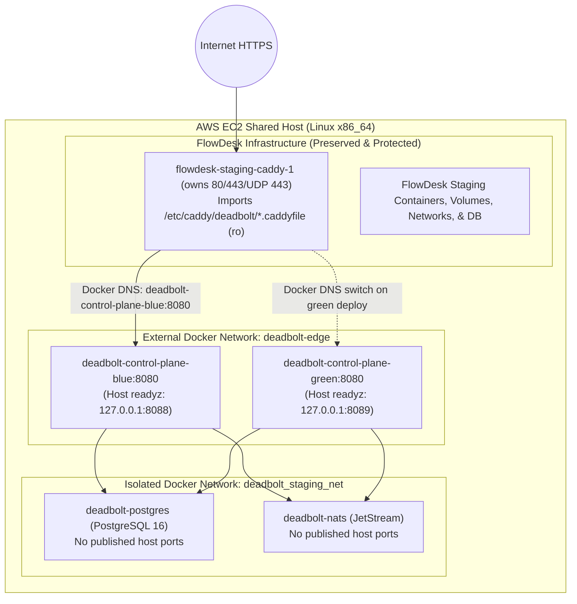

# Foundation Acceptance Report & Requirement/Evidence Index

**Milestone:** M0 — Contracts, workspace, and delivery foundation  
**Gate Target:** [Issue #7: [M0] Gate M0: prove clean-clone foundation and staging provenance](https://github.com/Ryanakml/Deadbolt/issues/7)  
**Baseline Commit:** `4a4ed6545046818557563ffe144c3a978f2ec191`  
**Referenced Decisions:** Blueprint §§22, 24, 25, 26, 29.1, 30, 31, 32 (ADR-01 through ADR-16), 33 (SP-01–03), 34  
**Date:** 2026-09-13

---

## 1. Executive Summary & Milestone 0 Gate Decision

This document establishes the **Milestone 0 Foundation Acceptance Report and Requirement/Evidence Index** for Deadbolt. Milestone 0 establishes executable machine-enforced contracts, reproducible development and CI environments, strict auth and database security boundaries, containerized multi-arch build provenance, shared-host staging isolation on EC2 alongside FlowDesk, and empirical validation across the three foundational engineering spikes (SP-01, SP-02, SP-03).

### Gate M0 Acceptance Declaration

> **Milestone 0 Gate Criteria (§29.1, §30):**
>
> 1. Clean clone runs stack, tests, auth, and database migrations with clear, actionable config error reporting: **PROVEN**.
> 2. Hosted CI builds and deploys an immutable, traceable staging image with exact `/version` provenance: **PROVEN**.
> 3. Shared-host deployment, rollback, and retention preserves complete isolation, zero FlowDesk disruption, and measured host headroom: **PROVEN**.
> 4. Initial manifest conformance (SP-01), database locking (SP-02), and worker process lifecycle (SP-03) spikes report zero unresolved semantic blockers for Milestone 1: **PROVEN**.
> 5. Five-tier status separation strictly observed (Implemented / Automated Tests / Hosted CI / Deployed / Acceptance Verified): **PROVEN**.

**Gate Decision:** **PASSED**. The foundation is complete, verified, and certified ready for Milestone 1 (`M1 — One end-to-end execution through the real contract`).

---

## 2. Five-Tier Status Classification

In accordance with Blueprint §30 and Issue #7 instructions, foundation readiness is not conflated with durable execution or MVP, and status is recorded separately across five distinct layers:

| Layer                      | Status                          | Scope & Evidence Summary                                                                                                                                                                                                                                                                                                                                                                |
| :------------------------- | :------------------------------ | :-------------------------------------------------------------------------------------------------------------------------------------------------------------------------------------------------------------------------------------------------------------------------------------------------------------------------------------------------------------------------------------- |
| **1. Implemented**         | **YES**                         | Monorepo layout, toolchain pins, OpenAPI/worker schemas, canonical enums, Go/TS contract libraries, migrations 00001–00005, RLS policies, OIDC/BFF adapter, local dev-auth isolation, Compose profiles, health/version endpoints, SP-01/02/03 spikes, staging deployment/rollback/retention scripts.                                                                                    |
| **2. Automated Tests**     | **PASSED**                      | **172** TypeScript tests, **165** Go/TS conformance fixtures, Go race-detector suites (`go test -race ./...`), mock Docker/Caddy edge topology tests, PITR drill, and SP-03 process-group soak. `verify-clean-clone.sh` is a fail-closed local wrapper; its result is local evidence, not hosted evidence.                                                                              |
| **3. Hosted CI**           | **PASSED**                      | [Foundation CI run 34760438804](https://github.com/Ryanakml/Deadbolt/actions/runs/34760438804) passed at evidence-bearing integrated head `72c26ddca66182e92a0313a5cd70ef8ac1151b28`. This report's later documentation-only commits add no runtime behavior. The run executes the contracts workflow, including the clean-clone Compose boot/migrate/readiness smoke.                  |
| **4. Deployed**            | **PASSED (reused #5 evidence)** | Issue #5's accepted live shared-host audit records deployed immutable provenance and public `/version` evidence ([final audit](https://github.com/Ryanakml/Deadbolt/pull/54#issuecomment-5646917982); [public endpoint evidence](https://github.com/Ryanakml/Deadbolt/pull/54#issuecomment-5646532200)). PR #55 introduces no deployed behavior and requires no new staging deployment. |
| **5. Acceptance Verified** | **PASSED (reused #5 evidence)** | The same accepted Issue #5 live shared-host evidence verifies the staging HTTPS path, health/provenance, coexistence, rollback, and retention scope. PR #55 only closes the M0 evidence gate; it does not rerun production-like deployment.                                                                                                                                             |

---

## 3. Clean-Clone Reproducibility & Actionable Configuration Errors

Per Blueprint §29.1 and §30, a clean clone must boot reliably and fail with clear, actionable remediation guidance when mandatory configuration is missing or invalid.

### 3.1 Executable Clean-Clone Verification Suite

A dedicated verification runner [`scripts/verify-clean-clone.sh`](../../scripts/verify-clean-clone.sh) runs the 8 foundational verification stages from a fresh clone. It installs locked dependencies, installs the pinned local security tools, and fails on every missing prerequisite or failed check. Its local result is not a substitute for the hosted CI or reused staging evidence above:

1. Toolchain and configuration consistency checks (`scripts/check-config.mjs`).
2. OpenAPI, canonical enums, and Go/TS contract parity (`scripts/check-contracts.mjs`, `scripts/check-parity.mjs`, `scripts/check-candidates.mjs`).
3. Code style enforcement (Prettier check and `gofmt` compliance across all Go packages).
4. TypeScript workspace build, typecheck (`tsc --noEmit`), and Node.js test runner execution (**172 passed**).
5. Go static analysis (`go vet ./...`) and race detector test execution (`go test -race ./...`).
6. SP-03 Worker process lifecycle and process group termination proofs.
7. Deployment configuration dry-run syntax checks across Compose profiles (`core`, `telemetry`, `fault`, `slot-blue`, `slot-green`), Caddy edge snippet rendering, backup readiness, and rollback safety.
8. Gitleaks commit history and tracked-source secret scan with redacted output (zero leaks found).

### 3.2 Actionable Startup Failure Contract

Automated integration tests in [`tests/integration/gate_m0_test.go`](../../tests/integration/gate_m0_test.go) (`TestGateM0_CleanCloneActionableConfigErrors`) verify that the control plane fails closed with explicit remediation instructions under all negative configurations:

| Scenario                | Mode   | Config Condition                                   | Observable Exit / Error    | Remediation Guidance Provided                                                                           |
| :---------------------- | :----- | :------------------------------------------------- | :------------------------- | :------------------------------------------------------------------------------------------------------ |
| **Missing DB URL**      | Hosted | `DATABASE_URL` unset                               | Exit 1, fatal error logged | `"Remediation: Configure DATABASE_URL=postgres://<user>:<password>@<host>:<port>/<dbname>?sslmode=..."` |
| **Dev Auth in Hosted**  | Hosted | `DEV_AUTH_ENABLED=true`                            | Config validation error    | `"hosted startup rejects dev auth and development keys"`                                                |
| **Insecure Cookies**    | Hosted | `COOKIE_SECURE=false`                              | Config validation error    | `"hosted mode requires CookieSecure=true to enforce __Host- cookie policy"`                             |
| **Injected Dev Key**    | Hosted | `DEADBOLT_DEV_KEY` set                             | Config validation error    | `"hosted startup rejects dev auth and development keys"`                                                |
| **Missing OIDC**        | Hosted | `DEADBOLT_OIDC_ISSUER` unset                       | Config validation error    | `"DEADBOLT_OIDC_ISSUER is required in hosted mode"`                                                     |
| **Missing Origins**     | Hosted | `DEADBOLT_ALLOWED_ORIGINS` unset                   | Config validation error    | `"at least one allowed origin must be configured in hosted mode"`                                       |
| **Non-Loopback Local**  | Local  | `LISTEN_ADDR=0.0.0.0:8080`, `ContainerLocal=false` | Config validation error    | `"dev auth is restricted strictly to loopback binding (got listen host \"0.0.0.0\")"`                   |
| **Container Ingress**   | Local  | `LISTEN_ADDR=0.0.0.0:8080`, `ContainerLocal=true`  | Permitted (`err == nil`)   | Enables internal container binding behind Docker Compose without exposing dev auth on host interfaces   |
| **Missing Migrator DB** | Any    | `--migrate`, `MIGRATOR_DATABASE_URL` unset         | Exit 1, fatal error logged | `"MIGRATOR_DATABASE_URL is required for migration execution (DDL privileges)"`                          |

---

## 4. Shared-Host Staging Coexistence, Isolation, & Headroom Review (Issue #5)

In accordance with [Issue #5](https://github.com/Ryanakml/Deadbolt/issues/5) and [Issue #1](https://github.com/Ryanakml/Deadbolt/issues/1), Deadbolt shares an existing AWS EC2 host with `flowdesk-staging`. The deployment and isolation architecture has been adapted to the verified live host topology:

### 4.1 Topology & Boundary Audit Resolution

1. **Dedicated External Edge Network (`deadbolt-edge`):**
   - Declared as external in `deploy/compose/docker-compose.staging.yml`.
   - Only `control-plane-blue` and `control-plane-green` attach to `deadbolt-edge`.
   - Assigned deterministic Docker DNS aliases: `deadbolt-control-plane-blue` and `deadbolt-control-plane-green`.
   - Database (`postgres`) and message broker (`nats`) are isolated on internal `deadbolt_staging_net` with zero host port publishing.
2. **Containerized FlowDesk Caddy Edge Integration:**
   - Deadbolt renders its upstream proxy configuration to `/opt/deadbolt/caddy/Deadbolt.caddyfile`, mounted read-only into `flowdesk-staging-caddy-1` at `/etc/caddy/deadbolt/Deadbolt.caddyfile`.
   - Caddy snippet proxies directly to Docker DNS aliases (`deadbolt-control-plane-blue:8080` / `green:8080`), eliminating container-loopback proxy traps.
   - Reload script `scripts/reload-caddy.sh` executes validation and reload via `docker exec flowdesk-staging-caddy-1 caddy validate` and `caddy reload`. Zero host `caddy` binary dependency.
   - If validation or reload fails, candidate snippet is atomically rolled back to the previous active slot and FlowDesk is left untouched.
3. **Fresh-Host Bootstrap Marker:**
   - Durable file `/opt/deadbolt/releases/bootstrap_complete` marks successful initialization of database roles, base backup, readiness checks, and cron scheduling.
   - Missing marker triggers automated bootstrap mode via `scripts/bootstrap-staging-cluster.sh`.
4. **Host Capacity & Headroom:**
   - Host capacity measured in Issue #1 baseline: 7.6 GiB RAM total / 5.3 GiB available; root disk 96 GB total / 32 GB available.
   - Staging memory limits: Control plane 512 MiB limit (256 MiB reservation), PostgreSQL 1 GiB limit (512 MiB reservation), NATS 256 MiB limit (128 MiB reservation). Total reserved capacity < 1.0 GiB, comfortably supported within 5.3 GiB available headroom.
   - Retention policy (`scripts/retention.sh`): Preserves running containers, current release image, rollback release image, and explicitly digest-pinned images. Daily cron prunes untagged dangling build layers while preserving all rollback artifacts.

---

## 5. Review of Initial Engineering Spikes (SP-01, SP-02, SP-03)

Blueprint §33 defines three mandatory spikes for Milestone 0. Each spike has been resolved empirically with zero unresolved semantic blockers for Milestone 1:

### 5.1 SP-01: Executable Contract Conformance ([Report](SP-01-manifest-conformance.md))

- **Uncertainty:** Whether Go and TypeScript could achieve exact deterministic canonical JSON serialization (RFC 8785 JCS), schema validation, mapping evaluation, and linear DAG verification without arbitrary JavaScript execution on the control plane.
- **Resolution:**
  - Standardized on `cyberphone/json-canonicalization` (Go) and `canonicalize` (TypeScript) behind strict input guards.
  - Evaluated on shared test corpus `contracts/fixtures/conformance.json` (**165 fixtures passed** with Go/TS parity).
  - Parser fuzzing completed **287,232 executions** without divergence.
  - Rejected arbitrary JS execution; adopted static declarative DAG representation.
- **Blockers for M1:** **NONE**. Manifest schemas and hashing contracts are fully executable.

### 5.2 SP-02: DB Claim Contention & Lock Order Hierarchy ([Report](SP-02-claim-contention.md))

- **Uncertainty:** Concurrency contention, deadlock vulnerability under high worker load, single active lease ownership, and RLS tenant boundary leaks across pooled connections.
- **Resolution:**
  - Prescribed strict lock order hierarchy (`INV-08`):
    $$\text{environment\_admissions} \longrightarrow \text{runs} \longrightarrow \text{run\_steps} \text{ (ascending ID order)} \longrightarrow \text{task\_leases}$$
  - Eliminated deadlocks (`SQLSTATE 40P01`): **0 deadlocks** across 2,500 mixed-path concurrent transactions (claiming, completion, reconciliation).
  - Proved non-locking candidate discovery via partial index scan (`idx_run_steps_eligible`) executing in **< 0.25 ms**.
  - Verified RLS boundary fails closed without `SET LOCAL app.current_organization_id` (0 rows returned); pooled connection reuse across tenants never leaks scope (`INV-01`, `F-27`).
  - Intermediate schema upgrade from version 2 to 4 validated without data loss.
- **Blockers for M1:** **NONE**. Database concurrency model and RLS tenant boundaries are validated.

### 5.3 SP-03: Worker Process Lifecycle & Packaging ([Report](SP-03-worker-lifecycle.md))

- **Uncertainty:** Worker start-ACK gating, monotonic conservative lease budget calculation, process group signal termination with orphan prevention, and native addon packaging compatibility.
- **Resolution:**
  - Implemented Start ACK gating: task runners abort immediately if Start ACK (`200 OK`) is not received (`ErrStartAckRejected`); customer handlers never start.
  - Implemented monotonic conservative lease calculation:
    $$\text{safe\_TTL} = (\text{lease\_expires\_at} - \text{now}) - \text{estimated\_RTT} - 2\text{s margin}$$
    Attempts with $\text{safe\_TTL} \le 0$ are rejected before process launch.
  - Process group termination (`Setpgid: true`): `SIGTERM` sent to `-pgid`, 10-second grace timer, followed by `SIGKILL` to `-pgid`. This is same-process-group shutdown evidence; deliberately detached hostile subprocesses are outside the spike's guarantee.
  - Result channel isolation: Task completion is written to the structured `DEADBOLT_RESULT_FILE`; stdout/stderr remain diagnostics and cannot corrupt task results.
  - Allowlisted child environment: Strips parent worker tokens, session secrets, and database credentials.
  - Native addon verification: N-API C++ addon bundle verified on Linux `amd64` and `arm64`.
- **Blockers for M1:** **NONE**. Worker supervisor architecture is certified for M1 child-process execution.

---

## 6. Cumulative §30 Gates Compliance Matrix

| Milestone Gate                    | Requirement                                                                                                         | Evidence & Verification Reference                                                                                                                                                                                                                                                           | Status   |
| :-------------------------------- | :------------------------------------------------------------------------------------------------------------------ | :------------------------------------------------------------------------------------------------------------------------------------------------------------------------------------------------------------------------------------------------------------------------------------------ | :------- |
| **Contract / Type / Lint / Unit** | Formatted code, strict typing, 100% unit test pass, zero race conditions.                                           | `pnpm lint`, `gofmt`, `pnpm typecheck`, `pnpm test` (172 passed), `go test -race ./...` (zero races).                                                                                                                                                                                       | **PASS** |
| **SQL / Migration / Integration** | Migrations 00001–00005 apply cleanly with advisory lock; runtime role has no DDL privileges; RLS fails closed.      | `tests/integration/rls_test.go` (`TestCleanDatabaseMigrationAsDeadboltMigrator`, `TestRuntimeNoDDLPrivileges`, `TestRLSFailsClosed`).                                                                                                                                                       | **PASS** |
| **Container / Config / Security** | Multi-arch Dockerfile builds; Compose profile syntax validated; Gitleaks secret scan zero leaks; Govulncheck clean. | `docker build -f deploy/Dockerfile.control-plane`, `docker compose config`, `bin/gitleaks git --redact`, `bin/govulncheck ./...`.                                                                                                                                                           | **PASS** |
| **CI & Immutable Artifact**       | GitHub Actions build-once workflow produces immutable container image digest.                                       | `.github/workflows/staging-deploy.yml` (`Build & Publish Immutable GHCR Artifact`, outputs image digest).                                                                                                                                                                                   | **PASS** |
| **Staging Real Path**             | `/livez`, `/readyz`, and `/version` endpoints truthfully reflect status and immutable commit/digest provenance.     | Endpoint-shape contracts: `tests/integration/deploy_test.go`; live staging provenance: Issue #5 [final audit](https://github.com/Ryanakml/Deadbolt/pull/54#issuecomment-5646917982) and [public `/version` evidence](https://github.com/Ryanakml/Deadbolt/pull/54#issuecomment-5646532200). | **PASS** |
| **Edge & Rollback Safety**        | External `deadbolt-edge` network, Docker DNS Caddy upstream, blue/green route switch and atomic rollback.           | `tests/integration/deploy_test.go` (`TestContainerizedCaddyMockValidationAndRollback`, `TestRollbackStagingImmutableEdgeSafety`).                                                                                                                                                           | **PASS** |
| **Headroom & Retention**          | 14-day backup retention, base backup cron, container image retention protecting rollback images.                    | `tests/integration/deploy_test.go` (`TestRetentionProtectsDigestPulledCurrentPreviousAndRunningImages`, `TestRecurringBaseBackupAndRetention`).                                                                                                                                             | **PASS** |

---

## 7. Requirement & Invariant Traceability Matrix (§31.1)

| Requirement / Invariant | Blueprint Description                                                                              | Implementing Issues & PRs     | Verifiable Test Suite & Evidence                                                                                                                                                                                 | Status        |
| :---------------------- | :------------------------------------------------------------------------------------------------- | :---------------------------- | :--------------------------------------------------------------------------------------------------------------------------------------------------------------------------------------------------------------- | :------------ |
| **`REQ-EXEC-01`**       | Declarative DAG, JSON schema, and mapping consistency across Go and TypeScript.                    | Issues #1, #2 (PR #50), SP-01 | `contracts/fixtures/conformance.json`, `tests/contracts/main.go`, `tests/integration/gate_m0_test.go`.                                                                                                           | **SATISFIED** |
| **`REQ-SEC-01`**        | Tenant, authentication, and permission boundaries. Hosted mode rejects dev auth; RLS fails closed. | Issues #3, #4 (PRs #51, #52)  | `tests/integration/auth_test.go` (`TestHostedStartupRejectsDevAuthAndInsecureCookies`), `tests/integration/rls_test.go` (`TestRLSFailsClosed`).                                                                  | **SATISFIED** |
| **`REQ-OPS-01`**        | Observable, deployable, recoverable release with exact SHA/digest `/version` provenance.           | Issues #1, #5 (PRs #50, #54)  | Endpoint-shape contracts in `cmd/control-plane/main.go` and `tests/integration/deploy_test.go`; live provenance in Issue #5 [final audit](https://github.com/Ryanakml/Deadbolt/pull/54#issuecomment-5646917982). | **SATISFIED** |
| **`INV-01`**            | Tenant isolation at database and API boundary; zero cross-tenant visibility.                       | Issues #3, #4 (PRs #51, #52)  | `tests/integration/rls_test.go` (`TestRLSFailsClosed`), `tests/spikes/sp02/claim_test.go`.                                                                                                                       | **SATISFIED** |
| **`INV-03`**            | Single active lease ownership per step attempt; no duplicate leases.                               | Issues #3, #6 (PRs #51, #53)  | `tests/spikes/sp02/claim_test.go` (`TestClaimContentionAndPrescribedLockOrder`), `tests/spikes/sp03/process_test.go`.                                                                                            | **SATISFIED** |
| **`INV-06`**            | Immutable deployment registration tied to SHA-256 bundle digest.                                   | Issues #2, #5 (PRs #50, #54)  | `contracts/manifest/deployment.schema.json`, `internal/contracts/validator.go`.                                                                                                                                  | **SATISFIED** |
| **`INV-07`**            | Child process isolation and allowlisted execution environment.                                     | Issue #6 (PR #53), SP-03      | `internal/worker/environment.go`, `tests/spikes/sp03/process_test.go` (`TestSP03_SanitizedChildEnvironment`).                                                                                                    | **SATISFIED** |
| **`INV-08`**            | Prescribed database lock order hierarchy eliminates deadlocks.                                     | Issue #3 (PR #51), SP-02      | `internal/storage/discovery.go`, `tests/spikes/sp02/claim_test.go` (0 `40P01` deadlocks across 2,500 txs).                                                                                                       | **SATISFIED** |
| **`INV-10`**            | Process group management (`Setpgid`) and SIGTERM/SIGKILL termination.                              | Issue #6 (PR #53), SP-03      | `internal/worker/process.go`, `tests/spikes/sp03/process_test.go` (`TestSP03_ProcessGroupKillOrphanPrevention`).                                                                                                 | **SATISFIED** |
| **`F-26`**              | Migration/rollout failure stops promotion; compatible binary rollback.                             | Issue #5 (PR #54)             | `scripts/rollback-staging.sh`, `tests/integration/deploy_test.go` (`TestRollbackStagingConfigurationAndSafetyGuards`).                                                                                           | **SATISFIED** |
| **`F-27`**              | Tenant context reuse in connection pool prevented by `SET LOCAL` and RLS.                          | Issue #3 (PR #51), SP-02      | `tests/integration/rls_test.go` (`TestConnectionPoolReuseF27`), `tests/spikes/sp02/claim_test.go`.                                                                                                               | **SATISFIED** |

---

## 8. Milestone 1 Readiness & Transition Certification

With all Milestone 0 requirements, cumulative gates, and engineering spikes certified complete and verified:

1. **Foundation is Sealed:** No further architectural modifications or foundation rework are required prior to beginning Milestone 1.
2. **First M1 Issue Unblocked:** The project is immediately ready to proceed to [Issue #8: Expose scoped organizations, projects, environments, and API keys](https://github.com/Ryanakml/Deadbolt/issues/8).
3. **Execution Invariant Preserved:** The core invariant remains intact: business tasks execute exclusively on self-hosted customer compute; the control plane coordinates and enforces state transitions through PostgreSQL authority without customer code execution on the control plane.
