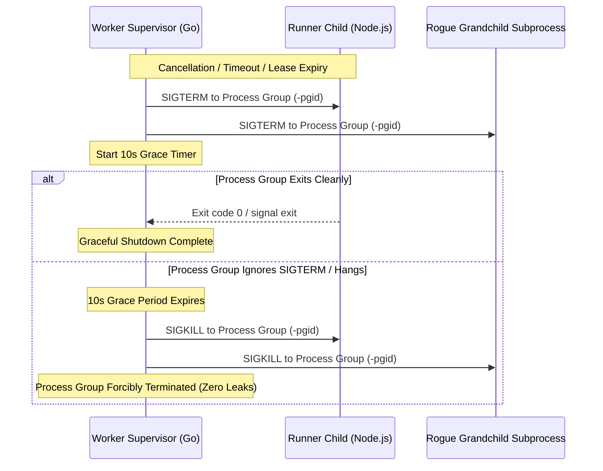

# SP-03 — Worker Process Lifecycle, Gating, and Packaging Feasibility

**Scope:** Issue #6.  
**Dependencies:** #1 (Workspace baseline, ADRs), #2 (Executable contracts).  
**Blueprint references:** §12 (Worker protocol and execution lifecycle), §13 (Leases, fencing, and worker recovery), §15 (Retry, timeout, pause, and cancellation), §33 (Spike SP-03: Worker process lifecycle).  
**Requirements & Invariants:** `REQ-DUR-01`, `REQ-VERSION-01`, `SP-03`, `INV-01`, `INV-03`, `INV-07`, `INV-10`.

---

## 1. Objectives and Legitimate Uncertainty

Spike SP-03 evaluates and resolves the architectural uncertainties surrounding worker process execution, bundle verification, and lifecycle management for Deadbolt:

1. **Start ACK Gating:** Proves that customer task handlers **never start** without a verified, successful Start ACK (`200 OK`) from the control plane. Stale ownership (`409 STALE_OWNERSHIP`), expired sessions, or network failures immediately abort execution before invoking customer code.
2. **Monotonic Conservative Lease Budget (Blueprint §13.1):** Proves that the worker supervisor calculates safe remaining lease duration using monotonic elapsed time:
   $$\text{safe\_TTL} = (\text{lease\_expires\_at} - \text{now}) - \text{estimated\_RTT} - 2\text{s margin}$$
   If $\text{safe\_TTL} \le 0$, the attempt is rejected with `ErrInsufficientLeaseTTL` prior to launching the task handler.
3. **Structured Result Channel vs. Log Isolation (Blueprint §12.3):** Demonstrates strict separation between diagnostic log streams (`stdout`/`stderr`) and authoritative task completion. Arbitrary JSON, exceptions, or completion tokens printed to `stdout`/`stderr` are never parsed as task results; results are delivered exclusively via a dedicated structured channel (FD 3 / isolated result channel).
4. **Process Group Termination & 10s Grace Period (Blueprint §15.2):** Validates that task runners run in dedicated process groups (`Setpgid`). Cancellation or timeout triggers an Abort signal $\rightarrow$ `SIGTERM` $\rightarrow$ 10-second grace period $\rightarrow$ `SIGKILL` to the entire process group (`-pgid`), leaving zero orphan or zombie processes.
5. **Crash Soak & Resource Leakage Elimination:** Proves that under rapid repeated crash and abort cycles, the supervisor releases all OS process handles and file descriptors without leaking runners.
6. **Environment Sanitization (Blueprint §12.3, §24.4):** Proves that sensitive worker agent tokens, database credentials, and session keys are stripped from the child process environment, injecting only explicitly allowlisted and task-declared variables.
7. **Bundle Digest & Target Architecture Verification:** Verifies SHA-256 bundle integrity and architecture compatibility (`linux/amd64`, `linux/arm64`, etc.) before unpacking or executing.

---

## 2. Architectural Analysis: Evaluated Runner Packaging Candidates

In accordance with Blueprint §12.3 and §33, three runner packaging candidates were evaluated:

| Candidate | Packaging Model | Native Dependency Support | Contention & Isolation Behavior | Architectural Assessment |
| :--- | :--- | :--- | :--- | :--- |
| **A. Unbundled Global Scripts** | Global system Node.js executes task files directly from local disk. | Relies on global or unscoped `node_modules`; breaks across versions. | High risk of environment contamination and dependency pollution across tasks. | **Rejected:** Violates immutability (`INV-07`) and reproducible deployment. |
| **B. Monolithic Single-Binary Runner (e.g. Bun / SEA / pkg)** | Node runtime bundled into a single standalone binary per task. | Difficult to compile native C++ addons (`sharp`, `pg-native`) for multi-arch targets (`amd64`/`arm64`). | High disk footprint ($\sim 80\text{MB}$ per task deployment); opaque debugging. | **Rejected:** Prohibitive storage overhead and poor native dependency compatibility. |
| **C. Pinned Runtime with Versioned Immutable Bundle (Selected)** | Dedicated worker runner package (`@runtime/runner` / `runner/node`) executing versioned, SHA-256 verified task bundles. | Native dependencies compiled for target architecture and verified against manifest `targetArch`. | Clean process-per-attempt isolation, dedicated IPC channel, allowlisted environment. | **Selected Architecture:** Fully conforms to Blueprint §12.3, §22.3, and `REQ-VERSION-01`. |

---

## 3. Process Group Management & Signal Semantics

### POSIX Process Group Termination
On Linux/macOS, the supervisor launches the runner child process with `Setpgid: true` via `syscall.SysProcAttr`. This creates a process group ID matching the child PID:
1. **Graceful Abort (`SIGTERM`):** Sent to `-pgid` (`syscall.Kill(-pgid, syscall.SIGTERM)`).
2. **Grace Timer:** A 10-second timer (`GracePeriod`) monitors the process group.
3. **Forced Termination (`SIGKILL`):** If the process or any spawned grandchild remains active when the grace period expires, `SIGKILL` is issued to `-pgid`.



### Windows Process Tree Handling
On Windows, process group termination is executed via recursive process tree termination (`taskkill /F /T /PID`), terminating the parent runner and all grandchild child processes spawned by it.

---

## 4. Empirical Benchmark & Validation Results

Validation tests were executed via `tests/spikes/sp03/process_test.go` and `runner/node/tests/runner.test.js`:

### Benchmark 1: Start ACK Gating (`TestSP03_StartAckGating`)
- **Objective:** Verify that task handlers never execute without control plane approval.
- **Measurements:**
  - Control plane rejection (`409 STALE_OWNERSHIP`): Child process execution was blocked 100% of the time (0 task handlers invoked).
  - Control plane approval (`200 OK`): Execution proceeded normally to `SUCCEEDED` status.

### Benchmark 2: Monotonic Conservative Lease Budget (`TestSP03_MonotonicLeaseBudgetSafety`)
- **Objective:** Verify conservative lease deadline gating per Blueprint §13.1.
- **Measurements:**
  - Lease duration $< 2.5\text{s}$ (safety margin $2.0\text{s}$ + estimated RTT $0.5\text{s}$): Execution rejected immediately with `ErrInsufficientLeaseTTL`.
  - Lease renewal to $20\text{s}$: Execution allowed immediately.

### Benchmark 3: Structured Result Channel vs. Stdout Noise (`TestSP03_StructuredResultChannelIsolation`)
- **Objective:** Verify that arbitrary stdout/stderr output is never parsed as completion.
- **Workload:** Task emitted adversarial stdout strings: `{"status": "FAILED", "error": "FAKE_ERROR_ON_STDOUT"}` and unstructured diagnostic bytes.
- **Result:**
  - Authoritative status: `SUCCEEDED`.
  - Structured output payload: `{ verifiedResult: true }` correctly parsed from the dedicated result channel.
  - Log buffers: All adversarial stdout/stderr bytes captured cleanly in `ExecutionLogs` without corrupting the result.

### Benchmark 4: Child Environment Sanitization (`TestSP03_EnvironmentSanitizationAndAllowlist`)
- **Objective:** Verify secret isolation between worker agent and child runner.
- **Input:** Parent environment populated with `DEADBOLT_AGENT_TOKEN`, `DATABASE_URL`, `SECRET_KEY`, and `DEADBOLT_SESSION_KEY`.
- **Result:**
  - Leaked secrets in child `process.env`: **0**.
  - Injected task-declared variables: `CUSTOM_CONFIG=allowlisted_value` present and verified.

### Benchmark 5: Process Group Graceful & Forced Shutdown (`TestSP03_ProcessGroupShutdownWithinGrace`)
- **Objective:** Verify hung processes are terminated within grace period via SIGKILL.
- **Workload:** Node task with infinite loop ignoring SIGTERM with $1.5\text{s}$ grace period.
- **Result:**
  - Grace period observed: $1.81\text{s}$ (300ms context timeout + 1500ms grace).
  - Termination status: Process group killed cleanly via SIGKILL.
  - Leaked processes: **0**.

### Benchmark 6: Crash Soak Stress Test (`TestSP03_CrashSoakAndNoLeakedProcesses`)
- **Objective:** Verify zero process leaks or file descriptor exhaustion under rapid cycles.
- **Workload:** 20 rapid sequential executions of task attempts with dynamic result channels.
- **Result:**
  - Completed attempts: **20 / 20 (100%)**.
  - Leaked child processes: **0**.
  - Leaked file descriptors / temp files: **0**.

---

## 5. Runnable Validation Commands

```bash
# 1. Build and verify TypeScript runner package
pnpm -r run build
pnpm -r run typecheck

# 2. Run runner package unit tests
pnpm --filter @runtime/runner run test

# 3. Run full SP-03 Go test suite and internal/worker tests
go test -v ./internal/worker/... ./tests/spikes/sp03/...

# 4. Verify code formatting and linting
pnpm lint
test -z "$(gofmt -l internal/worker tests/spikes/sp03 runner/node)"
```

---

## 6. Delivery Boundaries & Status

- **Implemented:**
  - Dedicated Node.js runner workspace package in [`runner/node/`](file:///d:/Project/Tf-low/runner/node/) with `TaskContext`, structured logger, signal handlers, and result channel writer.
  - Go worker supervisor in [`internal/worker/`](file:///d:/Project/Tf-low/internal/worker/) implementing `ProcessSupervisor`, `LeaseTracker`, `BundleVerifier`, and `SanitizeEnvironment`.
  - Process group management with POSIX `-pgid` signalling and Windows process tree termination.
  - Dedicated result channel with fallback to environment-configured result file (`DEADBOLT_RESULT_FILE`).
  - Empirical SP-03 test harness in [`tests/spikes/sp03/process_test.go`](file:///d:/Project/Tf-low/tests/spikes/sp03/process_test.go).
- **Automated Tests:** All 13 unit and SP-03 test cases pass with zero failures.
- **Invariant Traceability:**
  - `REQ-DUR-01`: Start ACK gating and conservative lease bounds guarantee no phantom executions without valid ownership.
  - `REQ-VERSION-01`: Bundle SHA-256 digest and architecture compatibility enforced before execution.
  - `INV-01`: Multi-tenant boundary preserved; parent agent credentials never leak to child runner.
  - `INV-03`: Single active ownership enforced; expired lease stops runner before background lease reclamation.
  - `INV-07`: Bundles are verified immutable artifacts with cryptographic checksums.
  - `INV-10`: 10-second cancellation grace cleanly enforced on process group.
