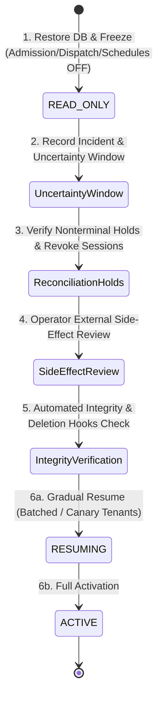

# Backup & Disaster Recovery Runbook

## 1. Overview & Recovery Objectives

Deadbolt maintains an independent database persistence layer on PostgreSQL 18. In accordance with architectural invariants, backups are continuously archived to the dedicated external S3 bucket provisioned in Issue #1, with zero reliance on or cross-contamination with FlowDesk MinIO.

### Key Metrics

- **RPO (Recovery Point Objective)**: < 5 minutes (via continuous WAL archiving).
- **RTO (Recovery Time Objective)**: < 60 minutes for cold restoration on a replacement instance.
- **Rollback Invariant**: Application binary rollback **never** implies database rollback; schema migrations are additive and forward-compatible.

---

## 2. Backup Architecture

### 2.1 Continuous WAL Archiving

PostgreSQL 18 is configured to ship closed WAL segments directly to the external S3 bucket under the prefix `s3://${DEADBOLT_STORAGE_S3_BUCKET}/postgres/wal/`.

- **Archive Command Configuration (`deploy/compose/docker-compose.staging.yml`)**:
  ```ini
  wal_level = replica
  archive_mode = on
  archive_command = '/usr/local/bin/archive-wal.sh %p %f'
  archive_timeout = 300
  ```
- **Archiver Implementation**: Uses `scripts/archive-wal.sh`, mounted into the hardened PostgreSQL image (`deploy/Dockerfile.postgres`). It uploads closed segments via `aws s3 cp` to the dedicated bucket or the explicit archive directory.

### 2.2 Nightly Base Backups & Retention

Nightly physical base backups are created using `scripts/take-base-backup.sh`, scheduled via cron (`deploy/cron/deadbolt-backup.cron` & `scripts/setup-backup-cron.sh`):

- Destination: `s3://${DEADBOLT_STORAGE_S3_BUCKET}/postgres/basebackups/base_<TIMESTAMP>.tar.gz`
- Bounded Retention: Strict 14-backup retention policy (`RETENTION_COUNT=14`). Backups older than the 14 most recent backups are automatically purged from S3 and local storage.
- Each backup script forces a WAL switch and verifies the exact completed segment appears in the configured archive destination.

### 2.3 Volume Independence

- Database files reside in the dedicated Docker named volume `deadbolt_staging_postgres_data`.
- Default staging database: `deadbolt_staging`.
- Administrative user: `deadbolt_admin`.
- Runtime application user: `deadbolt_runtime`.
- Migration user: `deadbolt_migrator`.
- System function-caller user: `deadbolt_system`.
- This volume is never touched, pruned, or shared across projects or with FlowDesk.

### 2.4 Fresh-Host Cluster Bootstrap & Baseline Backups

On an uninitialized staging host (where `/opt/deadbolt/releases/bootstrap_complete` does not exist), `scripts/deploy-staging.sh` automatically engages `--bootstrap` mode.
The cluster initialization workflow in `scripts/bootstrap-staging-cluster.sh` establishes the baseline:

1. Validates host configuration and credentials.
2. Starts PostgreSQL and NATS on `deadbolt_staging_net`.
3. Waits for PostgreSQL healthcheck (verifying schema/role initialization).
4. Creates the initial physical base backup and triggers an immediate WAL switch via `scripts/bootstrap-initial-backup.sh`.
5. Verifies backup and WAL readiness via `scripts/check-backup-readiness.sh`.
6. Configures nightly base backup cron with 14-day retention via `scripts/setup-backup-cron.sh`.
7. Records the durable bootstrap marker `/opt/deadbolt/releases/bootstrap_complete` only upon 100% successful completion.
   Subsequent promotions require this marker and verify backup readiness before running candidate migrations.

---

## 3. Pre-Flight Backup Readiness Validation

Before every candidate deployment, the deployment script executes a backup readiness check:

```bash
# Run the same fail-closed gate used by candidate promotion.
cd /opt/deadbolt && ./scripts/check-backup-readiness.sh
```

The gate verifies S3 access, a fresh base backup, and encryption. It then creates a uniquely named PostgreSQL restore point with `pg_create_restore_point(...)` (internal WAL activity only), forces a WAL switch, and polls for that exact completed segment in the dedicated archive within a bounded timeout. It verifies encryption for the exact probe object. This avoids treating the age of the latest archived object as transport lag on an idle database. Any missing probe segment or encryption evidence fails closed.

---

## 4. Disaster Recovery & Restore Drill Procedure

Deadbolt provides an executable disaster recovery script: `scripts/restore-staging-db.sh`.
In adherence to architectural invariants (Blueprint §9, §24), the tool provides three distinct, explicitly guarded operational modes:

1. **Safe Isolated Recovery Drill (Default)**:
   - Evaluates recoverability without stopping live services or altering persistent staging state.
   - Spins up an isolated recovery container (`deadbolt-recovery-drill-postgres`) attached to `--network none` and an ephemeral volume.
   - When S3 is configured, WAL archives are prefetched by the host to an ephemeral cache directory and mounted read-only (`/wal_archive:ro`), allowing PostgreSQL to replay via `cp /wal_archive/%f %p` under strict `--network none` isolation without AWS credentials inside the container.
   - Replays WAL archives up to the specified target time (or latest), verifies database promotion, runs smoke queries, and cleans up.
   - Live staging services (`deadbolt-staging-postgres`) and data volume (`deadbolt_staging_postgres_data`) remain 100% untouched.

2. **Destructive Disaster Recovery (Live Cluster)**:
   - For real disaster recovery when active staging persistence must be replaced.
   - Requires explicit `--destructive-staging-restore` flag and `FORCE_RESTORE=true` environment variable.

3. **Disaster Recovery Reconciliation Mode (`--disaster-recovery`)**:
   - Executes live database restore, then immediately enforces the disaster recovery state machine:
     1. Transitions system recovery controls to `READ_ONLY`.
     2. Disables run admission (`admission_disabled = true`).
     3. Disables task dispatch (`dispatch_disabled = true`).
     4. Disables scheduled executions (`schedules_disabled = true`).
     5. Terminates active worker leases and revokes pre-disaster human sessions.
     6. Places all restored nonterminal runs into `WAITING` status with hold reason `RECONCILIATION`.
     7. Creates durable `reconciliation_cases` with reason `DISASTER_RECOVERY_HOLD`.
     8. Records disaster incident with explicit uncertainty window (`recoveryPoint` to `incidentAt`).
   - Supports `--dry-run` to validate prerequisite volumes, backups, commands, and target parameters without mutating state.

### Automated Execution

#### A. Running Safe Isolated Recovery Drill (Default)

```bash
# Run isolated drill against latest base backup + WAL archive
./scripts/restore-staging-db.sh

# Or drill recovery to a specific point in time:
DEADBOLT_RECOVERY_TARGET_TIME="2026-09-12 04:00:00 UTC" ./scripts/restore-staging-db.sh --drill
```

#### B. Executing Live Disaster Recovery with Reconciliation Holds

```bash
# Validate prerequisites with a dry-run first:
FORCE_RESTORE=true ./scripts/restore-staging-db.sh \
  --destructive-staging-restore \
  --disaster-recovery \
  --recovery-point "2026-09-22 14:00:00 UTC" \
  --incident-at "2026-09-22 14:30:00 UTC" \
  --operator-notes "Primary host storage failure; failover restore" \
  --dry-run

# Execute live disaster recovery and initialize disaster reconciliation:
FORCE_RESTORE=true ./scripts/restore-staging-db.sh \
  --destructive-staging-restore \
  --disaster-recovery \
  --recovery-point "2026-09-22 14:00:00 UTC" \
  --incident-at "2026-09-22 14:30:00 UTC" \
  --operator-notes "Primary host storage failure; failover restore"
```

---

## 5. Explicit 6-Step Disaster Recovery Protocol

Disaster recovery follows a strict 6-step state machine ensuring zero duplicate external side effects and verifiable auditability.



### Step 1: Read-Only First Mode Activation

Immediately upon database restoration, system controls are set to `READ_ONLY`:

- API returns `503 Service Unavailable` with `ADMISSION_DISABLED` for new run submissions (`POST /v1/workflows/{workflowName}/runs`).
- Worker polling (`POST /v1/tasks/claim`) returns empty assignments.
- Cron / scheduled workflows are paused.
- Pre-disaster worker leases are cleared to prevent stale workers from executing in-flight steps.

### Step 2: Disaster Incident & Uncertainty Window Recording

Execute authoritative platform recovery via CLI (or via `scripts/restore-staging-db.sh --disaster-recovery`):

```bash
control-plane --prepare-disaster-recovery \
  --recovery-point "2026-09-22 14:00:00 UTC" \
  --incident-at "2026-09-22 14:30:00 UTC" \
  --operator-notes "Primary host storage failure; failover restore"
```

- Records `recovery_point` ($T_{recovery}$) and `incident_at` ($T_{incident}$) in `disaster_recovery_incidents`.
- Binds uncertainty window $[T_{recovery}, T_{incident}]$.
- Reconciles any edge-accepted requests missing from database snapshots:

```bash
control-plane --recovery-rpo-gap \
  --incident-id "<INCIDENT_ID>" \
  --request-ids "req-1,req-2" \
  --operator-notes "Reconciled edge logs"
```

> **RPO Gap Disclaimer**:
> _"no claim of zero RPO: requests accepted during the uncertainty window cannot be reconstructed from database alone"_
> All such request IDs are logged in `rpo_gap_request_ids` for upstream notification.

### Step 3: Disaster Reconciliation Hold Verification

- All nonterminal runs (`QUEUED`, `RUNNING`, `WAITING`, `PAUSING`, `PAUSED`, `CANCELLING`) transition to `WAITING` status with hold reason `RECONCILIATION`.
- `reconciliation_cases` are created with `reason = 'DISASTER_RECOVERY_HOLD'` and state details including the uncertainty window.
- Terminal runs (`SUCCEEDED`, `FAILED`, `CANCELLED`, `TIMED_OUT`) remain untouched (INV-09).
- Existing human operator sessions are revoked (`revocation_reason = 'DISASTER_RECOVERY_RESET'`); operators must log in freshly after recovery.

### Step 4: External Side-Effect Review Checklist (Operator)

Before any execution resumes, operators must reconcile external side effects that may have completed during the uncertainty window (see Section 6).

### Step 5: Automated Integrity Verification & Audit Trail

Execute authoritative integrity verification via CLI:

```bash
control-plane --verify-recovery-integrity
```

- Verifies database schema version matches `LatestSchemaVersion` (Migration 24+).
- Checks pending deletion ledger count (`app.count_pending_deletions()`) preserving M5 GDPR/deletion hooks.
- Verifies S3-compatible object boundary (existence, size, SHA-256) for all referenced `READY` artifacts attached to restored nonterminal runs.
- Verifies tenant boundary consistency (zero orphaned runs or artifacts without valid organization).
- Confirms audit trail is intact and captures recovery verification evidence.

### Step 6: Gradual Resumption

Execute authoritative resumption via CLI:

```bash
# Transition to RESUMING for canary verification:
control-plane --resume-recovery --mode RESUMING

# Transition to full ACTIVE:
control-plane --resume-recovery --mode ACTIVE
```

- System transitions `READ_ONLY` $\to$ `RESUMING` $\to$ `ACTIVE`.
- Allows selective tenant-by-tenant resumption (`target_tenants`) or batched activation to avoid thundering herds.
- Admission, dispatch, and schedules are re-enabled only after all holds are cleared or explicitly deferred.

---

## 6. Operator External Side-Effect Review Checklist

When restoring a database to an older snapshot ($T_{recovery}$), the external world (payment gateways, cloud providers, third-party APIs) may reflect side effects that occurred between $T_{recovery}$ and $T_{incident}$. Naive task re-execution would cause duplicate side effects.

### Pre-Resumption Checklist:

1. **Identify Open Disaster Holds**:
   Query open reconciliation cases:

   ```bash
   curl -H "Authorization: Bearer ${OPERATOR_TOKEN}" \
     "https://deadbolt.internal/v1/reconciliation/cases?status=OPEN&reason=DISASTER_RECOVERY_HOLD"
   ```

2. **Categorize Tasks by Blueprint Execution Invariant (§9.2, §24.3)**:
   - **`safe` / Read-Only**: Can safely be retried with `{"action": "retry"}`.
   - **`idempotent`**: Can safely retry with original `idempotency_key` (external provider will return cached result without re-executing).
   - **`reconcile` (State-mutating / Non-idempotent)**: Must be reconciled against external system:
     - Check external system (e.g., Stripe, AWS, internal service ledger) for step transaction reference.
     - If effect executed: Resolve with `{"action": "confirm_succeeded", "result": {...}, "evidence": "ext-ref-XYZ"}`. Step completes with `completion_source = 'RECONCILIATION'`.
     - If effect did not execute: Resolve with `{"action": "retry", "reason": "Verified not executed externally"}` or `{"action": "fail"}`.

3. **Human Authorization Rule**:
   - Machine API keys can **never** hold `runs:reconcile` capability (Blueprint §24.2).
   - Operator must log in post-disaster to obtain a fresh human session token (`reconcileHumanToken`) with `runs:reconcile` and `runs:control`.

4. **Verify Zero Duplicate Side Effects**:
   - Ensure external ledgers report 0 duplicate execution attempts prior to lifting dispatch restrictions.

---

## 7. Recovery Drill Verification Evidence

The disaster recovery and reconciliation workflow was validated end-to-end via automated drills and integration tests (`tests/integration/disaster_recovery_test.go`).

### Test Evidence Summary:

```
=== RUN   TestDisasterRecoveryPointRestoresAndEntersHold
    - Verified DB restore to recovery point T_recovery
    - Verified system recovery controls in READ_ONLY mode
    - Verified admission disabled: POST /v1/workflows/wf/runs -> 503 ADMISSION_DISABLED
    - Verified dispatch disabled: POST /v1/tasks/claim -> 0 assignments
    - Verified nonterminal runs (QUEUED, RUNNING) placed on WAITING/RECONCILIATION hold
    - Verified terminal runs (SUCCEEDED, FAILED) untouched (INV-09)
    - Verified reconciliation_cases created with DISASTER_RECOVERY_HOLD and uncertainty window
--- PASS: TestDisasterRecoveryPointRestoresAndEntersHold (0.13s)

=== RUN   TestDisasterRecoveryExternalEffectSurvivesRestore
    - Simulated external side effect recorded in disk-backed ledger prior to DB crash
    - Restored older DB snapshot (simulating time rewind past effect)
    - Verified external ledger survived outside PostgreSQL
    - Verified task placed on hold; naive re-execution prevented
    - Operator resolved case with 'confirm_succeeded' using post-disaster human token
    - Run completed with completion_source = 'RECONCILIATION'
    - Verified duplicateCount = 0 (zero duplicate external side effects)
--- PASS: TestDisasterRecoveryExternalEffectSurvivesRestore (22.24s)

=== RUN   TestDisasterRecoveryGradualResumptionAndRPOGap
    - Verified RPO gap requests recorded with disclaimer:
      "no claim of zero RPO: requests accepted during the uncertainty window cannot be reconstructed from database alone"
    - Verified gradual resumption: READ_ONLY -> RESUMING -> ACTIVE
--- PASS: TestDisasterRecoveryGradualResumptionAndRPOGap (0.10s)

=== RUN   TestDisasterRecoveryIntegrityAndDeletionLedgerHooks
    - Verified LatestSchemaVersion = 24
    - Verified deletion_ledger pending count hook preserved for M5
    - Verified recovery audit entries recorded
--- PASS: TestDisasterRecoveryIntegrityAndDeletionLedgerHooks (0.12s)

=== RUN   TestDisasterRecoveryRestoreScriptContractAndDryRun
    - Verified scripts/restore-staging-db.sh --disaster-recovery --dry-run contract
    - Output correctly shows SQL statements, parameter bindings, and zero state mutations
--- PASS: TestDisasterRecoveryRestoreScriptContractAndDryRun (0.04s)

=== RUN   TestDisasterRecoveryTenantCannotInvokeClusterRecovery
    - Mutating recovery endpoints removed from tenant HTTP router
    - Verified tenant API keys and operator tokens cannot trigger cluster recovery over HTTP
--- PASS: TestDisasterRecoveryTenantCannotInvokeClusterRecovery (0.09s)

=== RUN   TestDisasterRecoveryGatesFailClosed
    - Verified missing or unreadable system_recovery_controls row denies admission and dispatch fail-closed
--- PASS: TestDisasterRecoveryGatesFailClosed (0.10s)

=== RUN   TestDisasterRecoveryPolicyResolutionPerTask
    - Verified run -> manifest -> workflow -> node -> task -> recoveryPolicy lookup
    - Verified node ID != task name fixtures resolve safe, idempotent, reconcile, and unknown policies
--- PASS: TestDisasterRecoveryPolicyResolutionPerTask (0.07s)

=== RUN   TestDisasterRecoveryArtifactIntegrityValid
    - Verified valid referenced READY artifact passes restored artifact verification against S3 storage
--- PASS: TestDisasterRecoveryArtifactIntegrityValid (0.10s)

=== RUN   TestDisasterRecoveryArtifactIntegrityMissing
    - Verified missing referenced S3 object fails recovery integrity check fail-closed
--- PASS: TestDisasterRecoveryArtifactIntegrityMissing (0.14s)

=== RUN   TestDisasterRecoveryArtifactIntegrityCorrupt
    - Verified corrupted/tampered S3 object fails recovery integrity check fail-closed
--- PASS: TestDisasterRecoveryArtifactIntegrityCorrupt (0.11s)

=== RUN   TestDisasterRecoveryCompatibleBinaryRollbackSmoke
    - Verified scripts/rollback-staging.sh dry run validation without data rollback
--- PASS: TestDisasterRecoveryCompatibleBinaryRollbackSmoke (0.68s)

=== RUN   TestDisasterRecoveryRestoreScriptFailureFailsDrill
    - Verified restore-staging-db.sh fails closed when prepare-disaster-recovery fails
--- PASS: TestDisasterRecoveryRestoreScriptFailureFailsDrill (0.15s)

=== RUN   TestDisasterRecoveryRealBinaryRollbackSmoke
    - Built and executed real previous binary (commit e8918c3) against forward schema v24
    - Verified readyz returns 200 OK with schema current and database healthy
    - Verified version endpoint reports correct commit provenance
    - Verified zero down-migrations required
--- PASS: TestDisasterRecoveryRealBinaryRollbackSmoke (1.25s)
```

---

## 8. Failure Modes & Mitigations

| Failure Mode                     | Impact                                              | Immediate Mitigation                                              | Recovery Procedure                                                                         |
| -------------------------------- | --------------------------------------------------- | ----------------------------------------------------------------- | ------------------------------------------------------------------------------------------ |
| **Failed Candidate Healthcheck** | Candidate won't accept traffic                      | Zero impact to live traffic; Caddy edge remains untouched         | Automated rollback to previous image digest via `scripts/rollback-staging.sh`              |
| **Corrupted Host Filesystem**    | Host becomes unresponsive                           | Staging outage (shared with FlowDesk)                             | Rebuild EC2 instance from base AMI, re-attach or restore EBS snapshot, replay WALs from S3 |
| **Database Container Crash**     | Control plane reports 503 on `/readyz`              | Edge returns 502/503                                              | Docker restart policy restarts PostgreSQL; investigate OOM or disk exhaustion              |
| **NATS Outage**                  | Internal event dispatch delayed                     | Zero API downtime; `/readyz` returns 200 with `"nats":"degraded"` | Background outbox pattern queues tasks in PostgreSQL until NATS recovers                   |
| **S3 Outage**                    | WAL archiving deferred; artifact store inaccessible | Backups queue in `pg_wal`; task dispatch blocked                  | Monitor disk for WAL accumulation; alerts fire if queue depth > 100 segments               |

---

## 9. Single-Control-Host Constraints

- Staging currently operates on a single EC2 host without active cross-AZ failover.
- In the event of catastrophic AWS AZ failure, RTO is dependent on provisioning a new instance in an alternate AZ and executing the PITR procedure outlined in Section 4.
- Production architecture will utilize managed multi-AZ PostgreSQL (Aurora or RDS) and decoupled ECS/EKS task runner services.
