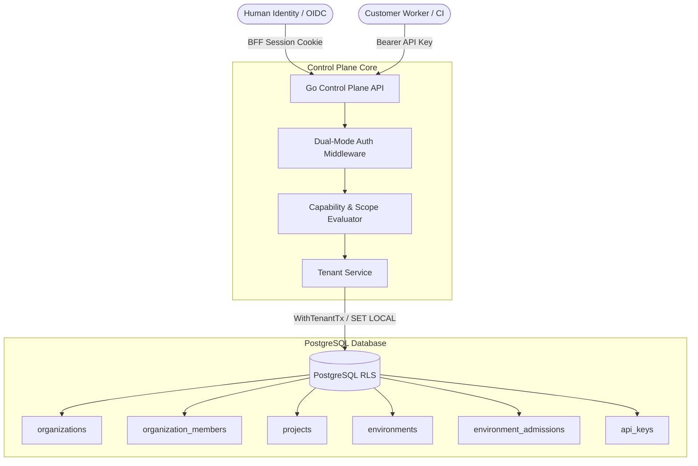
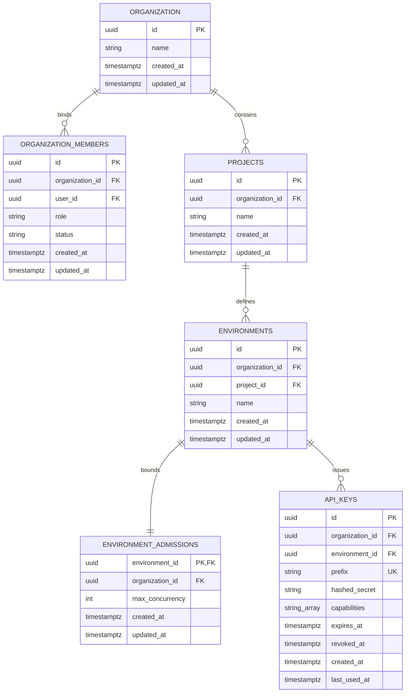

# Technical Specification: Tenant Management, RBAC, and Cryptographic API Keys (Issue #8)

> **Milestone:** M1 — Multi-Tenant Core & API Plane  
> **Target Branch:** `feat/m1-tenant-api-keys`  
> **Blueprint Traceability:** §18.1, §20, §24.1, §24.2, §24.3, §24.4, §32 (ADR-01, ADR-02, ADR-14)  
> **Core Invariants:** `INV-01`, `INV-14`, `REQ-SEC-01`, `REQ-PRODUCT-01`

---

## 1. Executive Summary

Issue #8 implements the foundational Control Plane domain logic, database security policies, and REST API surface for multi-tenant isolation, organization administration, project and environment hierarchy, and cryptographically secure machine credentials (API Keys).

This document details the exact technical contract, data models, cryptographic primitives, PostgreSQL Row Level Security (RLS) enforcement, Role-Based Access Control (RBAC) matrix, and API surface implemented in Deadbolt.

### Mutation idempotency

Every Issue #8 mutation requires `Idempotency-Key`. PostgreSQL `tenant_commands` is the replay authority, with a unique `(command_scope, idempotency_key)` boundary. The command claim, request-fingerprint check, domain mutation, outcome recording, and required audit write commit in one tenant transaction. An identical retry returns the recorded outcome without a second mutation; reusing the key with different method/path/body returns `409 IDEMPOTENCY_CONFLICT`. Storage errors fail closed. Audit events remain immutable observability records, not the idempotency store.

For API-key create and rotation, the plaintext secret is returned only by the first successful issuance. The durable command outcome contains only the redacted key resource; an identical replay returns that redacted outcome and can never recover the plaintext.



---

## 2. Multi-Tenant Domain Hierarchy

Deadbolt models customer tenant isolation using a strict hierarchical boundary:



### 2.1 Domain Entities

1. **Organization (`organizations`)**:
   - The top-level administrative and billing boundary.
   - All child entities are strictly scoped to one organization.
   - Created atomically with the creator bound as the initial `Owner`.

2. **Organization Member (`organization_members`)**:
   - Binds a human platform user (`user_id`) to an organization with a canonical role (`Viewer`, `Developer`, `Operator`, `Admin`, `Owner`).
   - Status is either `ACTIVE` or `SUSPENDED`.

3. **Project (`projects`)**:
   - A logical application or system namespace scoped to an organization.
   - Enforces unique project names per organization via `UNIQUE (organization_id, name)`.

4. **Environment (`environments`)**:
   - An isolated runtime execution boundary scoped to a project and organization.
   - Canonical environment names are strictly constrained to: `development`, `staging`, `production`.
   - Enforces composite foreign keys: `FOREIGN KEY (organization_id, project_id) REFERENCES projects(organization_id, id) ON DELETE CASCADE`.

5. **Environment Admissions (`environment_admissions`)**:
   - Stores the execution quota and concurrency ceiling per environment (`max_concurrency`, default: 10, minimum: 1).
   - Automatically provisioned upon environment creation to guarantee safe admission locking.

6. **API Key (`api_keys`)**:
   - A machine credential issued for headless CI/CD pipelines and self-hosted workers.
   - Strictly bound to **exactly one** environment (`environment_id`).
   - Contains explicit capability grants and lifetime limits.

---

## 3. Cryptographic API Key Lifecycle & Security Contract

Machine credentials in Deadbolt adhere to zero-trust principles defined in Blueprint §24.4 and ADR-14.

### 3.1 Plaintext Format & Entropy Analysis

$$\text{Plaintext API Key} = \underbrace{\text{db\_}\langle\text{env}\rangle\text{\_}\langle\text{8-hex}\rangle}_{\text{Prefix}} \text{\_} \underbrace{\text{Base64RawURL}(\text{Secret})}_{\ge 256\text{-bit Secret}}$$

- **Entropy:** Secret keys are generated by drawing 32 bytes (256 bits) from a cryptographically secure random number generator (`crypto/rand.Read`).
- **Prefix Component:** Composed of:
  - Fixed platform identifier: `db`
  - Target environment name: e.g. `production`, `staging`, `development`
  - 8-character hex disambiguation: 4 random bytes encoded to hex (e.g. `3f9a1b2c`)
- **Secret Component:** 32 random bytes encoded with unpadded Base64 URL-safe encoding (`base64.RawURLEncoding`), yielding a 43-character secret string.
- _Example:_ `db_production_3f9a1b2c_s7K8_d9L...`

### 3.2 One-Time Display & Database Storage

To eliminate database compromise risks (credential harvesting from SQL dumps or read replicas):

1. **Never Persist Plaintext:** Plaintext secrets are never stored in the database, never written to disk, and never logged.
2. **One-Time Display (`GeneratedKey`)**: The plaintext key is returned **strictly once** in the HTTP response of `POST /api/v1/environments/{envId}/api-keys`. It cannot be retrieved again.
3. **SHA-256 Hashing:** The database persists only:
   - `prefix`: Stored as plaintext with a global `UNIQUE (prefix)` index for fast $O(1)$ lookup.
   - `hashed_secret`: The 64-character lowercase hex digest of the SHA-256 cryptographic hash of the entire plaintext key:
     $$\text{hashed\_secret} = \text{hex}(\text{SHA-256}(\text{plaintextKey}))$$
4. **Timing-Safe Verification:** During authentication, candidate keys are hashed with SHA-256 and evaluated against `hashed_secret` using constant-time comparison (`subtle.ConstantTimeCompare`) to prevent timing side-channel attacks.

### 3.3 Strict Environment Binding

API keys belong to **exactly one environment**. An API key issued for `staging` cannot initiate runs or claim work in `production`. Any cross-environment request is rejected with `403 Forbidden` (`CROSS_TENANT_ACCESS_DENIED`).

### 3.4 Machine Key Capability Restrictions

Blueprint §24.2 mandates that sensitive human-in-the-loop decisions require an identifiable human actor:

- **Barred Capabilities:** Machine API keys **cannot** be granted `approvals:decide` (human approval decisions) or `runs:reconcile` (manual side-effect reconciliation).
- **Enforcement:** If a request attempts to generate an API key with either of these capabilities, the request is immediately rejected with `403 Forbidden` (`MACHINE_KEY_UNAUTHORIZED`).

### 3.5 Expiration & Revocation Mechanics

- **Default Lifetime:** Defaults to 90 days (`DefaultExpiryDays = 90`) unless explicitly configured.
- **Immediate Revocation:** Any key can be instantly revoked via `DELETE /api/v1/api-keys/{id}`. The timestamp is recorded in `revoked_at`.
- **Atomic Rotation & Privilege Escalation Defense:** API keys can be atomically rotated via `POST /api/v1/api-keys/{id}/rotate`. Rotation verifies that all capabilities of the target key are a subset of the caller's effective capabilities ($\text{targetCaps} \subseteq \text{callerCaps}$), rejecting privilege escalation attempts with `403 Forbidden` (`CAPABILITY_ELEVATION_FORBIDDEN`).
- **Last-Used Auditing:** Upon successful authentication, `last_used_at` is updated within the tenant transaction.

---

## 4. Role-Based Access Control (RBAC) & Defense-in-Depth

### 4.1 Canonical Roles & Capability Matrix (Blueprint §24.2)

Deadbolt enforces role-based access control across five canonical roles:

| Capability                       | Identifier                                                |  Viewer  | Developer | Operator |  Admin  |  Owner  |
| :------------------------------- | :-------------------------------------------------------- | :------: | :-------: | :------: | :-----: | :-----: |
| Read Status & History            | `runs:read`, `workflows:read`, `workers:read`, `org:read` | **Yes**  |  **Yes**  | **Yes**  | **Yes** | **Yes** |
| Read Payload & Logs              | `payload:read`                                            | **No**\* |  **Yes**  | **Yes**  | **Yes** | **Yes** |
| Run & Control Execution          | `runs:create`, `runs:control`                             |  **No**  |  **Yes**  | **Yes**  | **Yes** | **Yes** |
| Deploy to Staging                | `deployments:register`, `deployments:activate:staging`    |  **No**  |  **Yes**  | **Yes**  | **Yes** | **Yes** |
| Deploy to Production             | `deployments:activate:production`, `deployments:write`    |  **No**  |  **No**   | **Yes**  | **Yes** | **Yes** |
| Worker Drain                     | `workers:drain`                                           |  **No**  |  **No**   | **Yes**  | **Yes** | **Yes** |
| Human Approvals & Reconciliation | `approvals:decide`, `runs:reconcile`                      |  **No**  |  **No**   | **Yes**  | **Yes** | **Yes** |
| Manage Members & API Keys        | `admin:member`, `admin:key`, `admin:project`              |  **No**  |  **No**   |  **No**  | **Yes** | **Yes** |
| Modify Organization Settings     | `org:update`                                              |  **No**  |  **No**   |  **No**  | **Yes** | **Yes** |
| Delete Organization              | `org:delete`                                              |  **No**  |  **No**   |  **No**  | **No**  | **Yes** |

_\*Note: Viewers see execution state, timing, and sanitized error summaries. Inspecting sensitive business payloads, step inputs/outputs, artifacts, or execution logs requires the explicit `payload:read` capability._

### 4.2 Last Owner Defense

To prevent catastrophic tenant lockout (an organization with zero active owners):

1. **Demosi Ditolak:** Operasi `UpdateMemberRole` yang mengubah role seorang Owner menjadi non-Owner (misal `Admin` atau `Developer`) akan ditolak jika jumlah Owner aktif di organisasi tersebut $\le 1$ (`LAST_OWNER_DEMOTION_FORBIDDEN`).
2. **Penghapusan Ditolak:** Operasi `RemoveMember` yang menghapus seorang Owner akan ditolak jika jumlah Owner aktif $\le 1$ (`LAST_OWNER_REMOVAL_FORBIDDEN`).
3. **Succession Requirement:** Organisasi hanya dapat memindahkan kepemilikan dengan cara mengangkat Owner kedua terlebih dahulu sebelum mencabut status Owner pertama.

---

## 5. PostgreSQL Row Level Security (RLS) & Database Hardening

### 5.1 Fail-Closed RLS Policies

All tenant tables in PostgreSQL have Row Level Security enabled and forced:

```sql
ALTER TABLE organizations ENABLE ROW LEVEL SECURITY;
ALTER TABLE organizations FORCE ROW LEVEL SECURITY;

CREATE POLICY tenant_isolation_organizations ON organizations
    FOR ALL
    USING (id = app.current_organization_id())
    WITH CHECK (id = app.current_organization_id());
```

- **Transaction-Local Setting:** Every query executed by the control plane establishes the tenant context using transaction-local configuration:
  ```sql
  SELECT set_config('app.current_organization_id', $1, true);
  ```
  The third argument (`is_local = true`) ensures the setting is automatically cleared when the transaction commits or rolls back, preventing connection-pool contamination (Failure Mode F-27).
- **Fail-Closed Behavior:** If a connection queries a table without setting `app.current_organization_id`, the function returns `NULL`, causing `id = NULL` to evaluate to `false`. Zero rows are returned.
- **NOBYPASSRLS:** The runtime application user (`deadbolt_runtime`) does not possess `BYPASSRLS` privileges and cannot bypass security policies.

### 5.2 Restricted Discovery Functions (Blueprint §24.3)

Because RLS blocks cross-tenant queries, initial identity bootstrap and machine key lookups execute via narrowly scoped `SECURITY DEFINER` functions with fixed search paths:

1. **`app.discover_user_memberships(p_user_id UUID)`**:
   - Queries `organization_members` across tenants, returning only rows matching the verified `p_user_id`.
2. **`app.authenticate_api_key(p_prefix TEXT)`**:
   - Added in migration `00006_api_keys_lookup.sql`.
   - Locates the key metadata and `hashed_secret` by unique prefix across tenants without requiring pre-existing tenant context.
   - Only `deadbolt_runtime` is granted execute rights.

---

## 6. REST API Surface Reference

All endpoints are prefixed with `/api/v1`.

### 6.1 Authentication Headers

- **Machine Identity:** `Authorization: Bearer db_<env>_<8hex>_<secret>`
- **Human Identity:** Cookie `__Host-runtime_session` (Go BFF session) + header `X-Organization-ID: <uuid>`.
- **Dual-Mounted Routing:** To ensure strict compatibility with both OpenAPI specifications (`/api/v1/...`) and root v1 consumers (`/v1/...`), all routes are registered under both path prefixes.

### 6.2 Endpoint Catalog

| Method   | Path                                                 | Required Role / Capability      | Description                                                                  |
| :------- | :--------------------------------------------------- | :------------------------------ | :--------------------------------------------------------------------------- |
| `POST`   | `/api/v1/organizations`                              | Human Identity                  | Creates a new organization; assigns caller as `Owner`.                       |
| `GET`    | `/api/v1/organizations`                              | Human Identity                  | Lists all organizations where caller is an active member.                    |
| `GET`    | `/api/v1/organizations/{id}`                         | `CapOrgRead`                    | Gets organization metadata.                                                  |
| `PATCH`  | `/api/v1/organizations/{id}`                         | `CapOrgUpdate` (Admin/Owner)    | Updates organization name.                                                   |
| `DELETE` | `/api/v1/organizations/{id}`                         | `CapOrgDelete` (Owner only)     | Permanently deletes organization and cascades all data.                      |
| `GET`    | `/api/v1/organizations/{id}/members`                 | `CapOrgRead`                    | Lists organization members and roles.                                        |
| `POST`   | `/api/v1/organizations/{id}/members`                 | `CapAdminMember` (Admin/Owner)  | Adds a user to the organization.                                             |
| `PATCH`  | `/api/v1/organizations/{id}/members/{userId}`        | `CapAdminMember` (Admin/Owner)  | Updates member role (enforces serialized Last Owner defense).                |
| `PATCH`  | `/api/v1/organizations/{id}/members/{userId}/status` | `CapAdminMember` (Admin/Owner)  | Updates member status (`ACTIVE`/`SUSPENDED`, enforces Last Owner defense).   |
| `DELETE` | `/api/v1/organizations/{id}/members/{userId}`        | `CapAdminMember` (Admin/Owner)  | Removes a member (enforces serialized Last Owner defense).                   |
| `GET`    | `/api/v1/projects`                                   | `CapOrgRead`                    | Lists projects in the active organization.                                   |
| `POST`   | `/api/v1/projects`                                   | `CapAdminProject` (Admin/Owner) | Creates a new project in the active organization.                            |
| `GET`    | `/api/v1/projects/{projectId}/environments`          | `CapOrgRead`                    | Lists environments and concurrency quotas.                                   |
| `POST`   | `/api/v1/projects/{projectId}/environments`          | `CapAdminProject` (Admin/Owner) | Creates environment and provisions admission quota.                          |
| `POST`   | `/api/v1/environments/{envId}/api-keys`              | `CapAdminKey` (Admin/Owner)     | Generates a 256-bit API key (returns plaintext once).                        |
| `GET`    | `/api/v1/environments/{envId}/api-keys`              | `CapAdminKey` (Admin/Owner)     | Lists redacted API key summaries (no plaintext, no hash).                    |
| `POST`   | `/api/v1/api-keys/{id}/rotate`                       | `CapAdminKey` (Admin/Owner)     | Atomically revokes existing key and returns newly generated replacement key. |
| `DELETE` | `/api/v1/api-keys/{id}`                              | `CapAdminKey` (Admin/Owner)     | Revokes an API key immediately.                                              |
| `GET`    | `/api/v1/environments/{envId}/payload-preview`       | `CapPayloadRead`                | Demonstrates payload access protection for Viewers.                          |

### 6.3 Standardized OpenAPI 3.1.0 Error Envelope (Blueprint §20.1)

All error responses strictly adhere to the top-level schema contract defined in `contracts/openapi/control-plane.yaml`:

```json
{
  "code": "FORBIDDEN",
  "message": "Access denied",
  "requestId": "req_01j...",
  "details": {},
  "retryable": false
}
```

- `code`: Machine-readable SCREAMING_SNAKE_CASE code (e.g., `UNAUTHENTICATED`, `FORBIDDEN`, `ENVIRONMENT_MISMATCH`, `LAST_OWNER_DEMOTION_FORBIDDEN`).
- `message`: Human-readable description.
- `requestId`: Distributed tracing and log-correlation ID extracted from `X-Request-ID` or automatically generated via UUIDv7/v4.
- `details`: Structured payload map.
- `retryable`: Boolean indicator helping clients distinguish transient errors from permanent policy violations.

---

## 7. Hardening & Security Safeguards

### 7.1 Cross-Site Request Forgery (CSRF) and Origin Gate

State-mutating HTTP operations (`POST`, `PATCH`, `DELETE`) authenticated via ambient human session cookies require strict Origin and CSRF validation:

- The `Origin` header must match configured trusted origins (`AllowedOrigins`). Untrusted or absent origins trigger `403 ORIGIN_FORBIDDEN`.
- The `X-CSRF-Token` header must match the session's cryptographically bound CSRF token hash. Missing or invalid tokens trigger `403 CSRF_TOKEN_INVALID`.
- Headless Bearer API keys are explicitly exempted from ambient cookie CSRF checks.

### 7.2 Strict Environment Mismatch Prevention

API keys are permanently bound to a single environment (`development`, `staging`, or `production`). If a request authenticated by an API key specifies an environment (via path parameter `envId`, query parameter `environment`/`env_id`, or headers `X-Environment`/`X-Environment-ID`) that does not match the key's assigned environment, the request is immediately rejected with HTTP `403 Forbidden` (`ENVIRONMENT_MISMATCH`).

### 7.3 Concurrency Serialization for Last Owner Defense

To eliminate time-of-check to time-of-use (TOCTOU) race conditions when multiple administrators concurrently demote, suspend, or remove owners:

- All owner-affecting mutations execute within `WithTenantTx`.
- The transaction acquires a row-level lock on the organization record (`SELECT id FROM organizations WHERE id = $1 FOR UPDATE`).
- Parallel requests are fully serialized at the PostgreSQL engine level, guaranteeing that the active Owner count cannot drop below 1.

### 7.4 Timing Side-Channel Resistance & Write Throttling

- When authenticating API keys, unknown key prefixes trigger a constant-time dummy comparison (`DummyHash`) to prevent prefix enumeration via response-time variance.
- Updates to `last_used_at` timestamps are throttled to a minimum interval of 60 seconds per key, eliminating database row-lock contention under heavy parallel execution traffic.

### 7.5 Capability Elevation Defense (Blueprint §24.2)

- When an API key is created (by either a human user or an existing machine key with `admin:key`), the requested capabilities are validated to ensure $\text{requestedCapabilities} \subseteq \text{creatorEffectiveCapabilities}$.
- Creators cannot grant permissions they do not possess.
- Violations are rejected with HTTP `403 Forbidden` (`CAPABILITY_ELEVATION_FORBIDDEN` / `ErrCapabilityElevation`).

### 7.6 Authoritative Environment Scope on Resource IDs (Blueprint §20.1 & §24.3)

- On resource-ID-targeted routes lacking an explicit `/environments/{envId}` path prefix (such as `POST /api-keys/{id}/rotate` and `DELETE /api-keys/{id}`):
  - The control plane authoritatively resolves the target key's environment binding from PostgreSQL.
  - If the caller is a machine API key, the target key's environment must match the caller's scoped environment.
  - Cross-environment rotation or revocation attempts are rejected with HTTP `403 Forbidden` (`ENVIRONMENT_MISMATCH`).

### 7.7 Immutable Lifecycle Audit Trail (Blueprint §18.1 & §24.3)

- All API key mutations (`api_key.create`, `api_key.rotate`, `api_key.revoke`) append immutable audit events to the `audit_events` table within the same atomic database transaction (`WithTenantTx`).
- Plaintext secrets, entropy payloads, and cryptographic hashes are strictly excluded from audit event metadata.
- Audit records capture `organization_id`, `actor_id` (human user UUID or creator key UUID), `action`, `target_type: api_key`, `target_id`, `correlation_id` (`X-Request-ID`), and sanitized metadata (`key_id`, `environment_id`, `prefix`).

### 7.8 Internal Error Sanitization & Request Tracing (Blueprint §20.1 & §25.1)

- In compliance with RFC/OpenAPI 3.1.0 security hygiene, internal server errors (`500 Internal Server Error`) never expose raw backend driver messages or PostgreSQL stack traces to clients.
- Errors are logged server-side with structured fields and the active `requestId`.
- Clients receive a standardized, sanitized envelope:
  ```json
  {
    "code": "INTERNAL_SERVER_ERROR",
    "message": "An internal server error occurred",
    "requestId": "req_...",
    "details": {},
    "retryable": false
  }
  ```

### 7.9 Gate M0 Dependency Clarification

- Issue #8 builds upon the Foundation Contracts milestone (Gate M0, Pull Request #52).
- Tenant OpenAPI contracts in `contracts/openapi/control-plane.yaml` strictly declare `x-implemented: false` until their respective Milestone gates are promoted.
- The control plane codebase compiles cleanly and passes all local contract and parity checks without modifying M0 baseline artifacts.

---

## 8. Verification & Automated Test Results

The implementation is verified by 21 exhaustive integration test suites in [`tests/integration/tenant_test.go`](file:///d:/Project/Tf-low/tests/integration/tenant_test.go) executed against real PostgreSQL instances:

| #   | Suite                                       | Test Objective                                                                                                                                | Outcome  |
| --- | :------------------------------------------ | :-------------------------------------------------------------------------------------------------------------------------------------------- | :------: |
| 1   | `TestOrganizationBootstrapAndOwnerCreation` | Verifies atomic organization creation and binding of caller as active `Owner`.                                                                | **PASS** |
| 2   | `TestProjectAndEnvironmentProvisioning`     | Verifies project creation, `development`/`staging`/`production` environments, admission quota rows, and rejection of invalid names.           | **PASS** |
| 3   | `TestAPIKeyGenerationAndEntropy`            | Asserts 256-bit entropy (32 random bytes), `db_<env>_<8hex>` prefixing, SHA-256 hash persistence, and redacted summary output.                | **PASS** |
| 4   | `TestAPIKeyAuthenticationAndScoping`        | Tests successful authentication, timestamp updating on `last_used_at`, and rejection of tampered/unknown keys with `401 Unauthorized`.        | **PASS** |
| 5   | `TestExpiredAndRevokedAPIKeys`              | Asserts revoked keys fail with `API_KEY_REVOKED` and expired keys fail with `API_KEY_EXPIRED` (verified on DB row).                           | **PASS** |
| 6   | `TestCrossTenantDenial`                     | Validates that an API key or session from Org A cannot access or query resources from Org B (RLS zero rows & `403 Forbidden`).                | **PASS** |
| 7   | `TestRBACPermissionMatrix`                  | Verifies full capability matrix across all 5 canonical roles and verifies that `Viewer` cannot access payload endpoints (machine and human).  | **PASS** |
| 8   | `TestLastOwnerDefense`                      | Proves that demoting or removing the sole remaining active Owner fails with `LAST_OWNER_DEMOTION_FORBIDDEN` / `LAST_OWNER_REMOVAL_FORBIDDEN`. | **PASS** |
| 9   | `TestMachineKeyApprovalRestriction`         | Proves that attempting to create machine keys with `approvals:decide` or `runs:reconcile` fails with `MACHINE_KEY_UNAUTHORIZED`.              | **PASS** |
| 10  | `TestHTTPTenantEndpoints`                   | End-to-end HTTP validation for listing summaries and revoking API keys over REST.                                                             | **PASS** |
| 11  | `TestErrorEnvelopeFormat`                   | Validates canonical OpenAPI error envelope: `{ code, message, requestId, details, retryable }`.                                               | **PASS** |
| 12  | `TestEnvironmentMismatchRejection`          | Verifies 403 `ENVIRONMENT_MISMATCH` rejection across path parameter, query parameters, and request headers.                                   | **PASS** |
| 13  | `TestCSRFAndOriginEnforcementOnMutations`   | Tests that cookie-authenticated mutations without Origin or valid CSRF tokens fail with 403 `ORIGIN_FORBIDDEN` / `CSRF_TOKEN_INVALID`.        | **PASS** |
| 14  | `TestAPIKeyRotation`                        | Tests atomic key rotation via `POST /api/v1/api-keys/{id}/rotate`, revoking prior key and returning active replacement key.                   | **PASS** |
| 15  | `TestMemberStatusAndLastOwnerSuspension`    | Validates member status transitions (`ACTIVE`/`SUSPENDED`) and prevents suspending the sole remaining active Owner.                           | **PASS** |
| 16  | `TestLastOwnerDefenseConcurrentRace`        | Executes 10 concurrent goroutines attempting to remove owners; verifies serialized row-lock prevents orphan organization.                     | **PASS** |
| 17  | `TestAPIKeyLastUsedAtThrottling`            | Confirms high-frequency authentications update `last_used_at` with a 60-second cooldown window (asserted DB column does not advance).         | **PASS** |
| 18  | `TestDualRouteMounting`                     | Proves identical routing and security enforcement across `/api/v1/...` and `/v1/...` routes.                                                  | **PASS** |
| 19  | `TestCapabilityElevationForbidden`          | Tests capability elevation rejection in both direct service and HTTP endpoint (403 `CAPABILITY_ELEVATION_FORBIDDEN`).                         | **PASS** |
| 20  | `TestEnvironmentMismatchOnKeyLifecycle`     | Verifies machine callers cannot rotate or revoke keys outside their environment (403 `ENVIRONMENT_MISMATCH`).                                 | **PASS** |
| 21  | `TestAuditedKeyLifecycleEvents`             | Proves atomic append-only audit trail logging for create, rotate, and revoke events without secret leakage.                                   | **PASS** |

### Workspace Health Check

- All Tenant & RLS integration tests: **100% Passed (29/29 tests)**
- Full Auth integration tests: **100% Passed**
- Go compiler / vet (`go vet ./internal/tenant/... ./tests/integration/...`): **Clean (exit code 0)**
- Code formatting (`gofmt -l`): **100% compliant**
- OpenAPI Contract Validation: **100% compliant (`check-contracts.mjs` rules)**
