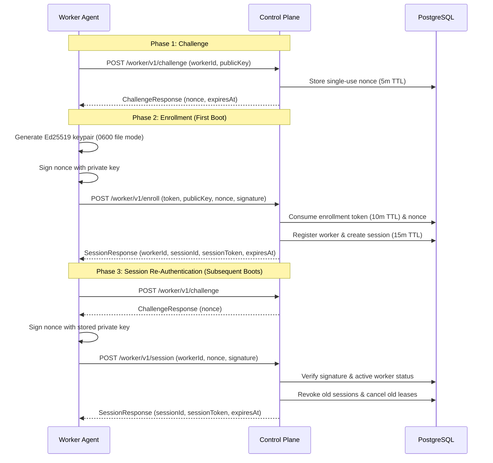
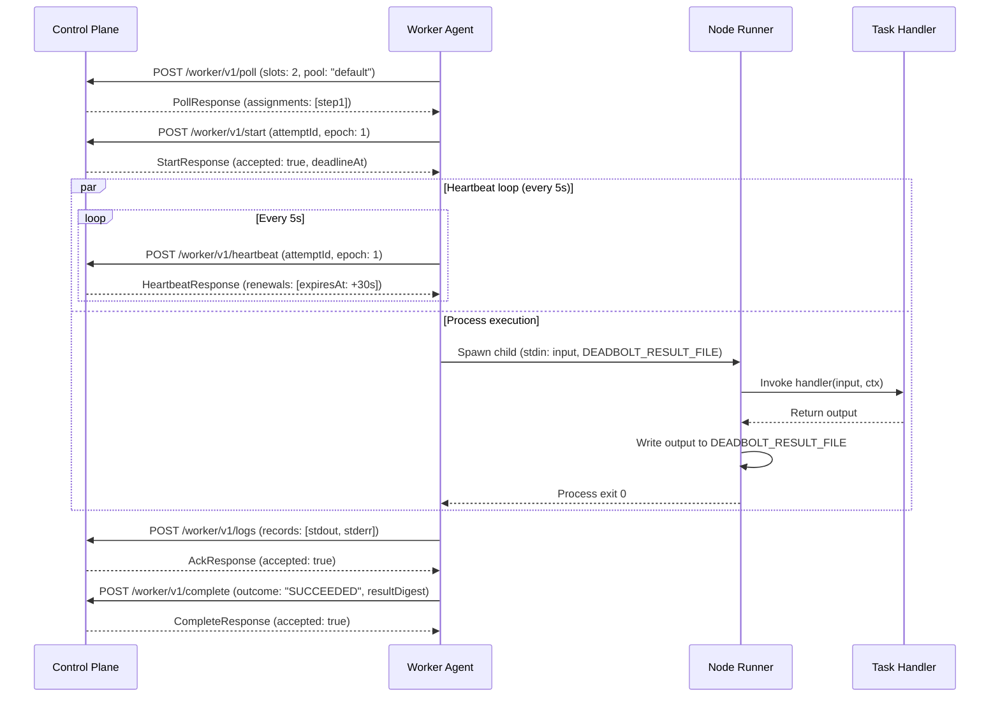

# Worker Agent and Execution Lifecycle

This document describes the customer-hosted worker agent, cryptographic enrollment, session management, runner transport, and execution isolation contracts per Blueprint §12, §13, §24 and Issue #11.

---

## 1. Network Boundary and Isolation

1. **Outbound HTTPS Only**:
   - Customer-hosted workers establish outbound HTTPS connections exclusively to `/worker/v1/...` on the Deadbolt control plane.
   - Workers expose **no public inbound listening ports**.
   - Workers have **no direct database (PostgreSQL) access** and **no direct NATS broker access**.
   - Unencrypted HTTP (`http://`) is strictly rejected by the agent unless communicating with loopback (`localhost`, `127.0.0.1`, `::1`) during local testing.

2. **Tenant and Environment Scoping**:
   - All worker assignments, session tokens, and claims are scoped strictly to one organization and environment.
   - Workers cannot query or claim assignments across tenant or environment boundaries.

---

## 2. Cryptographic Enrollment & Session Lifecycle

### 2.1 Enrollment Token Contract

- Created by an authorized member (`admin:key`, `admin:member`, or Role `Admin`/`Owner`) via `POST /api/v1/environments/{envId}/worker-enrollments`.
- Contains 256 bits of cryptographic entropy with a `dbt_` prefix.
- Stored as a cryptographic SHA-256 hash (`token_hash`).
- **Single-use**: Marked `used_at` upon successful enrollment. Replay attempts are immediately rejected.
- **Expiry**: Valid for strictly 10 minutes (`expires_at = created_at + 10m`).

### 2.2 Worker Keypair & Permissions

- The agent generates an **Ed25519** keypair (`crypto/ed25519`).
- The private key is saved to disk with strict **`0600`** permissions (read/write only by the owning user).
- On startup, the agent verifies file permissions. If permissions allow group or other access (on POSIX systems), startup is halted with `INSECURE_KEY_PERMISSIONS`.

### 2.3 Challenge Nonce & Proof of Possession

- The agent calls `POST /worker/v1/challenge` before enrolling or re-authenticating.
- Nonces are 32-byte cryptographically random hex strings with a 5-minute TTL.
- Nonces are strictly single-use; the database marks them consumed upon first verification.
- The worker proves possession of its private key by signing the challenge message (`deadbolt-challenge:<nonce>`).

### 2.4 Session Tokens & Revocation

- Session tokens are valid for **15 minutes** (`expires_at = created_at + 15m`).
- Authenticated requests pass the session token via `Authorization: Bearer <sessionToken>`.
- The agent proactively refreshes its session before expiration.
- **Revocation**:
  - Admin/Owner revocation (`POST /api/v1/workers/{workerId}/revoke`) marks the worker `REVOKED`, revokes all active sessions (`revoked_at = clock_timestamp()`), and drops active leases.
  - Revoked workers receive HTTP 403 `WORKER_REVOKED` and halt execution immediately.
  - Reconnecting creates a fresh session; old sessions are revoked and active leases from prior sessions are removed.

---

## 3. Worker Execution & Runner Protocol

### 3.1 Process Isolation

- **One Process per Attempt**: Each attempt spawns exactly one isolated Node.js child process group.
- **Dedicated Result Channel**: The runner writes the authoritative result JSON to a dedicated temporary file specified via `DEADBOLT_RESULT_FILE`.
- **Log Streaming**: Runner `stdout` and `stderr` are captured separately as unstructured log streams. Arbitrary text printed to stdout is **never parsed as completion**.
- **Log Batching**: Captured logs are redacted and shipped asynchronously to `POST /worker/v1/logs`.

### 3.2 Task Secrets & Environment Allowlisting

- Customer task secrets reside solely on customer-hosted workers.
- The control plane **never stores task credentials**.
- The worker agent filters the parent process environment before spawning the child process:
  - System variables (`PATH`, `NODE_PATH`, `TEMP`, etc.) are preserved.
  - Sensitive parent keywords (`TOKEN`, `SECRET`, `PASSWORD`, `DATABASE_URL`, etc.) are **blocked**.
  - Only variables explicitly declared in the deployment manifest task definition are injected into the child process.

### 3.3 Bundle Verification

- Task bundles are packaged as immutable tar archives.
- Before execution, the agent validates:
  1. **Digest**: Computes SHA-256 and verifies it matches `bundleDigest`.
  2. **Architecture**: Confirms `targetArchitecture` matches the host architecture (`amd64` or `arm64`).

---

## 4. Lease Management & Monotonic Fencing

1. **Lease TTL and Heartbeat**:
   - Default lease TTL is **30 seconds**.
   - The worker sends a heartbeat every **5 seconds** via `POST /worker/v1/heartbeat`.
   - The control plane extends the lease by 30 seconds upon each valid heartbeat.

2. **Monotonic Local Budget (`RTT - 2s`)**:
   - The worker agent tracks lease expiration using a monotonic clock relative to the server's renewal ACK.
   - The agent enforces a safety margin of **round-trip time (RTT) + 2 seconds**.
   - If a heartbeat renewal is not received before this safety boundary, the agent terminates the child process group (SIGTERM, followed by SIGKILL after 10s grace).

3. **Start Deadline & Idempotent Start Retry**:
   - The server accepts `POST /worker/v1/start` strictly within **5 seconds** of assignment claim (`claimStartDeadlineAt`).
   - If a network partition occurs during Start, the agent retries the identical Start request.
   - If already marked `RUNNING`, the server idempotently returns the original stored deadline **without altering or extending the deadline**.

4. **Fencing Tokens (Ownership Epoch)**:
   - The ownership epoch increments on every attempt.
   - All mutations (`Start`, `Heartbeat`, `Complete`, `StopAck`) validate `(attemptId, ownershipEpoch, sessionId)`.
   - Late completions from expired leases or old sessions return HTTP 409 `STALE_OWNERSHIP` and are rejected.

5. **Stop Commands**:
   - If an attempt is cancelled or its lease is expired by the server, `HeartbeatResponse` includes a `StopCommand`.
   - The agent immediately terminates the child process group and submits `POST /worker/v1/stop-ack`.

---

## 5. Graceful Drain & Shutdown

- When receiving `SIGINT` or `SIGTERM`, or when instructed via `POST /api/v1/workers/{workerId}/drain`:
  - The worker transitions to `DRAINING`.
  - Polling for new assignments ceases immediately.
  - Active attempts are granted a deployment grace period (default **60 seconds**) to complete.
  - If attempts exceed the grace period, the agent forcefully terminates lingering processes and exits.
