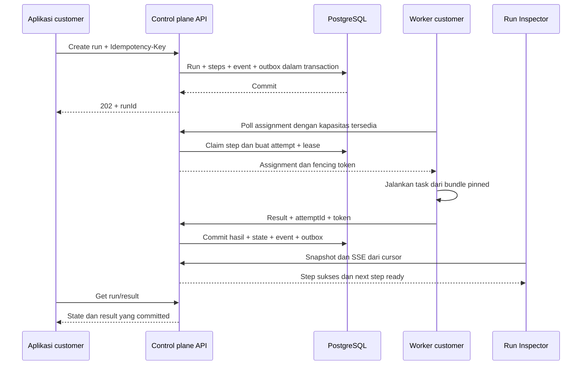
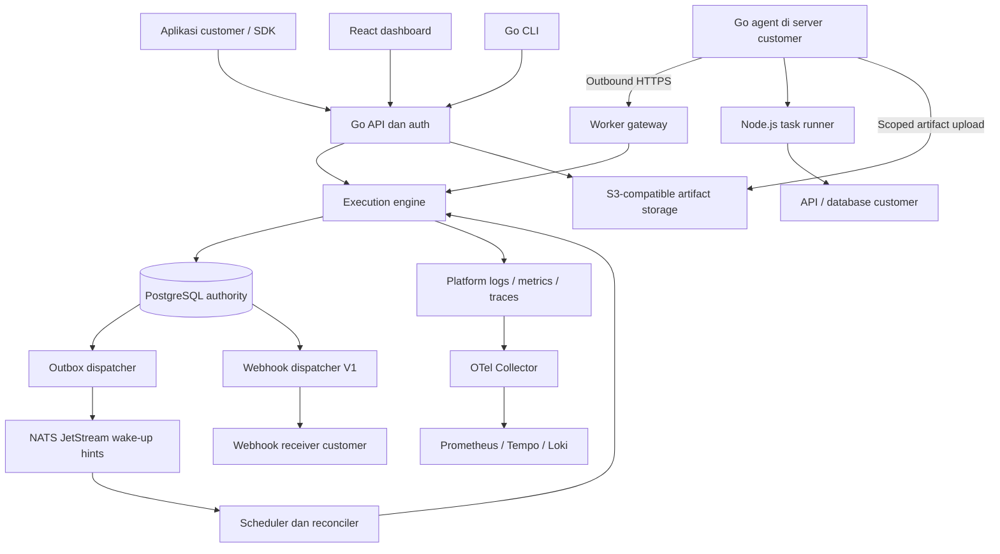
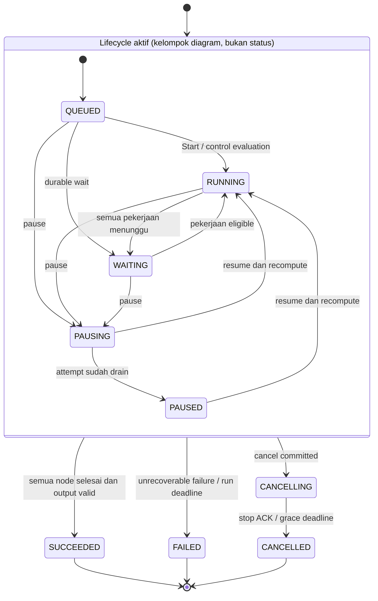
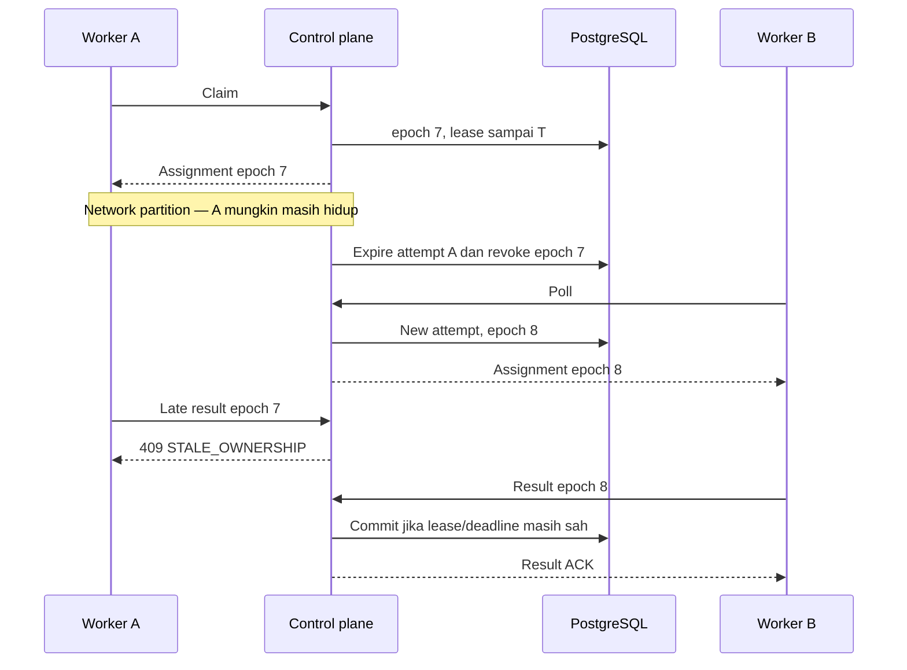
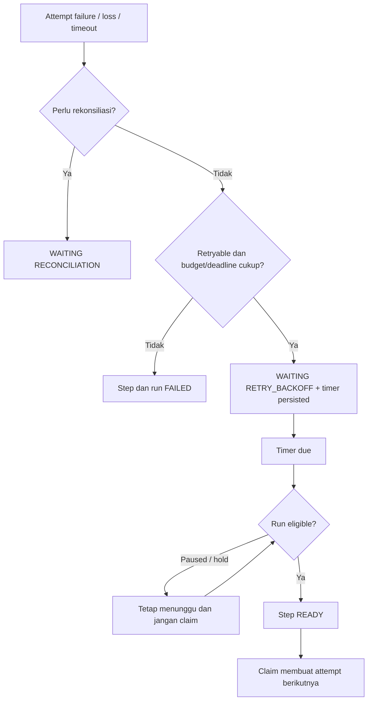
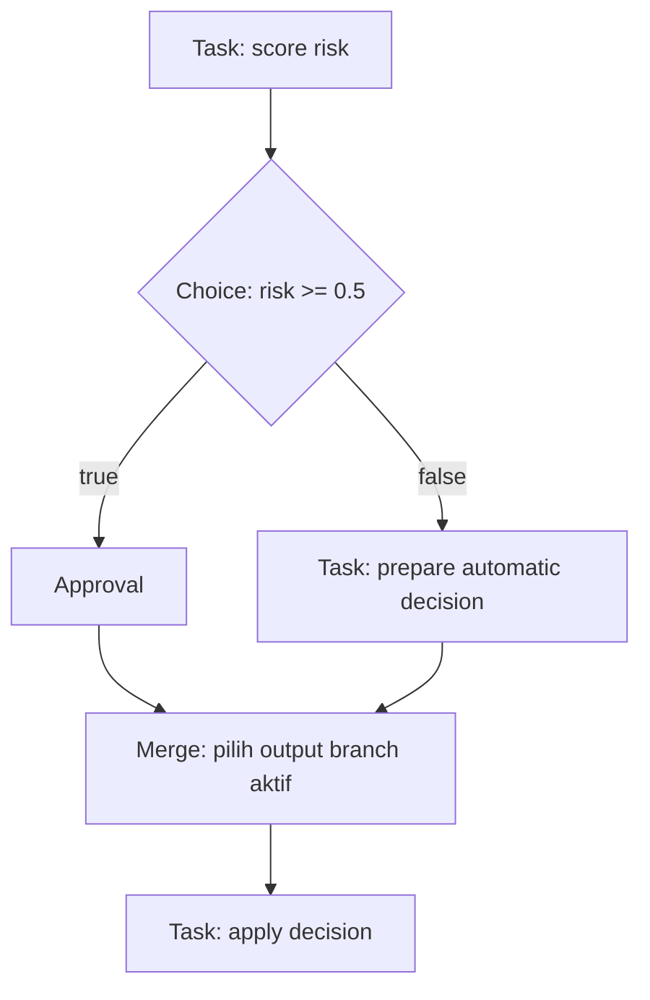
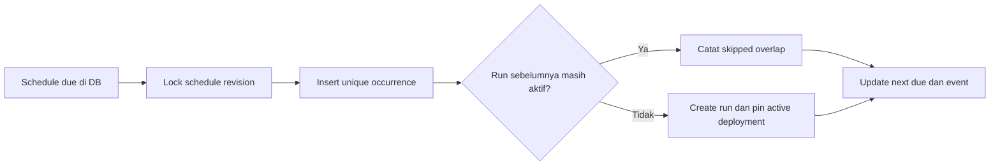
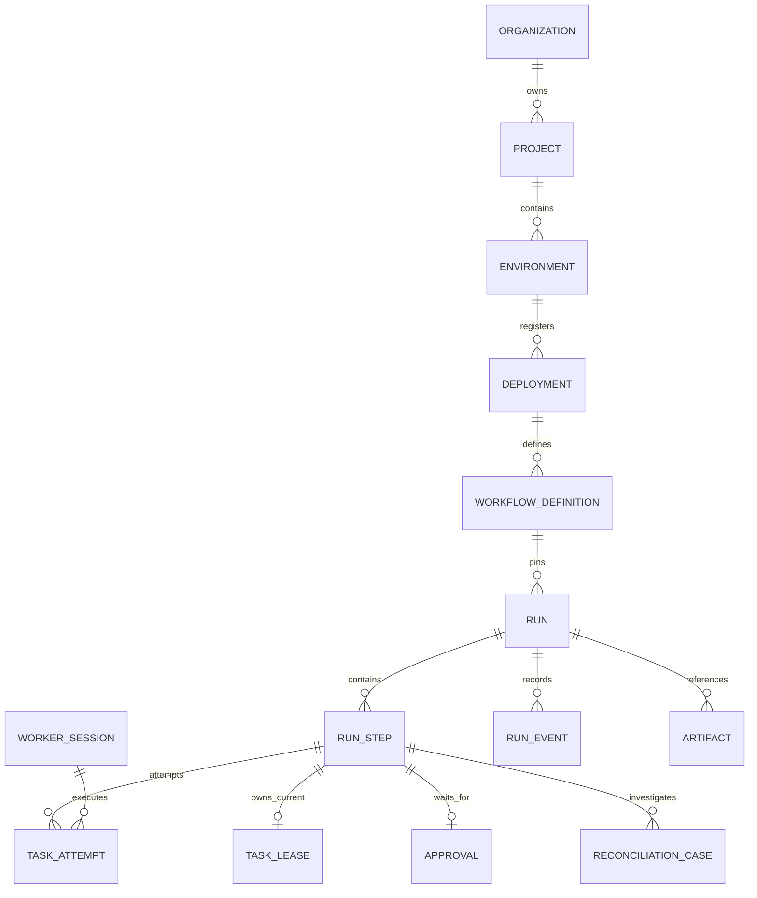
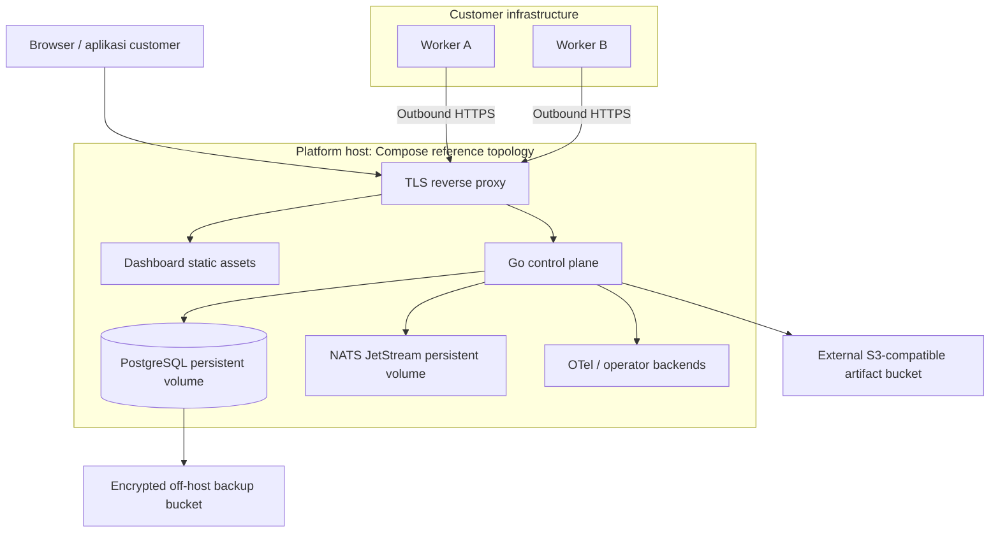
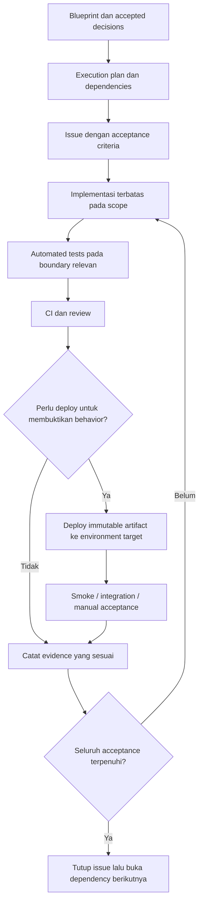

# Runtime Cloud — Product & Engineering Blueprint v1.0

> **Status:** baseline desain sebelum development, 10 September 2026. Dokumen ini menetapkan kontrak produk dan engineering; bukan klaim bahwa sistem sudah dibuat, diuji, atau siap produksi.
>
> **Product promise:** developer mendefinisikan pekerjaan dan alurnya. Runtime Cloud menyimpan kemajuan secara durable, mengoordinasikan worker, dan memulihkan execution berdasarkan aturan yang dapat diperiksa. Pekerjaan yang sudah tercatat sukses tidak otomatis diulang. Side effect eksternal tetap membutuhkan idempotency atau rekonsiliasi.
>
> **Keputusan utama:** hosted control plane, customer-hosted workers, TypeScript tasks, workflow berupa declarative DAG, PostgreSQL sebagai authority, dan satu region control plane untuk MVP/V1. Tidak ada replay fungsi JavaScript arbitrer atau eksekusi kode customer di server platform pada scope ini.

## Cara memakai blueprint ini

Baca Bagian 1–9 untuk memahami produk dan satu execution lengkap. Bagian 10–23 menjelaskan kontrak runtime, developer platform, dan pengalaman pengguna. Bagian 24–30 menjelaskan keamanan, operasi, scope rilis, dan urutan pembangunan. Bagian 31–34 menyediakan aturan penurunan menjadi execution plan, decision register, eksperimen, dan pemeriksaan konsistensi.

Kata **wajib** berarti acceptance requirement. **Default** adalah perilaku bawaan yang tetap diuji; perubahan konfigurasi hanya boleh berada dalam batas yang didokumentasikan. **Target** adalah sasaran yang harus diukur sebelum menjadi janji layanan. **Later** berarti tidak masuk MVP/V1 dan tidak boleh muncul seolah sudah tersedia di SDK atau onboarding.

Keputusan dalam dokumen ini menjadi source of truth. Execution plan mengatur pekerjaan untuk mewujudkannya, bukan mengubah kontraknya secara diam-diam. Perubahan fundamental harus memperbarui blueprint, decision record, kontrak, dan test yang terdampak sebelum implementation issue diteruskan.

---

## 1. Produk yang kita bangun

Runtime Cloud adalah developer infrastructure untuk **durable workflow execution**: menjalankan rangkaian pekerjaan yang kemajuannya tetap diketahui walaupun proses mati, request timeout, worker berpindah, atau workflow menunggu keputusan manusia.

Contoh pekerjaan:

```text
Terima permintaan riset
→ cari sumber
→ ekstrak isi
→ analisis
→ minta approval
→ buat laporan
→ beri tahu aplikasi customer
```

Developer tetap menulis business logic: bagaimana mencari sumber, memanggil model, atau menyusun laporan. Platform menangani pencatatan execution, penjadwalan, retry, timeout, koordinasi worker, waiting, dan diagnosis kegagalan.

Durable tidak berarti setiap pekerjaan pasti berhasil. API eksternal bisa terus gagal, input bisa salah, dan customer bisa membatalkan run. Durable berarti keputusan dan kemajuan yang sudah committed tidak hilang hanya karena proses restart, serta sistem mempunyai langkah berikutnya yang eksplisit: lanjut, tunggu, retry, gagal, batal, atau meminta rekonsiliasi.

Kita tidak menjanjikan arbitrary external side effects exactly-once. Kita juga tidak menyediakan visual no-code builder, hosting aplikasi umum, LLM gateway, atau pengganti seluruh observability stack.

### 1.1 Pengguna awal dan problem utamanya

Pengguna awal adalah backend/AI engineer di tim SaaS kecil yang sudah bisa menjalankan Node.js worker, tetapi mulai kesulitan mengelola background workflow beberapa langkah. Use case utama adalah **document/research processing yang dapat membutuhkan approval**, dengan task HTTP/AI yang sebagian aman diulang.

Masalah yang mereka alami:

- Request aplikasi selesai lebih cepat daripada pekerjaan background.
- Mereka tidak tahu step mana sudah selesai ketika worker restart.
- Retry bisa menggandakan side effect.
- Error tersebar di logs tanpa hubungan dengan execution tertentu.
- Approval disimpan terpisah dari proses yang menunggunya.
- Deployment baru berisiko mengubah perilaku run lama.

Platform engineer, data pipeline, billing, media processing, dan agent orchestration adalah arah ekspansi. Billing bukan demo pertama karena konsekuensi side effect finansial membutuhkan integrasi idempotency dan prosedur rekonsiliasi yang benar-benar terbukti.

### 1.2 Nilai produk yang akan dibuktikan

Developer harus bisa menjawab dari satu Run Inspector: pekerjaan ini berhenti di mana, mengapa, siapa yang sedang mengerjakannya, kapan sistem mencoba lagi, dan tindakan apa yang aman dilakukan.

Target evaluasi onboarding V1: engineer yang memahami TypeScript dapat menjalankan contoh lokal lalu menghubungkan dua worker staging dalam 30 menit menggunakan dokumentasi. Ukur time-to-first-successful-run dan time-to-first-recovered-run dalam uji pengguna; angka ini target produk, bukan hasil yang sudah dicapai.

Kita tidak mengklaim unggul atas produk lain tanpa evaluasi. Diferensiasi yang dikejar adalah model declarative yang dapat diperiksa, customer-owned compute, dan diagnosis recovery yang jelas. Validasi dengan pengguna awal tetap diperlukan sebelum investasi cloud execution.

## 2. Batas janji dan model tanggung jawab

| Pihak | Bertanggung jawab atas |
|---|---|
| Runtime Cloud | State yang committed, schedule, ownership, retry policy, history, isolasi tenant platform, API, dan dashboard |
| Customer | Kebenaran task, akses API eksternal, kapasitas worker, versi kode yang diperlukan, idempotency side effect, dan backup sistem customer |
| External provider | Perilaku API serta jaminan idempotency/retention yang mereka dokumentasikan |

Task dapat dieksekusi lebih dari sekali. Bahkan dua proses dapat sementara melakukan pekerjaan yang sama ketika terjadi network partition. Platform hanya menerima hasil dari ownership yang masih sah; ini tidak otomatis membatalkan request eksternal dari proses lama.

Kemajuan yang belum committed dapat hilang. Tidak ada pemulihan instruction pointer di tengah fungsi task. Jika task aman diulang, attempt berikutnya memulai fungsi itu dari awal. Untuk pekerjaan panjang, developer membaginya menjadi task lebih kecil dengan output durable, atau mengelola checkpoint aplikasi sendiri.

Output dan input melewati control plane walaupun kode serta secrets berada di worker customer. Customer-hosted execution tidak berarti seluruh data tetap di jaringan customer. Hal ini harus terlihat pada onboarding dan dokumentasi data handling.

## 3. Scope rilis dan keputusan awal

| Dimensi | Foundation / MVP | V1 / Flagship | Later |
|---|---|---|---|
| Compute customer | Dua self-hosted workers | Worker pools dan lifecycle yang matang | Managed cloud workers |
| SDK | TypeScript, task dan static DAG | Choice/merge, approval, delay, schedules | Python, dynamic map, loop, child workflow |
| Alur | Linear task DAG | Parallel dan structured conditional DAG | Replay workflow code arbitrer jika terbukti dibutuhkan |
| Reliability | Outbox, lease, fencing, retry, timeout, reconciliation | Full control actions dan operational hardening | HA lintas zona/region |
| UI | Runs, step/attempt/event, worker, recovery | Onboarding, approvals, versions, schedules, failure explorer | Advanced analytics |
| Developer tools | Local stack, register manifest, start worker, run/inspect | CLI lengkap dan dokumentasi SDK | Hosted builds/artifact distribution |
| Secrets task | Lokal pada worker customer | Tetap lokal pada worker customer | Managed task secret service |
| Platform | Satu region, Compose reference deployment | Hardened single-region private/public beta sesuai release gates | Kubernetes, Firecracker, multi-region |

Foundation adalah infrastruktur pembangunan. MVP berarti core value sudah dibuktikan end-to-end. V1 berarti pengalaman produk dan operasi untuk lingkup yang dinyatakan sudah lengkap. V1 bukan otomatis enterprise-ready atau high availability.

Security fundamental tidak ditunda demi urutan prioritas. Tidak ada hosted beta dengan tenant isolation, transport encryption, atau authorization yang sengaja belum selesai.

## 4. Perjalanan developer

### 4.1 Local-first

1. Developer memasang CLI dan TypeScript SDK dari versi yang kompatibel.
2. `runtime init` membuat project contoh, schema, task, workflow, dan konfigurasi non-secret.
3. `runtime dev` memulai stack lokal melalui Docker Compose dan worker lokal. Docker merupakan prerequisite yang diperiksa CLI.
4. Developer trigger run, membuka inspector lokal, lalu mematikan satu worker untuk melihat recovery.
5. Development lokal tidak memerlukan akun cloud atau mengirim telemetry/payload ke cloud secara default.

### 4.2 Menghubungkan ke hosted control plane

1. Developer login melalui browser, memilih organization, project, dan environment `staging`.
2. CLI memvalidasi dan membangun kode task secara lokal menjadi bundle menggunakan pinned Node.js toolchain dan package lock customer; prerequisite ini diperiksa `runtime doctor`. CLI mengekspor manifest DAG, schema, policy, serta SHA-256 bundle.
3. `runtime deploy --env staging` **mendaftarkan immutable deployment manifest**, bukan mengunggah atau menjalankan kode di platform.
4. Customer mendistribusikan bundle yang sama ke dua worker menggunakan mekanisme deployment mereka sendiri. Worker memverifikasi checksum dan mengiklankan deployment yang tersedia.
5. Deployment berstatus `AVAILABLE` ketika setidaknya satu worker kompatibel terhubung. Aktivasi production memerlukan preflight dua worker untuk target recovery; override satu worker hanya di dev/staging dengan penjelasan bahwa failover belum tersedia.
6. `runtime deployments activate <deploymentId>` memindahkan pointer aktif untuk run baru. Run lama tetap pinned ke deployment sebelumnya.
7. Backend aplikasi memanggil API create-run menggunakan environment-scoped API key.
8. Developer memantau inspector. Aplikasi memperoleh status/result melalui polling SDK atau webhook pada V1.

CLI membedakan `REGISTERED`, `AVAILABLE`, dan `ACTIVE`. Tidak boleh menulis “production ready” hanya karena manifest berhasil disimpan. Availability adalah kondisi worker saat ini; pointer aktif dapat tetap menunjuk deployment yang sedang tidak memiliki worker, dengan warning yang jelas.

### 4.3 Happy path dan pengalaman recovery



Browser tidak mengambil state dari worker. SDK, dashboard, dan webhook membaca keputusan control plane yang sudah committed. Jika koneksi worker putus, UI menunjukkan attempt yang lease-nya sedang berlaku, lalu expiry/recovery setelah keputusan itu benar-benar terjadi.

## 5. Mental model dan istilah inti

| Istilah | Arti di Runtime Cloud |
|---|---|
| Organization | Tenant dan batas kepemilikan platform |
| Project | Kelompok workflow dan worker milik organisasi |
| Environment | Isolasi `development`, `staging`, atau `production`; key dan assignment tidak lintas environment |
| Task definition | Nama pekerjaan, schema, policy, dan entrypoint dalam bundle |
| Workflow definition | Declarative DAG berisi node, dependency, input mapping, dan output mapping |
| Deployment | Manifest immutable, bundle digest, runtime/protocol version, serta workflow/task definitions |
| Run | Satu execution workflow dengan input dan deployment pinned |
| Step | Satu node logis dalam run; memiliki identitas stabil |
| Attempt | Satu usaha mengeksekusi task step; retry membuat attempt baru |
| Worker agent | Program Go di infrastruktur customer yang mengelola assignment dan child process |
| Task runner | Proses Node.js yang menjalankan satu task attempt |
| Control plane | API dan pengambil keputusan scheduling/state; tidak mengeksekusi kode customer |
| Execution plane | Worker customer dan task runner yang melakukan pekerjaan nyata |
| Checkpoint | Boundary hasil step yang sudah committed; bukan snapshot memory task |
| Lease | Hak sementara sebuah attempt atas step, dengan expiry |
| Fencing token | Nomor generasi ownership yang membuat hasil pemilik lama dapat ditolak |
| Reconciliation | Membandingkan state tersimpan dengan kenyataan lalu memperbaiki keadaan yang tertinggal atau ambigu |

Nama task yang sama boleh muncul sebagai beberapa node berbeda. `send-to-owner` dan `send-to-reviewer` dapat memanggil task `send-email` yang sama, tetapi keduanya memiliki step ID dan operation ID berbeda.

## 6. Execution model: declarative DAG

### 6.1 Keputusan dan alasannya

Workflow di MVP/V1 adalah data deklaratif yang disimpan sebagai JSON tervalidasi. TypeScript menyediakan builder dengan type checking, tetapi output builder tetap graph yang bisa dibaca Go tanpa menjalankan JavaScript customer.

DAG adalah directed acyclic graph: node punya arah dependency dan tidak membentuk siklus. Node berikutnya dapat berjalan ketika aturan dependency terpenuhi. Karena alur tersimpan, scheduler yang restart cukup membaca graph dan step state; tidak perlu menghidupkan kembali fungsi `async` yang terputus.

Trade-off: developer tidak dapat menulis arbitrary `await`, loop berdasarkan hasil runtime, atau I/O langsung dalam fungsi workflow. Semua pekerjaan nyata ditempatkan di task. Ini membatasi fleksibilitas, tetapi mengurangi risiko replay nondeterminism dan membuat graph di dashboard sesuai graph yang benar-benar dieksekusi.

Menggunakan replay merupakan alternatif sah, tetapi bukan arsitektur rilis ini. Temporal menunjukkan pendekatan pemulihan melalui history/replay; Runtime Cloud memilih declarative graph sehingga kontrak SDK dan engine tidak berpura-pura memiliki kemampuan replay. [Referensi replay](https://github.com/temporalio/documentation/blob/main/docs/encyclopedia/workflow/workflow-execution/workflow-execution.mdx).

### 6.2 Contoh SDK yang menjadi kontrak desain

Contoh berikut adalah API target, belum package yang tersedia. Implementation wajib mempertahankan semantics ini; detail ergonomi dapat disempurnakan lewat contract test tanpa mengganti execution model.

```ts
import { defineTask, defineWorkflow, input, output } from "@runtime/sdk";

export const search = defineTask({
  name: "search-web",
  inputSchema: { type: "object", properties: { query: { type: "string" } },
    required: ["query"], additionalProperties: false },
  outputSchema: { type: "object", properties: { pages: {
    type: "array", items: { type: "string" } } },
    required: ["pages"], additionalProperties: false },
  recovery: "safe", // customer menyatakan pekerjaan aman diulang
  retry: { maxAttempts: 3, initialDelayMs: 1000, maxDelayMs: 30000 },
  timeoutMs: 60000,
  handler: async ({ query }, ctx) => {
    return { pages: await searchProvider(query, { signal: ctx.signal }) };
  },
});

export const research = defineWorkflow({
  name: "research-report",
  inputSchema: { type: "object", properties: { query: { type: "string" } },
    required: ["query"], additionalProperties: false },
  nodes: [
    { id: "search", type: "task", task: search,
      input: { query: input("/query") } },
    { id: "analyze", type: "task", task: "analyze-pages", after: ["search"],
      input: { pages: output("search", "/pages") } },
    { id: "report", type: "task", task: "generate-report", after: ["analyze"],
      input: { analysis: output("analyze", "/analysis") } },
  ],
  output: { reportUrl: output("report", "/reportUrl") },
  outputSchema: { type: "object", properties: { reportUrl: { type: "string" } },
    required: ["reportUrl"], additionalProperties: false },
});
```

`analyze-pages` dan `generate-report` juga wajib didefinisikan dalam bundle yang sama; potongan ini hanya menampilkan satu handler. CLI menolak task reference yang tidak ditemukan.

`input()` dan `output()` menghasilkan reference descriptors, bukan membaca data saat build. Format manifest memakai tagged objects (`$ref: "run.input"` atau `$ref: "step.output"`, `stepId`, `pointer`) dengan JSON Pointer. Literal object dibedakan melalui tagged `literal` bila memakai reserved key. Builder dan engine wajib mempunyai shared test vectors untuk encoding ini.

Run dibuat dari backend customer:

```ts
const run = await client.runs.create({
  workflow: "research-report",
  environment: "staging",
  input: { query: "pasar software otomasi" },
  idempotencyKey: requestId,
});
// HTTP 202 berarti accepted dan persisted, bukan workflow sudah selesai.
console.log(run.id);
```

### 6.3 Validasi dan batas bahasa workflow

- Node ID unik dan immutable dalam satu deployment; task names hanya referensi, bukan operation identity.
- Graph harus acyclic dan seluruh node terjangkau dari entry dependency. Dependency output wajib menunjuk ancestor yang valid.
- Schema memakai subset JSON Schema 2020-12 yang dikunci: object, array, string, boolean, null, integer/number, required, enum, const, oneOf untuk tagged unions, bounds, dan additionalProperties. Semua schema `$ref`, custom code, dan format assertion tidak didukung pada MVP/V1; builder meng-inline reusable schema. Schema/payload nesting dibatasi 32 level dan schema per definition maksimal 64 KiB. Tagged `$ref` milik input mapping adalah format Runtime Cloud yang berbeda dari JSON Schema `$ref`.
- Input/output berupa UTF-8 JSON. Tidak ada `undefined`, NaN, Infinity, Date object, BigInt, atau binary inline. Integer interoperabel dibatasi safe integer JavaScript; decimal presisi tinggi dikirim string.
- Missing field berbeda dari null. Mapping wajib gagal dengan `INPUT_MAPPING_ERROR` jika field tidak ada kecuali descriptor memiliki default eksplisit.
- Runtime input tidak boleh mengubah struktur graph. Static fan-out boleh dihasilkan saat build dan harus berada dalam batas node count.
- JSON expression untuk choice hanya `eq`, `neq`, `gt`, `gte`, `lt`, `lte`, `in`, `exists`, `and`, `or`, `not`; tanpa eval, network, random, atau waktu sistem. Perbandingan type mismatch menghasilkan validation error, bukan coercion.
- Semua schema, timeout, retry, recovery policy, dan graph dipin dalam deployment. Mengubahnya membuat deployment baru.
- Capability MVP menerima graph linear berisi task saja: satu root dan maksimum satu predecessor/successor per node. Parallel, choice, merge, approval, dan user delay ditolak dengan `UNSUPPORTED_CAPABILITY` sampai milestone terkait dirilis; field kontraknya boleh sudah tersedia tanpa mengiklankan fitur aktif.
- Graph wajib nonempty, maksimal node count sesuai scope, dan output mapping harus menunjuk nilai yang pasti tersedia. Semua leaf wajib terhubung dengan hasil atau dinyatakan sebagai explicit side-effect leaf; tidak ada silently orphaned branch.

## 7. Arsitektur dan tanggung jawab komponen



Diagram memisahkan tanggung jawab, bukan deployment microservices. MVP/V1 menjalankan API, gateway, engine, scheduler, reconciler, outbox, SSE, dan webhook dispatcher sebagai modul dalam **satu Go control-plane binary**. Loop berjalan terpisah tetapi memakai fungsi transition engine yang sama.

| Komponen | Tanggung jawab | Larangan |
|---|---|---|
| API | Auth, validation, idempotency, request/result contract | Mengubah status dengan SQL ad-hoc di luar engine |
| Engine | Menilai transition dan commit atomik | Menjalankan business code customer |
| Scheduler | Mengaktifkan node/deadline/timer yang due | Menyimpan schedule authoritative di memory |
| Reconciler | Mendeteksi ready work, lease expiry, dan state tertinggal | Mengulang side effect eksternal tanpa recovery policy |
| Gateway | Session worker, poll, claim, heartbeat, completion | Memberi worker credential database/broker |
| Outbox dispatcher | Mengirim notification/event setelah commit | Menjadikan publish sebagai bukti task selesai |
| Worker agent | Memverifikasi bundle, menjalankan runner, mengirim hasil | Memutuskan sendiri task berikutnya atau sukses final |
| Webhook dispatcher | Delivery event dengan retry dan security policy | Bergantung pada customer worker untuk mengirim event |
| Dashboard | Menjelaskan committed state dan tindakan sah | Menebak terminal status dari hilangnya koneksi |

### 7.1 Stack yang dipakai

Go dipilih karena coordination membutuhkan banyak I/O concurrent, timers, dan proses background dengan deployment binary yang sederhana. Goroutine membantu struktur concurrency tetapi tidak menggantikan transaction, lease, atau fencing. Rust/C++ tidak dipilih untuk core awal karena kita belum mempunyai kebutuhan yang membenarkan complexity tambahan; TypeScript dipakai pada workload developer dan UI agar pengalaman integrasinya familiar.

Go untuk control plane, agent, CLI; PostgreSQL untuk durable state; NATS JetStream untuk notification transport; TypeScript/Node.js untuk task; React + Vite + TanStack Router/Query untuk dashboard; Tailwind/shadcn untuk UI; React Flow untuk graph; S3-compatible storage untuk artifacts; OpenTelemetry untuk instrumentasi; GitHub Actions dan Docker Compose untuk delivery awal.

SQL memakai `pgx` dan query eksplisit/sqlc; migrations SQL berurutan melalui tool Go migration yang dipin di repository. Tidak ada ORM sebagai abstraction wajib untuk locking/transition. React server state berada di TanStack Query; Zustand hanya jika state UI lintas komponen memang membutuhkannya.

**Redis tidak diperlukan pada MVP/V1.** Rate counters sederhana dan quotas disimpan di PostgreSQL; cache lokal hanya optimisasi disposable. **gRPC tidak diperlukan:** agent memakai HTTPS JSON long polling untuk memperkecil protocol surface. **ClickHouse, Kubernetes, Firecracker, dan distributed control-plane microservices adalah Later.**

NATS mempercepat wake-up, tetapi polling PostgreSQL tetap membuat sistem maju ketika broker tidak tersedia. Pilihan ini memberi latihan delivery semantics tanpa menjadikan kebenaran execution bergantung pada broker.

## 8. Satu run dari accepted sampai selesai

1. API mengautentikasi key, memastikan environment dan permission, memvalidasi input, serta memilih active deployment sekali saja.
2. Dalam satu transaction: buat run, seluruh `run_steps` dari graph immutable, initial events, idempotency record, dan outbox. Root task menjadi `READY`; node lain `BLOCKED`.
3. Response `202` hanya dikirim sesudah commit. Run berada di `QUEUED` sampai task pertama benar-benar started, atau sampai control node pertama dievaluasi.
4. Worker dengan deployment yang cocok dan slot kosong melakukan assignment poll. Gateway memilih ready step yang eligible dan mengklaimnya secara atomik.
5. Claim membuat attempt `CLAIMED`, menaikkan ownership epoch step, dan memberikan lease 30 detik. Step menjadi `RUNNING`; run menjadi `RUNNING` ketika Start diterima.
6. Worker mengirim Start sebelum menjalankan handler. Start yang sah mengubah attempt menjadi `RUNNING` dan menetapkan attempt deadline.
7. Agent memperpanjang lease dengan heartbeat setiap 5 detik setelah Start, tetapi lease tidak pernah melewati attempt/run deadline.
8. Hasil handler divalidasi dan dikirim dengan attempt ID, ownership epoch, session identity, dan result digest. Artifact besar harus sudah finalized.
9. Completion transaction menyimpan result, menutup attempt, mengubah step, menambah event, serta mengaktifkan scheduling work. ACK dikirim setelah commit.
10. Scheduler mengevaluasi dependency melalui engine. Node berikutnya menjadi `READY`, `WAITING`, `SKIPPED`, atau langsung `SUCCEEDED` untuk control node sesuai jenisnya.
11. Ketika seluruh node sukses/skipped dan output mapping valid, run menjadi `SUCCEEDED`. Output run dan event terminal committed bersama. V1 membuat webhook delivery intent pada transaction yang sama.

Jika response pada langkah 2 atau 9 hilang, caller mengulang request dengan identity yang sama. Sistem mengembalikan keputusan yang sudah tersimpan, bukan membuat pekerjaan logis baru.

## 9. Invariants: aturan yang tidak boleh dilanggar

Invariants adalah kondisi yang harus selalu benar, termasuk saat crash. Kode, schema, dan test memakai ID berikut sebagai referensi.

| ID | Invariant |
|---|---|
| INV-01 | Semua resource dan akses memiliki tenant/project/environment scope yang benar; worker tidak menerima scope lain |
| INV-02 | Run selalu menunjuk deployment immutable; active pointer baru tidak mengubah run lama |
| INV-03 | Maksimal satu ownership lease current untuk satu task step; proses fisik lama tetap mungkin hidup |
| INV-04 | Start, heartbeat, result, dan artifact association hanya diterima dari ownership/session sah, kecuali duplicate result identik yang sudah committed |
| INV-05 | Step `SUCCEEDED` tidak dijalankan ulang dalam run yang sama |
| INV-06 | State transition, execution event, dan outbox intent terkait committed atomik |
| INV-07 | Satu logical invocation memiliki operation ID stabil lintas attempt, unik dari invocation lain |
| INV-08 | Node tidak boleh started sebelum dependency, run control, quota, dan deployment compatibility terpenuhi |
| INV-09 | Run/step/attempt terminal tidak dibuka kembali; rerun membuat run baru |
| INV-10 | Approval hanya memiliki satu decision committed; timer/schedule occurrence hanya menghasilkan satu logical action |
| INV-11 | Hilangnya broker notification tidak membuat committed runnable work terlupakan permanen |
| INV-12 | Logs/traces boleh terlambat/hilang sesuai policy; execution history dan state correctness tidak bergantung padanya |
| INV-13 | Result ambigu tidak otomatis diulang jika recovery policy memerlukan rekonsiliasi |
| INV-14 | Tidak ada admitted run tanpa validasi, quota admission, durable input, dan idempotency contract |

## 10. State machine dan aturan perubahan state

### 10.1 Status canonical

Status adalah enum kontrak; UI boleh menerjemahkan label tetapi tidak menambahkan status sendiri. `reason_code` menjelaskan penyebab tanpa memperbanyak status: misalnya `NO_COMPATIBLE_WORKER`, `RETRY_BACKOFF`, `APPROVAL`, `RECONCILIATION`, atau `QUOTA_WAIT`.

| Entity | Status nonterminal | Status terminal |
|---|---|---|
| Run | `QUEUED`, `RUNNING`, `WAITING`, `PAUSING`, `PAUSED`, `CANCELLING` | `SUCCEEDED`, `FAILED`, `CANCELLED` |
| Step | `BLOCKED`, `READY`, `RUNNING`, `WAITING` | `SUCCEEDED`, `FAILED`, `CANCELLED`, `SKIPPED` |
| Attempt | `CLAIMED`, `RUNNING` | `SUCCEEDED`, `FAILED`, `TIMED_OUT`, `LOST`, `CANCELLED` |
| Approval | `PENDING` | `APPROVED`, `REJECTED`, `EXPIRED`, `CANCELLED` |
| Timer | `PENDING` | `FIRED`, `CANCELLED` |

`READY` berarti task step eligible berdasarkan dependency; tidak berarti worker tersedia. `CLAIMED` hanya milik attempt, dan step-nya sudah `RUNNING` karena ownership sudah dialokasikan. `SUCCEEDED` berarti hasil committed, bukan sekadar handler mengembalikan nilai.

### 10.2 Run state dan prioritas



Kotak lifecycle aktif pada diagram hanya mengelompokkan state nonterminal; `Active` bukan enum API. Panah keluar berlaku dari state di dalamnya bila guard terpenuhi. Diagram merangkum lifecycle; tabel aturan di bawah menentukan race behavior. Resume melakukan recompute, sehingga hasil aktual bisa `QUEUED` jika belum pernah started, `WAITING` jika hanya ada durable waits, atau langsung `SUCCEEDED` bila final control decision sudah lengkap. Panah `PAUSED → RUNNING` menunjukkan keluar dari pause, bukan kewajiban ada proses hidup.

Urutan penentuan state di engine:

1. Terminal state yang sudah committed tidak berubah.
2. Cancel request yang sudah committed mempertahankan `CANCELLING` sampai cancellation settlement; failure/deadline setelah itu tidak menggantinya.
3. Unrecoverable failure/run deadline membuat `FAILED` dan mencabut seluruh ownership yang tersisa.
4. Semua node selesai sukses/skipped + output valid membuat `SUCCEEDED`, termasuk saat sedang drain pause.
5. Pause requested: `PAUSING` selama ada attempt aktif, lalu `PAUSED`.
6. Ada attempt aktif/ready work: `RUNNING`, kecuali run yang belum pernah started tetap `QUEUED` sampai Start/control evaluation pertama.
7. Selain itu `WAITING`, dengan alasan durable wait yang tersimpan.

Jika ada hold rekonsiliasi, ready work tidak boleh diklaim. Run tetap `RUNNING` selama sibling attempt sedang drain, kemudian `WAITING/RECONCILIATION`; detail hold selalu ditampilkan. Tidak ada run sukses hanya karena jumlah task aktif menjadi nol.

### 10.3 Tabel transition inti

| Trigger | Prasyarat | Commit atomik | Duplicate/race |
|---|---|---|---|
| Claim | Step `READY`, run eligible, capacity tersedia, worker cocok | Step `RUNNING`, attempt `CLAIMED`, epoch +1, lease, event | Claim lain gagal/no work; tidak membuat attempt kedua |
| Start | Ownership current, sebelum claim + 5 detik dan lease expiry; belum cancelled | Attempt `RUNNING`, started/deadline, event | Start identik mengembalikan state saat ini; stale ditolak |
| Success | Ownership current, deadline belum lewat, output valid | Attempt/step `SUCCEEDED`, output reference, event/outbox | Identik mengembalikan ACK lama; digest berbeda `409` |
| Task error | Ownership current | Attempt `FAILED`; step wait retry atau terminal failure | Error lama tidak menimpa sukses |
| Lease expired | DB time melewati expiry | Attempt `LOST`, ownership revoked; retry/reconcile/failure | Satu transition menang melalui lock; heartbeat lama ditolak |
| Attempt deadline | Deadline sudah due | Attempt `TIMED_OUT`, ownership revoked; retry/reconcile/failure | Result terlambat ditolak walau handler sudah selesai |
| Retry due | Step `WAITING/RETRY_BACKOFF`, budget tersedia, run tidak paused/held/cancelling | Timer `FIRED`, step `READY`, event | Tidak membuat attempt; attempt hanya dibuat saat claim |
| Dependency satisfied | Node `BLOCKED`, guard dan mapping valid | `READY` untuk task, atau control transition | Scheduler ulang tidak menggandakan node/action |
| Approval decision | Pending, tidak expired/cancelled | Decision + audit + activation intent | Sama idempotent; keputusan berlawanan `409` |
| Manual reconciliation | Hold current dan expected revision cocok | Resolution record dan step/action baru | Revision berbeda `409`, refresh sebelum bertindak |

Keputusan yang berkompetisi diserialkan dengan row lock run lalu step/attempt. “Siapa menang” berarti transaction sah yang commit lebih dulu, bukan timestamp di browser atau worker. Walau result masuk sebelum janitor berjalan, completion tetap memeriksa expiry/deadline terhadap waktu DB.

### 10.4 Failure propagation

Default workflow adalah **fail-fast**: ketika step tidak bisa dipulihkan, engine membuat step `FAILED`, run `FAILED`, cancels semua nonterminal sibling/dependent step, mencabut leases, dan mengirim stop command. Terminal success sibling tetap disimpan.

Run `FAILED` berarti platform tidak akan menerima pekerjaan lanjutan; bukan bukti bahwa semua proses customer sudah mati. Inspector menampilkan stop acknowledgement atau “termination unconfirmed”. Penanganan partial success dan compensation otomatis adalah Later. Customer dapat membuat workflow kompensasi terpisah secara eksplisit; tidak ada rollback side effect otomatis.

## 11. Persistence, transaction, dan checkpoint

### 11.1 Apa yang authoritative

PostgreSQL menyimpan materialized execution state **dan** append-only execution events. Engine membaca state tables untuk scheduling. Event history menjelaskan keputusan dan menjadi bukti audit; MVP/V1 tidak menjanjikan membangun ulang seluruh database hanya dari event stream.

Setiap keputusan bermakna menulis state + event + outbox dalam transaction yang sama. Karena itu crash tidak menghasilkan state “sukses” tanpa history atau event scheduling yang hilang. Execution events berbeda dari diagnostic logs: event correctness tidak disampling.

Checkpoint di produk adalah output sebuah step yang sudah committed. Step sukses dapat dipakai ulang oleh downstream tanpa mengeksekusi task itu lagi. Checkpoint tidak menyimpan socket, stack, atau local variables runner.

### 11.2 Strategi concurrency

Default isolation PostgreSQL adalah `READ COMMITTED` dengan row locks, conditional updates, dan unique constraints yang eksplisit. Ini dipilih supaya aturan ownership dapat diperiksa tanpa mengandalkan seluruh database menggunakan serializable transaction.

Lock order wajib: environment admission row bila diperlukan → schedule row bila operasi occurrence → run → steps dalam urutan ID → attempts/leases/approval/timer/reconciliation rows dalam urutan ID. Approval decision dan timer firing masuk engine melalui run/step terlebih dahulu, bukan menahan approval/timer lock lalu meminta run lock. Claim menghitung live leases berindeks di bawah environment admission lock untuk menegakkan concurrency quota; tidak ada mutable active counter yang harus didecrement oleh completion. Completion hanya perlu run → step → attempt/lease. Tidak ada jalur yang mengambil environment lock setelah mengunci run.

Candidate scan pertama membaca kandidat tanpa menjadikannya ownership. Claim kemudian mengambil environment lock, run lock, lalu step lock dan memeriksa ulang state. `FOR UPDATE SKIP LOCKED` boleh dipakai ketika mengambil run/step sesuai urutan itu agar pekerjaan lain tidak menunggu kandidat yang sedang dikunci; juga untuk batch outbox/timer yang tidak melibatkan run. Timer handler melepaskan batch reservation sebelum engine mengambil run lock, lalu memvalidasi timer kembali di bawah run lock. Teknik ini cocok untuk queue-like access, bukan general-purpose consistent reads. [PostgreSQL SELECT locking](https://www.postgresql.org/docs/current/sql-select.html).

**Optimistic concurrency** dipakai untuk tindakan user: client mengirim `expectedRevision`, yaitu versi resource yang terakhir dilihatnya. Jika resource berubah, API mengembalikan `409 REVISION_CONFLICT`. Ini mencegah user menyetujui atau menyelesaikan hold berdasarkan layar yang sudah usang. Revision tidak menggantikan DB locks untuk engine.

Tidak ada transaction yang menunggu HTTP provider, NATS publish, S3 upload, atau proses task. Deadlock/serialization retry dilakukan terbatas pada operasi DB internal yang idempotent, dengan metric dan logging; bukan mengulang handler task.

### 11.3 Crash di sekitar commit

| Titik crash | Keadaan setelah restart |
|---|---|
| Sebelum transaction create-run commit | Run tidak ada; request ulang dapat membuatnya |
| Setelah commit sebelum HTTP response | Idempotency record mengembalikan run yang sama |
| Setelah claim commit sebelum assignment diterima | Attempt akhirnya `LOST`; recovery mengikuti policy, tidak mengasumsikan handler belum berjalan |
| Setelah external success sebelum completion commit | Outcome eksternal mungkin ambigu; gunakan idempotency atau reconciliation |
| Setelah completion commit sebelum ACK | Result ulang identik mendapat ACK yang sama; step tidak diulang |
| Setelah step success sebelum downstream scheduling | Reconciler mengevaluasi kembali node `BLOCKED` menggunakan persisted state |

## 12. Worker protocol dan execution lifecycle

### 12.1 Koneksi dan registration

Worker hanya membuka outbound HTTPS ke control plane. Tidak ada inbound port publik di worker, direct PostgreSQL access, atau subscription NATS customer.

Enrollment token dibuat oleh member berizin untuk satu environment/pool, disimpan hashed, sekali pakai, berlaku 10 menit. Agent menghasilkan key pair lokal; enrollment mengikat public key pada worker identity. Bootstrap API memverifikasi token dan proof-of-possession signature dengan challenge nonce sekali pakai.

Session token berlaku 15 menit, diikat ke worker ID, environment, dan session ID; renew memakai signature key worker serta nonce server, dan memeriksa revocation di DB. Private key disimpan file mode `0600`. Reconnect membuat session baru; untuk kesederhanaan, lease sesi lama dicabut dan diproses sebagai loss sesuai recovery policy. Agent menghentikan runner lama sebelum meminta assignment baru. Worker revocation menghentikan renew/poll dan membatalkan lease current; auth result lama tidak diterima.

TLS wajib di luar loopback development. Tidak ada worker yang dipercaya hanya karena mengirim `worker_id`.

### 12.2 Protocol surface

Semua request memakai `protocolVersion`, request ID, size limit, dan authenticated scope. Public URL berada di `/worker/v1/...`, terpisah dari customer API tetapi memakai boundary engine yang sama.

| Operation | Payload/response inti |
|---|---|
| Enroll/session | Enrollment proof atau signed challenge; session identity dan expiry |
| Poll | Available slots, deployment digests, pool; long poll maksimal 20 detik |
| Assignment | Run/step/attempt ID, task entrypoint, resolved input, deployment digest, operation ID, epoch, lease TTL/deadline, trace context |
| Start | Attempt ID, epoch; ACK sebelum handler dieksekusi |
| Heartbeat | Attempt IDs/epochs dan progress metadata terbatas; renew results + stop instructions |
| Complete | Outcome, output inline/artifact ID, digest, error envelope, epoch |
| Stop ACK | Attempt ID, apakah child process berhenti; bukan pembatalan side effect eksternal |
| Log batch | Attempt ID, sequence, redacted records; bounded/best effort |

Worker poll hanya mengklaim sejumlah slot yang tersedia, default concurrency 2 per agent. Gateway memverifikasi quota dan daftar deployment yang tersedia; worker tidak dapat meminta step arbitrary di luar assignment. Self-hosted worker dipercaya untuk hasil pekerjaan dalam environment miliknya, tetapi tetap tidak dipercaya untuk menyeberangi tenant atau mengganti ownership.

### 12.3 Menjalankan Node.js task

Satu attempt memakai satu child process Node.js. Agent menyampaikan input melalui stdin protocol yang dibatasi; runner menulis result melalui dedicated structured channel, sementara stdout/stderr merupakan logs. Stdout arbitrary tidak boleh diparse sebagai completion.

Bundle immutable berisi task registry, dependency yang dipin, dan entrypoint. Agent memverifikasi SHA-256 sebelum load. Satu deployment mempunyai target OS/architecture tertentu; hanya worker yang cocok boleh mengambilnya. Mixed-architecture pool tidak menjamin setiap worker bisa memulihkan setiap deployment. MVP mendukung Linux amd64/arm64 melalui image worker resmi; local Compose macOS memakai Linux containers. Native dependencies harus dibangun untuk arsitektur worker; CLI menolak mismatch manifest architecture.

Task menerima `ctx.operationId`, `ctx.attemptId`, `ctx.signal`, `ctx.log`, dan artifact client scoped. Handler menerima secrets hanya dari allowlist environment variables worker yang dinyatakan di manifest. Tidak ada fallback mengirim seluruh environment agent ke child process.

Cancellation/timeout mengirim abort signal, lalu SIGTERM, lalu SIGKILL process group setelah grace 10 detik. Agent membatasi log buffer dan jumlah runner. Host/container memory dan CPU limits adalah tanggung jawab deployment worker customer; process-per-attempt bukan security sandbox untuk hostile code. Menjalankan kode lintas customer pada host platform dilarang dalam MVP/V1.

### 12.4 Shutdown dan drain

Drain menolak assignment baru dan memberi attempt aktif kesempatan selesai sampai batas deployment grace yang dikonfigurasi, default 60 detik. Setelah itu agent menghentikan runner; control plane menjalankan recovery policy. Update worker tidak memindahkan run ke deployment lain.

UI membedakan worker `ONLINE`, `DRAINING`, `OFFLINE`, dan `REVOKED`. Worker liveness berasal dari session heartbeat; ownership task tetap berasal dari task lease. Worker online tidak membuktikan task sehat, sehingga timeout tetap berjalan walaupun heartbeat agent lancar.

## 13. Lease, fencing, dan pemulihan worker

### 13.1 Hak sementara untuk mengerjakan task

Lease adalah izin sementara untuk melaporkan hasil sebuah attempt. Claim menyimpan `attempt_id`, `worker_session_id`, `ownership_epoch`, dan `expires_at`. Default TTL 30 detik, heartbeat 5 detik. Start hanya boleh diterima server sebelum 5 detik setelah claim. Agent tidak menjalankan handler tanpa ACK tersebut; jika response Start ambigu, agent mengulang Start identik untuk membaca keputusan tersimpan selama identity masih sah, lalu tetap memeriksa remaining lease sebelum launch. Start yang sudah committed tidak mengubah deadline pada retry request. Jika belum ada Start ketika batas habis, attempt dipulihkan melalui lease expiry; lease tidak diperpanjang tanpa Start.

Control plane memakai waktu DB untuk keputusan deadline. Interval ownership berlaku sebelum `expires_at` secara strict: pada `DB_now >= expires_at` atau deadline, Start/renew/result baru ditolak. Tidak menggunakan waktu worker atau transaction-start timestamp yang lama untuk memperpanjang hak; baca waktu DB aktual sesudah lock didapat. Agent memakai monotonic elapsed time dari ACK renew, menghitung TTL konservatif dikurangi waktu round-trip dan margin 2 detik. Jika tidak dapat renew sebelum batas aman, agent menghentikan runner. Ini membantu, tetapi tidak dijadikan satu-satunya pertahanan karena proses bisa hang.

### 13.2 Mengapa fencing diperlukan



Epoch adalah fencing token: angka yang naik ketika ownership berganti. Semua mutation dari worker memeriksa current epoch, session, lease, deadline, dan run control. Worker A tidak boleh memperpanjang lease atau mengganti hasil worker B.

Fencing hanya melindungi resource yang memeriksa token tersebut. API eksternal yang tidak memahami epoch tetap bisa menerima request worker A. Karena itu fencing dan idempotency menyelesaikan masalah berbeda, dan keduanya diperlukan.

### 13.3 Aturan recovery

Reconciler memeriksa expired leases setiap 1 detik dalam batch terbatas. Lease loss menutup attempt sebagai `LOST`, membebaskan slot, menambah history, kemudian mengikuti recovery policy task:

- `safe`: boleh retry sesuai budget karena customer menyatakan pengulangan aman.
- `idempotent`: boleh retry dengan operation ID sama; customer wajib menghubungkannya ke deduplication eksternal yang masa berlakunya mencakup recovery window.
- `reconcile`: jangan langsung retry ketika hasil berpotensi ambigu; buat hold untuk keputusan manusia/aplikasi.

Tidak ada default diam-diam: `recovery` wajib ada pada setiap task definition. SDK lint memperingatkan penggunaan `safe` untuk contoh side effect, tetapi platform tidak mengklaim dapat membuktikan kebenaran handler.

## 14. Idempotency, hasil ambigu, dan rekonsiliasi manual

### 14.1 Identitas operation

Idempotency berarti pengulangan permintaan yang sama tidak menimbulkan efek logis baru. Untuk task, operation ID dibentuk dari environment/run ID dan node ID, kemudian di-hash menjadi opaque stable ID. Attempt number tidak masuk operation ID.

Contoh: node `charge-primary` pada run X mempunyai key berbeda dari node `charge-secondary`, walaupun keduanya memakai task `charge-customer`. Retry `charge-primary` mempertahankan key. Rerun membuat run baru dan key baru, sehingga UI wajib menjelaskan potensi pengulangan side effect.

Untuk `recovery="idempotent"`, task definition wajib menyertakan `idempotencyWindowMs`, yaitu batas konservatif jaminan dedup provider yang dinyatakan developer. Engine menyimpan `idempotency_valid_until` dari first claim time + window, sehingga assignment yang mungkin diterima juga dihitung. Validator menolak window yang lebih pendek dari claim-to-start budget + attempt timeout. Jangan dispatch attempt baru jika waktu sekarang + claim-to-start budget + attempt timeout dapat melewati window itu; masuk reconciliation hold sebagai gantinya. Window tidak diperpanjang oleh retry, deployment, atau restore. Platform tidak dapat membuktikan provider menepati deklarasi tersebut; integration evidence dan dokumentasi provider menjadi tanggung jawab integrator.

Jika satu task melakukan beberapa side effect, developer menurunkan subkeys deterministik seperti `operationId + ":reserve"` dan `operationId + ":notify"`, atau memecahnya menjadi task terpisah. Jangan menggunakan satu key untuk request berbeda.

### 14.2 Idempotency API

Create-run wajib membawa `Idempotency-Key`, scope `(environment_id, operation_type, key)`. Transaction menyimpan request hash, selected deployment, run ID, dan response identity. Key sama + payload sama mengembalikan run yang sama, walaupun active deployment sudah berubah. Key sama + payload berbeda menghasilkan `409 IDEMPOTENCY_CONFLICT`.

Request hash mencakup workflow, explicit deployment selector bila ada, dan canonical JSON input; header transport tidak termasuk. Unique constraint melindungi request bersamaan. Active deployment diselesaikan hanya pada create pertama. Canonicalization memakai JCS RFC 8785, lalu SHA-256 atas UTF-8 bytes; manifest hash dan result digest memakai aturan yang sama. Parser menolak duplicate property names, invalid Unicode, dan nonfinite numbers sebelum hashing; tidak melakukan Unicode normalization. Shared Go/TS fixtures mencakup urutan key, angka, null, dan Unicode agar implementasi tidak sekadar mengandalkan default JSON serializer. [JSON Canonicalization Scheme](https://www.rfc-editor.org/rfc/rfc8785).

Dedup record disimpan sekurangnya selama run aktif dan 30 hari setelah terminal; setelah itu key boleh expired dan replay lama dapat membuat run baru. Expiry ini wajib didokumentasikan. Caller yang membutuhkan dedup bisnis lebih lama wajib menyimpan business operation identity sendiri. Idempotency bukan jaminan tanpa batas waktu.

### 14.3 Ketika provider berhasil tetapi ACK hilang

Jika provider mendukung idempotency yang memenuhi window kita, attempt baru mengirim operation key sama dan mengambil hasil yang sama sesuai kontrak provider. Jika provider tidak mendukungnya, memilih retry buta bisa menggandakan efek.

Untuk `reconcile`, loss/timeout/unknown error menghasilkan step `WAITING` dengan `reason_code=RECONCILIATION`, bukan `FAILED` otomatis. Run memiliki hold yang memblokir claim baru; sibling yang sudah running boleh selesai. UI menampilkan “Outcome belum diketahui”, external reference bila tersedia, dan alasan hold.

Member dengan izin `runs:reconcile` memilih salah satu tindakan setelah memeriksa provider:

1. **Confirm succeeded:** mengirim hasil yang lolos schema serta evidence reference. Attempt tetap `LOST`/`TIMED_OUT` sesuai kenyataan; step menjadi `SUCCEEDED` dengan `completion_source=RECONCILIATION` dan audit actor.
2. **Confirm not executed, retry:** membuat retry intent jika budget masih ada. Operation ID tetap sama. Actor menyatakan efek belum terjadi; sistem mencatat alasan dan evidence.
3. **Fail run:** menghentikan workflow dengan alasan yang terlihat.

Tidak ada “retry anyway” tersembunyi yang melewati budget. Jika budget habis, pilihan adalah fail/cancel lalu membuat run baru secara eksplisit. Saat beberapa step butuh rekonsiliasi, hold baru dilepas setelah semuanya terselesaikan. Run deadline tetap berlaku selama hold.

Definitive task error dapat menyatakan `effect_status=NOT_APPLIED` dengan error code kontraktual, sehingga retry bisa dilakukan sesuai policy. Error yang tidak diklasifikasi dianggap `UNKNOWN` pada mode `reconcile`. Runtime mempercayai laporan customer handler untuk scope customer itu; ini bukan bukti independen provider.

## 15. Retry, timeout, pause, dan cancellation

### 15.1 Retry policy

Default task: `maxAttempts=3` termasuk attempt pertama, exponential backoff `min(30s, 1s * 2^(attempt-1))`, full jitter antara 0 dan hasil tersebut. Due timestamp dipilih sekali dan disimpan; restart tidak mengundi ulang.

Retry memerlukan error retryable/recovery policy aman, budget tersisa, run belum terminal/cancelling, dan remaining deadline cukup. `Retry-After` dapat menaikkan delay hingga batas policy; parser dan cap wajib diuji. Invalid input/output, missing task, incompatible bundle, authorization error, dan mapping/schema failure adalah non-retryable. Missing worker tidak membuat attempt sehingga tidak menghabiskan retry budget.



Panah guard bukan busy loop; scheduler memeriksa batch periodik dan bangun dari event. Paused retry tetap memiliki due timestamp asli. Setelah resume, pekerjaan yang sudah due dapat menjadi ready tanpa mengulang delay penuh.

### 15.2 Deadline yang berbeda

| Deadline | Default/batas | Perilaku |
|---|---|---|
| Claim-to-start | 5 detik | Assignment yang tidak started akan kehilangan lease; tidak diperpanjang tanpa Start |
| Lease TTL | 30 detik, heartbeat 5 detik | Hak ownership expired; recovery policy berlaku |
| Attempt execution | Default 5 menit, maksimum 1 jam | `TIMED_OUT`, ownership dicabut, best-effort stop |
| Run lifetime | MVP default/maksimum 24 jam; V1 default 7 hari, maksimum 30 hari | Semua waiting/queued/running termasuk; run `FAILED/RUN_DEADLINE_EXCEEDED` |
| Cancellation grace | 10 detik | Run menjadi `CANCELLED` setelah semua stop ACK atau grace due |
| Approval wait V1 | Default 24 jam; maksimum sisa run lifetime | Expired approval membuat run failed |

Queue delay dihitung terpisah dari attempt execution. Run deadline dimulai saat create-run accepted. Tidak ada per-step queue timeout tambahan pada MVP/V1; UI menunjukkan queue age dan no-worker reason, lalu run deadline menjadi batas akhir. Pause tidak membekukan deadline.

### 15.3 Pause/resume

Pause memblokir claim baru secara atomik. Task yang sudah claimed/running boleh mulai/selesai; ini definisi “pekerjaan in-flight”. Run `PAUSING` sampai semua attempt drain, kemudian `PAUSED`. Retry due, timer, atau approval boleh dicatat selama pause, tetapi tidak memulai node baru.

Jika semua pekerjaan terakhir selesai ketika pausing, run langsung `SUCCEEDED`; tidak menunggu resume tanpa alasan. Jika attempt terakhir gagal definitif, run `FAILED`. Resume menghapus pause flag dan menghitung ulang eligibility dari state durable.

### 15.4 Cancel dan race dengan completion

Cancel commit mencabut seluruh leases, membuat nonterminal steps/attempts `CANCELLED`, membatalkan pending approvals/timers, dan membuat run `CANCELLING`. Task yang sudah sukses tetap sukses. Stop commands memiliki record tersendiri untuk menunggu ACK atau grace timer; bukan mempertahankan ownership lama.

Completion yang commit sebelum cancel dipertahankan. Jika seluruh run sudah terminal, cancel mengembalikan `409 RUN_TERMINAL` dengan state terkini. Jika cancel commit dulu, result worker berikutnya ditolak. Setelah stop ACK atau grace 10 detik, run `CANCELLED`, dengan `termination_confirmed` yang dapat false.

Cancelled tidak berarti external effects di-rollback. UI dan API tidak boleh memakai wording yang menyiratkan uang, email, atau request eksternal otomatis dibatalkan.

## 16. Workflow composition dan human approval

### 16.1 Sequence dan parallel join

Task dengan beberapa `after` dependencies memakai aturan all-success: seluruh dependency wajib `SUCCEEDED`. Jika salah satunya `SKIPPED`, node ikut `SKIPPED`. Jika dependency gagal, fail-fast run berlaku. Node tanpa dependency merupakan entry node.

Parallel task mulai ketika capacity memungkinkan; “parallel” bukan janji mulai di nanosecond yang sama. Output downstream berasal dari committed output dependency, bukan memory worker.

### 16.2 Structured choice dan merge V1

Conditional branch menggunakan node `choice` yang mengevaluasi expression deklaratif atas run input/output ancestor. Choice menyimpan satu selected branch dan menjadi `SUCCEEDED`. Semua node dalam branch yang tidak dipilih menjadi `SKIPPED`.



`merge` menyebut choice ID dan terminal node tiap branch. Ia menunggu terminal node branch terpilih sukses; node branch tidak terpilih harus skipped. Ini berbeda dari task all-success join, sehingga skipped branch tidak membuat merge menunggu selamanya.

Output merge adalah tagged union `{ branch, value }` dengan schema eksplisit. Reference ke output branch yang mungkin skipped tidak boleh dipakai langsung di luar branch; wajib melalui merge. Branch harus terstruktur, tidak overlap, dan bertemu pada merge yang dideklarasikan; validator menolak cross-branch dependency dan graph irreducible yang belum didukung. Nested choices boleh sampai depth 8 dalam V1, dengan test vector yang sama pada CLI dan API.

### 16.3 Approval adalah control node, bukan task worker

Ketika dependency terpenuhi, approval node membuat record `PENDING` dengan payload, schema keputusan, permission yang diperlukan, dan expiry. Step `WAITING/APPROVAL`; tidak ada runner atau lease yang dipertahankan.

Approve/reject adalah **hasil bisnis**, bukan error teknis. Kedua decision membuat approval terminal dan step `SUCCEEDED` dengan `{ decision: "approved" | "rejected", actorId, decidedAt, comment }`. Workflow memakai choice berikutnya untuk menentukan tindakan. Reject tidak otomatis berarti run failed.

Expiry menghasilkan step/run `FAILED/APPROVAL_EXPIRED` pada V1. Cancel membuat approval `CANCELLED`. Approve/reject sesudah expiry atau cancel ditolak, walaupun expiry sweeper belum berjalan; API membandingkan waktu DB.

Hanya role dengan `approvals:decide` dapat memberi keputusan. Tidak ada public approval link, anonymous action, atau task worker yang berhak meng-approve pada V1. Dua keputusan bersamaan diselesaikan dengan row lock; same decision ulang idempotent, decision berlawanan `409`.

### 16.4 Apa yang belum didukung

Dynamic fan-out berdasarkan hasil task, loop agent tanpa batas, nested child workflows, durable signals umum, automatic compensation, dan replay arbitrary code adalah Later. Developer dapat menjalankan loop di dalam satu task, tetapi durability hanya pada boundary task tersebut; retry mengulang task itu dan deadline tetap berlaku. Batas ini harus muncul di dokumentasi use case AI agent.

## 17. Durable timer dan recurring schedule

Durable timer adalah record DB berisi action, due time, dan state. Scheduler restart membaca record yang sama, sehingga menunggu 24 jam tidak berarti proses harus hidup 24 jam.

MVP menggunakan timer untuk retry, deadline, lease expiry scheduling, dan cancellation settlement. V1 menambahkan delay node serta recurring schedule. Delay node menyimpan absolute `due_at` saat pertama eligible; restart/pause tidak memulai durasi dari nol.

Recurring schedule memakai cron 5-field, timezone IANA eksplisit (default UTC), dan schedule revision. Default overlap policy **skip if previous scheduled run still nonterminal**; tidak menumpuk backlog otomatis. Misfire policy **coalesce one**: setelah downtime buat maksimal satu run untuk occurrence terbaru yang terlewat, simpan jumlah occurrence yang dilewati, lalu hitung next future occurrence.



Scheduler mengambil environment admission lock, lalu schedule lock sebelum create-run. Occurrence ID unik `(schedule_id, revision, scheduled_at_utc)` dan create-run berada dalam transaction yang sama dengan advancing schedule. Duplicate scheduler tidak menggandakan run. Jika quota penuh, occurrence dicatat `SKIPPED_QUOTA` dengan alert; platform tidak membuat backlog tersembunyi. Schedule yang menunjuk workflow tanpa active deployment ditandai error dan dipause sampai diperbaiki.

Untuk DST, wall time yang tidak pernah terjadi dilewati; wall time yang muncul dua kali hanya diambil occurrence UTC pertama. Library cron/timezone wajib diuji terhadap fixtures DST. Default schedule mengikuti active deployment saat occurrence dibuat; pilihan pinned deployment tersedia eksplisit. Editing schedule membuat revision baru dan hanya memengaruhi occurrence mendatang, bukan run yang sudah ada.

## 18. Data model dan lifecycle data

### 18.1 Entitas dan constraints

Semua tabel tenant-owned membawa `organization_id`; resource project/environment juga membawa scope tersebut melalui composite foreign keys. ID acak sulit ditebak bukan pengganti authorization.

| Tabel | Data penting dan constraint |
|---|---|
| `users`, `oidc_identities` | Identitas manusia; unique issuer + subject; tidak menganggap email sebagai identifier permanen |
| `organizations`, `organization_members` | Tenant dan role; minimal satu owner aktif; last-owner removal ditolak |
| `projects`, `environments` | Unique name dalam parent; environment adalah boundary assignment/auth |
| `api_keys` | Prefix, hashed secret, scope, permissions, expiry, revoked_at; plaintext hanya sekali saat dibuat |
| `deployments` | Manifest JSON, canonical hash, bundle digest, schema/protocol/runtime version; immutable per environment |
| `workflow_definitions`, `task_definitions` | Unique `(deployment_id, name)`; graph, schemas, policies, entrypoints |
| `workflow_channels` | `(environment_id, workflow_name)` → active deployment; revision untuk activation concurrency |
| `runs` | Pinned deployment/workflow, input/output, status, revision, deadline, pause/hold flags, terminal reason, event sequence |
| `run_steps` | Unique `(run_id, node_id)`; kind, state, wait reason, output, current epoch, next attempt number |
| `task_attempts` | Unique `(step_id, attempt_number)`; immutable ownership identity, outcome/error, start/deadline, result digest |
| `task_leases` | Satu current row per step; attempt, session, epoch, expiry; historical ownership tetap di attempts/events |
| `workers`, `worker_sessions` | Environment/pool, public key, revocation, session expiry, last seen, capabilities |
| `worker_deployments` | Session + deployment digest yang tersedia; tidak dapat mengklaim versi lain |
| `run_events` | Unique `(run_id, sequence)`; event type/version, payload terbatas, committed_at |
| `timers` | Kind, reference, due_at, state; unique logical action identity |
| `approvals` | Unique step ID; payload, permission, decision, actor, expiry |
| `reconciliation_cases` | Step/attempt, unknown outcome, evidence, resolution, actor, revision |
| `stop_commands` | Attempt, reason, deadline, ack, termination confirmation; ownership sudah dicabut |
| `schedules`, `schedule_occurrences` | Definition/revision, due_at, overlap reference; unique occurrence key |
| `idempotency_records` | Scoped key hash, request hash, response identity, expiry |
| `outbox_events` | Unique event/action ID, payload version, publish attempts, next_at, published_at |
| `webhook_endpoints`, `webhook_deliveries` | Environment destination/revision, encrypted signing secret, immutable event body, attempts, next_at, outcome |
| `artifacts` | Owner scope/run/step, object key, size, SHA-256, state, expiry |
| `audit_events` | Actor, action, target, reason, correlation ID; redacted append-only record |
| `usage_records` | Unique source event + meter type; execution/storage measurements, bukan invoice V1 |

Index minimum meliputi `(environment_id, status, created_at)` runs, eligible ready steps, expired leases, pending timers by due_at, unpublished outbox by next_at, dan run events by sequence. Index dan partial uniqueness untuk live attempt/lease menjadi migration acceptance, bukan hanya komentar aplikasi.



Diagram memperlihatkan hubungan inti, bukan ERD seluruh auth/ops. Deployment menyimpan workflow version; tidak ada tabel version kedua yang berpotensi berbeda makna. Task definition juga versioned melalui deployment yang sama, sehingga run tidak mengambil task versi terbaru secara diam-diam.

### 18.2 Payload dan artifacts

Batas inline JSON adalah 256 KiB setelah UTF-8 serialization untuk input/output setiap run atau step. Payload lebih besar harus berupa typed artifact reference, bukan otomatis mengirim file ratusan MB ke JSONB. Maksimum artifact awal 100 MiB; bundle task tetap didistribusikan customer dan tidak termasuk artifact upload ini.

Artifact lifecycle: `PENDING_UPLOAD → READY → DELETING → DELETED`, atau `PENDING_UPLOAD → EXPIRED`. API membuat random storage key; worker menerima presigned PUT 5 menit untuk object tertentu. Setelah upload, finalize memverifikasi object size/checksum sebelum mengizinkan result mengacu padanya. Tidak ada list-bucket credential pada worker.

S3 upload tidak berada dalam DB transaction. Jika upload sukses tetapi completion gagal, object menjadi orphan dan di-GC setelah grace 24 jam bila tidak direferensikan. Artifact referenced oleh active run tidak dihapus oleh retention. Missing/corrupt referenced artifact memblokir consumer dan menghasilkan error integritas; runtime tidak diam-diam mengulang producer sukses.

Download memakai authenticated API yang membuat signed GET singkat. Viewer tidak memperoleh bucket path atau akses environment lain. Treat artifacts as untrusted: attachment download, safe content type, no inline HTML execution pada origin dashboard.

### 18.3 Retention

Default run input/output/history dan artifact terkait disimpan selama run aktif + 30 hari setelah terminal. Diagnostic task logs dan traces 7 hari; security audit 90 hari; raw usage records 90 hari. Angka ini batas produk awal dan harus terlihat pada UI, bukan diubah diam-diam oleh maintenance job. Tidak ada configurable retention tier pada MVP/V1.

Idempotency tombstone mengikuti window minimal yang dijelaskan di Bagian 14. Hapus detail payload tidak boleh menghapus identitas dedup sebelum expiry. Deployment/bundle reference dipertahankan selama ada active run; platform tidak dapat menjamin customer masih menyimpan file bundle, sehingga worker availability check dan no-compatible-worker alert tetap perlu.

Project deletion melalui owner action: revoke keys/workers, stop admission/schedules, cancel atau tunggu active runs sesuai pilihan eksplisit, kemudian async purge data dalam maksimum 7 hari. Backup terenkripsi habis menurut retention backup 30 hari; restored backup harus menerapkan kembali deletion ledger sebelum akses customer dibuka. Tidak menjanjikan penghapusan seketika dari semua backup.

## 19. Messaging, outbox, dan reconciliation otomatis

### 19.1 Mengapa outbox diperlukan

DB write dan NATS publish bukan satu atomic operation. Jika API menyimpan ready step lalu mati sebelum publish, task bisa tertinggal bila sistem hanya menunggu message. Karena itu transaction menyimpan **outbox intent** bersama state; dispatcher membacanya kemudian.

Dispatcher mengklaim batch dengan lock pendek dan retry due time. Publish memakai stable `event_id`; tunggu broker publish ACK sebelum menandai published. Crash sesudah publish sebelum penandaan dapat mengirim dua kali. Handler notification harus idempotent.

NATS stream hanya internal, subjects versioned seperti `runtime.v1.wakeup.<shard>`. Payload berisi ID dan routing hints, bukan secrets atau seluruh output. Queue messages tidak memberi hak menjalankan task; hanya transaksi claim di PostgreSQL yang memberi ownership.

Control-plane consumer melakukan ACK setelah hint dipakai untuk memicu scan DB; jika crash sebelum scan/ACK, redelivery atau polling tetap menemukan pekerjaan. ACK message tidak menandai task complete. Redelivery merupakan bagian normal JetStream yang perlu diuji. [NATS delivery semantics](https://github.com/nats-io/nats.docs/blob/master/nats-concepts/jetstream/consumers.md).

### 19.2 Reconciler sebagai pengaman

Setiap 1 detik, scan bounded/indexed mencari due timer dan expired lease. Setiap 5 detik, sweep mencari `READY` tanpa progress, dependency yang belum dievaluasi, outbox retry, dan terminal run yang webhook intent-nya perlu diperiksa. Semua corrective transition memakai engine dan unique identity, bukan SQL bypass.

Jika NATS kehilangan seluruh data, PostgreSQL tetap dapat men-drive work; published outbox lama tidak perlu di-replay seluruhnya agar run maju. Rekonstruksi broker berarti memulihkan stream/consumer config dan menghasilkan hints dari pending DB state. Telemetry kehilangan message tidak mengganti run state.

Jika DB tidak tersedia, API tidak menerima run baru dan gateway tidak memberi/renew ownership. Agent berhenti secara konservatif sebelum lease lokal habis. Setelah DB kembali, engine membaca state committed terakhir dan memproses expiry. Tidak ada mode “tetap jalan pakai memory” yang mengklaim durabilitas.

### 19.3 Fairness dan backpressure

Task FIFO dalam environment berdasarkan eligible_at lalu ID, dengan round-robin antar-environment yang memiliki eligible work. Claim mengunci admission row environment dan memastikan live lease count tidak melewati cap. Pool worker dan task concurrency limits dihitung pada boundary yang sama. Gateway tidak menyerahkan ribuan assignments kepada worker yang hanya punya dua slot.

API mengembalikan `429` + `Retry-After` jika admission quota penuh; run yang sudah accepted tidak dibuang. Task ready dapat menunggu quota dengan reason `QUOTA_WAIT`. Outbox/log/upload backlog punya queue size limit dan alert; diagnostic logs boleh drop dengan counter, execution events tidak boleh drop.

Tidak ada klaim strict global ordering lintas run. Execution event order hanya dijamin per run melalui sequence yang dialokasikan di bawah run row lock.

## 20. Public API, SDK, dan kompatibilitas

### 20.1 API contract

OpenAPI menjadi kontrak HTTP; JSON Schema manifest menjadi kontrak workflow; worker protocol memiliki schema terpisah. SDK generated transport boleh digunakan, dengan wrapper ergonomis TypeScript. Golden fixtures memastikan Go/TS sepakat tentang validation, mapping, error, hashing, dan event payload.

| Endpoint | Tujuan dan aturan |
|---|---|
| `POST /v1/workflows/{name}/runs` | Create, wajib idempotency key, `202` sesudah commit |
| `GET /v1/runs/{id}` | Snapshot, revision, lastEventSequence, result/error/reason |
| `GET /v1/runs/{id}/events` | Cursor pagination immutable events |
| `GET /v1/runs/{id}/stream` | SSE setelah cursor; hanya role scoped |
| `POST /v1/runs/{id}/pause` | Pause request + expectedRevision |
| `POST /v1/runs/{id}/resume` | Resume dari paused/pausing, recompute |
| `POST /v1/runs/{id}/cancel` | Durable cancellation request |
| `POST /v1/runs/{id}/rerun` | Run baru, input/deployment explicit, idempotency key baru |
| `POST /v1/reconciliation-cases/{id}/resolve` | Keputusan terotorisasi + evidence + revision |
| `POST /v1/approvals/{id}/decision` | V1 approve/reject dengan revision |
| `POST /v1/deployments` | Register manifest; digest sama idempotent |
| `POST /v1/workflows/{name}/activate` | Set active deployment dengan revision/preflight |
| `GET /v1/workflows`, `/runs`, `/workers` | Filter scope, cursor pagination |
| `/v1/schedules`, `/v1/webhook-endpoints` | CRUD V1 dengan audit dan scoped permission |
| `/v1/artifacts` | Create upload, finalize, scoped download |

Public API menerima key scope sebagai authority. Environment parameter harus cocok dengan key; mismatch ditolak, bukan membuat scope baru. Dashboard user memilih environment dari membership yang telah diverifikasi.

Error envelope: `{ code, message, requestId, details, retryable }`. `details` tidak mengandung secrets, stack internal, atau data tenant lain. `400` malformed, `401` unauthenticated, `403` permission, `404` resource tidak terlihat/tidak ada, `409` state/revision/idempotency conflict, `413` size, `422` schema/graph invalid, `429` limit, `503` dependency/admission unavailable.

Mutation success `200/201/202` mengikuti OpenAPI masing-masing; client tidak menebak dari body kosong. Command duplicate identik mengembalikan outcome/state yang sama jika command identity masih tercatat; command berlawanan tetap memeriksa current state.

### 20.2 Compatibility dan version lifecycle

Deployment mengandung `manifestVersion=1`, SDK version, protocol major, Node runtime major, target architecture, dependency lock digest, bundle digest, dan secret-name requirements. API menolak unsupported major; worker mengiklankan exact capabilities. Build memakai supported Node LTS yang dipin pada M0, bukan tag `latest`.

Server mendukung current dan previous tested SDK/agent minor pada major yang sama. Ini policy yang harus dibuktikan oleh compatibility CI, bukan asumsi semua minor kompatibel. Breaking change memerlukan major baru atau migration plan eksplisit. Event payload memiliki schema version dan unknown additive fields diabaikan client.

Run lama selalu menggunakan manifest dan bundle digest lama. Deployment activation/rollback hanya memengaruhi run baru. Customer wajib menyediakan worker dengan bundle lama sampai active runs selesai; UI menolak deletion registration yang masih direferensikan dan memperingatkan jika deployment aktif kehilangan kompatibel worker.

Manual rerun default memakai deployment yang sama dengan run asal; memilih active/new deployment harus eksplisit. Tidak ada “resume failed run” yang mengubah history terminal. V1 rerun menjalankan workflow dari awal; partial restart/reuse output antar-run adalah Later.

## 21. Webhook dan delivery result

V1 menyediakan webhook untuk `run.succeeded`, `run.failed`, `run.cancelled`, dan `approval.requested`. Event execution memakai lower-case namespace konsisten (`run.created`, `step.ready`, `attempt.started`, `attempt.lost`, `step.succeeded`, dan seterusnya); enum state tetap uppercase.

Terminal transaction membuat delivery intent berisi event ID stabil, environment, run ID, payload version, committed timestamp, dan ringkasan result. Large/sensitive result tidak dikirim penuh secara default; receiver menggunakan API scoped untuk mengambil detail.

Dispatcher memiliki DB delivery queue sendiri, tidak membutuhkan customer worker atau DAG runtime agar dapat mengirim notification. Ini reuse pola outbox/retry, bukan recursive workflow yang bisa deadlock ketika seluruh worker customer mati.

Delivery bersifat at-least-once, tanpa global ordering. Receiver dedup memakai event ID. Signature HMAC-SHA256 atas `timestamp + "." + raw_body` disertai key ID; receiver menolak timestamp di luar 5 menit dan membandingkan signature secara constant-time. Setiap retry menandatangani timestamp baru dengan event ID/body yang sama. Rotasi mendukung old/new verification key selama overlap 24 jam.

Connect timeout 3 detik, total 10 detik; HTTP 2xx berarti delivered, 429/5xx/network timeout retry dengan exponential jitter maksimum 1 jam; maksimum 12 attempt atau 24 jam, mana lebih dulu. 410 menonaktifkan endpoint; 3xx tidak diikuti; 4xx lain terminal failed. Delivery failure tidak membalikkan sukses run.

Setiap delivery intent mem-pin endpoint revision. Mengubah URL/signing configuration tidak diam-diam memindahkan pending payload ke tujuan baru: URL change membatalkan delivery yang belum dikirim untuk revision lama, lalu operator dapat melakukan explicit redelivery ke revision baru. Disable/revoke menghentikan future dispatch; request yang sudah dikirim tidak dapat ditarik kembali. Rotasi key melalui overlap policy tidak diperlakukan sebagai pemindahan destination.

Endpoint hanya HTTPS publik port 443. Validasi DNS dan resolved IP pada setiap delivery, blok private/link-local/loopback/metadata/reserved ranges untuk IPv4/IPv6, dan pakai validated IP untuk koneksi dengan TLS hostname asli agar tidak rentan DNS rebinding. Egress firewall menambah pertahanan; private endpoints adalah Later. Prinsip ini mengikuti mitigasi SSRF untuk outbound URL yang dikontrol pengguna. [OWASP SSRF prevention](https://cheatsheetseries.owasp.org/cheatsheets/Server_Side_Request_Forgery_Prevention_Cheat_Sheet.html).

UI menyediakan delivery history, redacted response snippet, next retry, dan manual redelivery terotorisasi. Redelivery mempertahankan event ID tetapi membuat delivery attempt baru. Receiver dapat menerima request lalu timeout; status tersebut tetap unknown/retryable, bukan bukti receiver belum menerima.

## 22. CLI, build, dan local development

### 22.1 Commands dan arti yang konsisten

| Command | Perilaku |
|---|---|
| `runtime init` | Scaffold task/workflow/config dan example tests |
| `runtime dev` | Start isolated local Compose stack + local worker + UI; menampilkan dependency failure dengan tindakan perbaikan |
| `runtime login` | Browser authorization code + PKCE dengan loopback callback; token di OS keychain |
| `runtime build` | Compile/bundle lokal, validate manifest, produce digest |
| `runtime deploy --env ...` | Register manifest; tidak menjalankan kode di platform |
| `runtime deployments activate ...` | Preflight + pindahkan active pointer |
| `runtime worker enroll` | Enrollment satu environment/pool |
| `runtime worker start` | Load explicit bundle paths, connect, run tasks |
| `runtime worker drain` | Stop receiving assignments, drain running work |
| `runtime runs create/list/inspect` | Trigger/read real API; create menerima idempotency key |
| `runtime logs --run ...` | Read scoped retained logs, tampilkan gaps/expiry |
| `runtime doctor` | Periksa Docker, compatibility, connectivity, bundle, dan missing secret names tanpa mencetak nilainya |

Tidak ada `runtime secrets set` pada MVP/V1 karena platform tidak menyimpan task secrets. Customer memakai secret manager atau environment file pada worker infrastructure mereka; contoh `.env.example` hanya nama placeholder dan file secret wajib gitignored.

### 22.2 Reproducible local environment

Compose profile core berisi control plane, dashboard, PostgreSQL, NATS, S3-compatible development store, dan dua workers contoh. Profile telemetry menambah OTel Collector, Prometheus, Tempo, dan Loki. Profile fault-test menambahkan fasilitas network fault lokal; tidak ada endpoint publik “kill any worker”.

Stack default bind loopback. Dev auth hanya tersedia saat `RUNTIME_MODE=local`, loopback-bound, dengan prominent banner; startup hosted mode menolak dev auth. Integration CI memakai fixture OIDC provider agar auth boundary tetap diuji. Production tidak menggunakan credential lokal.

File watch membangun deployment baru untuk run baru; tidak mengganti bundle di bawah active attempt. Worker dev mempertahankan bundle lama sampai run lama terminal atau user membatalkannya. Restart stack mempertahankan named volumes; reset destruktif memerlukan command eksplisit dengan scope yang ditampilkan.

### 22.3 Repository target

```text
runtime-cloud/
├── apps/dashboard/
├── apps/docs/
├── cmd/control-plane/
├── cmd/worker/
├── cmd/runtime/
├── internal/auth/
├── internal/execution/
├── internal/scheduling/
├── internal/gateway/
├── internal/outbox/
├── internal/webhooks/
├── internal/storage/
├── internal/telemetry/
├── sdk/typescript/
├── runner/node/
├── contracts/openapi/
├── contracts/manifest/
├── contracts/worker/
├── contracts/fixtures/
├── migrations/
├── tests/integration/
├── tests/fault/
├── tests/e2e/
├── deploy/compose/
├── docs/decisions/
├── docs/runbooks/
└── .github/workflows/
```

Direktori adalah boundary kode, bukan daftar microservices. Python SDK dan Kubernetes directories belum dibuat sebagai skeleton kosong untuk memberi kesan progress.

## 23. Dashboard sebagai control room

### 23.1 Information architecture dan tugas pengguna

| Area | Pertanyaan pengguna | Tindakan utama |
|---|---|---|
| Overview | Sistem sehat? Ada pekerjaan tertahan? | Masuk ke failure/queue/reconciliation list |
| Workflows | Versi apa aktif dan worker mana mendukungnya? | Lihat graph/versions, activate sesuai izin |
| Runs | Apa status permintaan tertentu? | Filter, inspect, pause/resume/cancel/rerun |
| Run Inspector | Berhenti di mana dan apa yang aman dilakukan? | Periksa attempt, evidence, next retry, hold |
| Workers | Ada kapasitas dan bundle yang cocok? | Enroll, inspect, drain/revoke sesuai izin |
| Approvals V1 | Keputusan apa yang menunggu? | Approve/reject setelah melihat konteks |
| Schedules V1 | Kapan run berikutnya dan ada missed occurrence? | Edit/pause schedule, inspect occurrence |
| Observability V1 | Failure mana berulang? | Filter error class, deployment, worker, waktu |
| Usage & Settings | Berapa kuota, retention, anggota, keys? | Kelola akses/limits dan integrasi |

### 23.2 Run Inspector

Header menampilkan run ID, workflow, pinned deployment, environment, state, reason, deadline, dan freshness. Graph memperlihatkan step logis; attempt retry tidak membuat node graph baru. Inspector step memiliki tabs Summary, Attempts, Events, Logs, Input, Output, dan Trace sesuai availability.

Contoh recovery yang harus terbaca jelas:

```text
Analyze — RUNNING
Attempt 1: LOST — lease expired, worker A tidak renew
Attempt 2: RUNNING — worker B, operation ID tetap sama
Search: SUCCEEDED — tidak dijalankan ulang
```

Untuk unknown side effect:

```text
Run menunggu rekonsiliasi
Provider mungkin sudah menerima operasi.
Periksa external reference lalu confirm succeeded / confirm not executed / fail.
```

CTA hanya muncul bila state dan permission memungkinkan. Backend tetap authority; jika user bertindak pada revision lama, dialog menunjukkan state terbaru dan alasan conflict. Error mutation tinggal di dialog terkait, tidak hilang ke toast generik.

### 23.3 Live updates yang bisa dipercaya

API mengembalikan consistent snapshot + `lastEventSequence` dalam satu read-only `REPEATABLE READ` transaction, atau satu SQL statement yang mengambil keduanya. Ini pengecualian read snapshot terhadap default write isolation `READ COMMITTED`; dua query read-committed terpisah tidak cukup untuk menjamin snapshot dan cursor cocok. SSE menggunakan `Last-Event-ID`/cursor dan membaca persisted events lebih besar daripada sequence itu. Client dedup berdasarkan sequence, bukan timestamp, lalu invalidates relevant query.

Reconnect memakai exponential backoff; UI menampilkan “Reconnecting, data terakhir pukul …”. Cursor terlalu lama/retention gap menghasilkan `RESYNC_REQUIRED`; client mengambil snapshot baru. Race snapshot–subscribe tidak menghilangkan event karena server melakukan catch-up dari DB. Cross-run list memakai refetch/invalidation, tidak mengandalkan satu sequence global.

SSE tidak boleh mengubah run jadi failed saat stream putus. Toast “recovered” hanya muncul setelah execution event committed.

### 23.4 Empty/error/permission states

- Belum ada workflow: tampilkan langkah init/build/register, bukan graph palsu.
- Tidak ada compatible worker: tampilkan expected deployment digest, last compatible worker, queue age, dan command yang relevan.
- Rate/quota limited: tampilkan limit dan next action; tidak menyiratkan data hilang.
- Payload/log expired: tampilkan retention boundary; bedakan expired dari empty result.
- Artifact corrupt/unavailable: tampilkan error integritas dan request ID; tidak memberi broken download diam-diam.
- Permission denied: jelaskan izin yang diperlukan tanpa membocorkan payload resource lain.
- Approval expired/cancelled: disable decision, tampilkan final reason.
- Cancellation unconfirmed: jelaskan platform berhenti menerima hasil tetapi proses eksternal mungkin belum berhenti.

### 23.5 Aksesibilitas dan skala UI

Desktop menjadi layout utama inspector, tablet dan mobile tetap menyediakan list/detail/actions; graph dapat diganti accessible node list. Keyboard navigation, focus management dialog, accessible names, reduced motion, dan status yang tidak hanya dibedakan warna wajib. Target WCAG 2.2 AA untuk core flows, diverifikasi melalui automated checks dan manual keyboard/screen-reader sampling.

Graph mendukung hingga batas 200 node V1 dengan minimap/collapse dan list fallback. Logs/events memakai cursor pagination/virtualization. Acceptance mencakup light/dark, slow network, disconnected stream, concurrent action, dan payload sensitif yang disembunyikan berdasarkan permission.

## 24. Authentication, authorization, dan tenant isolation

### 24.1 Human identity

Hosted deployment menggunakan satu managed OIDC provider dengan authorization code + PKCE. Kita tidak membangun password database, password reset, atau MFA sendiri. Provider production dipilih berdasarkan kemampuan OIDC standar, MFA, availability, dan biaya pada setup M0; integration boundary tetap issuer/subject/JWKS, bukan SDK vendor yang tersebar di domain engine.

Dashboard memakai Go BFF session dengan cookie `__Host-runtime_session`, HttpOnly, Secure, SameSite=Lax, idle expiry 12 jam dan absolute expiry 7 hari. State/nonce PKCE diverifikasi; session ID dirotasi setelah login/privilege change; logout/revocation berlaku di DB. Mutation berbasis cookie memerlukan CSRF token dan Origin validation. CORS hanya origin allowlist.

CLI menggunakan public OIDC client dengan browser + loopback redirect dan PKCE; long-lived refresh token hanya di OS keychain. Headless CI memakai environment API key berumur terbatas, bukan menyalin browser cookie.

### 24.2 Role dan capability

| Role | Read status/history | Read payload/log | Run/control | Reconcile/approve | Deploy/activate | Member/key/worker admin |
|---|---|---|---|---|---|---|
| Viewer | Ya | Tidak secara default | Tidak | Tidak | Tidak | Tidak |
| Developer | Ya | Ya | Create, pause/resume/cancel/rerun | Tidak | Register, activate staging | Tidak |
| Operator | Ya | Ya | Ya | Ya | Activate termasuk production | Drain worker |
| Admin | Ya | Ya | Ya | Ya | Ya | Ya, kecuali menghapus last owner |
| Owner | Ya | Ya | Ya | Ya | Ya | Ya, termasuk org deletion |

Role organisasi adalah default; resource environment policy dapat mempersempit permission, bukan memperluas lintas tenant. API key memiliki explicit capabilities dan satu environment, tidak mewarisi seluruh role pembuatnya selamanya. Approval/reconciliation machine key tidak disediakan di V1; keputusan tersebut membutuhkan identifiable human actor. Audit mencatat role/capability saat tindakan diterima.

Task payload sering berisi data bisnis sensitif. Viewer melihat status, sanitized errors, dan metadata; akses input/output/log/artifact memerlukan `payload:read`. Key machine untuk create/status dapat dibuat tanpa kemampuan membaca seluruh logs.

### 24.3 Database enforcement

Tenant tables memakai PostgreSQL RLS dengan `FORCE ROW LEVEL SECURITY`; runtime role bukan owner dan tidak memiliki BYPASSRLS. Setelah identity terverifikasi, tiap transaction melakukan `SET LOCAL` tenant context. Missing context harus fail-closed. Composite foreign keys mencegah resource milik organization A menunjuk project/environment B.

RLS melindungi organization boundary; environment/project capability tetap diperiksa di service layer dan scoped query. Integration tests wajib mencoba bypass melalui API, foreign ID substitution, worker message, artifact link, SSE reconnect, dan background job.

Identity bootstrap/membership discovery memakai fungsi narrowly scoped dengan input user identity yang terverifikasi; function privilege/search_path dikunci dan hasil hanya memberships user itu. Scheduler memakai dedicated system identity untuk enumerasi tenant IDs melalui fungsi terbatas, lalu memproses per-tenant transaction melalui RLS. Tidak ada generic “query arbitrary tenant data” endpoint atau role bypass yang dibagikan ke worker.

Database migrator memakai credential terpisah dari runtime. Pool connection wajib selalu memakai transaction-local context sehingga tenant context tidak bocor saat connection dipakai ulang.

### 24.4 Secrets dan platform hardening

Task secrets tetap di worker customer. Platform hanya menyimpan credential miliknya sendiri dan webhook signing secrets. Hosted platform menggunakan cloud secret manager dan envelope encryption dengan KMS untuk encrypted application secrets; key ID/version disimpan untuk rotation. Local mode menggunakan explicit development key di secret file gitignored, dan hosted startup menolaknya.

API keys random minimal 256-bit entropy; simpan prefix untuk display dan cryptographic hash untuk verifikasi. Key expiry default 90 hari, rotasi/revoke tersedia, last-used timestamp tidak menyimpan plaintext. Rate limit berlaku per key, user, dan environment; brute-force login menjadi tanggung jawab provider bersama edge limits platform.

Logs tidak merekam Authorization, cookies, enrollment/session tokens, signed URLs, atau secret values. Structured logger menyediakan redaction field allowlist. Redaction tidak dapat menjamin mengenali setiap secret arbitrary yang customer cetak; dokumentasi meminta customer tidak mencetak secrets dan memberi local redaction hooks. Payload preview membutuhkan explicit permission dan truncation.

Semua dependency/images dipin, vulnerability scan dan secret scan berjalan di CI; critical exploitable finding memblokir release, exception memiliki alasan, owner, dan expiry. Container platform non-root, filesystem read-only bila memungkinkan, minimal capabilities, dan tidak memasang Docker socket ke control plane.

## 25. Observability: state evidence dan diagnostic data

Execution history menjawab “apa keputusan runtime”; telemetry menjawab “mengapa lambat/error”. Keduanya mempunyai reliability dan retention berbeda.

### 25.1 Instrumentasi

Setiap API/worker operation memiliki request ID; run/step/attempt/event IDs ikut sebagai correlation fields. Trace propagation memakai W3C Trace Context. Task runner menerima trace context dan SDK logger; provider calls dapat menjadi child spans.

Tidak ada satu span terbuka selama 30 hari. Run memiliki stable correlation ID; task attempts, scheduler operations, dan waits menghasilkan bounded spans dengan links antar-trace bila diperlukan. Sampling traces tidak menghapus execution events. High-cardinality run ID masuk logs/traces, bukan Prometheus label.

OpenTelemetry Collector menerima, memproses, dan mengekspor telemetry; ia bukan database trace yang otomatis bisa di-query. Reference deployment memakai Prometheus untuk metrics, Tempo untuk traces, Loki untuk platform logs, dan Grafana untuk operator. Task diagnostic logs berukuran terbatas disimpan lewat ingestion API di PostgreSQL pada MVP agar Run Inspector memiliki query path nyata; migrasi log backend hanya dilakukan jika volume membutuhkannya. [Peran OTel Collector](https://opentelemetry.io/docs/collector/).

### 25.2 Metrics dan alert minimum

| Signal | Makna | Tindakan |
|---|---|---|
| Ready age / dispatch latency | Work accepted tidak segera mendapat worker | Cek compatible worker, quota, scheduler |
| Expired lease / reassignment latency | Recovery loop terlambat atau worker bermasalah | Cek DB health dan reconciler |
| Outbox age / failure rate | Notification tertahan | Cek NATS/dispatcher; pastikan DB polling tetap maju |
| Reconciliation hold age | Ada side effect belum terkonfirmasi | Operator/customer meninjau evidence |
| DB errors/latency/disk | Authority execution terancam | Stop admission bila perlu; runbook DB |
| Scheduler loop lag | Timer/deadline terlambat | Cek locks, query plan, worker goroutine |
| No compatible worker | Run pinned tidak punya executor | Deploy bundle lama/baru sesuai run |
| Webhook exhausted | Customer belum menerima terminal event | Periksa endpoint, redeliver |
| Dropped logs / telemetry backlog | Diagnosis mungkin tidak lengkap | Perbaiki ingestion tanpa mengubah run state |

Alert default staging: ready age >60 detik ketika compatible idle worker ada; outbox age >60 detik; no compatible worker dengan pending work >5 menit; reconciliation hold >1 jam; backup/restore validation failure segera. Threshold production dituning dari load gate dan disimpan sebagai configuration change yang diaudit.

`/livez` hanya membuktikan proses hidup. `/readyz` memeriksa schema compatibility, DB read/write readiness, dan scheduler freshness yang dibutuhkan admission; NATS/telemetry degraded dilaporkan terpisah karena DB fallback tetap sah. Public health tidak mengungkap credentials/topology; operator endpoint terautentikasi memberi detail.

## 26. Deployment, delivery, dan migrations

### 26.1 Topologi awal



Local development menggunakan S3-compatible local store; hosted staging memakai bucket eksternal supaya artifact dan backup tidak berada pada disk yang sama dengan database. Dua worker pada satu host cukup untuk process crash demo, tetapi tidak cukup untuk host failure test. Fault gate host resilience menggunakan worker pada dua failure domains; control-plane single host masih menjadi single point of failure yang dinyatakan jelas.

Postgres/NATS tidak expose port publik. Reverse proxy menangani TLS dan request size/time limits. Persistent volumes, disk alerts, dan backup credentials sudah diperlukan saat deployment pertama menyimpan data nyata.

### 26.2 CI dan promotion

Setiap PR menjalankan formatting/lint/typecheck, relevant unit/contract tests, real dependency integration tests jika domain berubah, migration validation, image build, dan security checks. Build artifact diberi commit SHA dan immutable digest. Environment tidak melakukan source build yang menghasilkan image berbeda tanpa provenance.

Merge ke main membangun kandidat sekali lalu auto-deploy staging melalui workflow yang serial per environment. Production promotion menggunakan digest staging yang sama setelah gates terpenuhi dan approval release owner sesuai kebijakan repository. Tidak ada manual SSH build sebagai jalur normal.

Deployment sequence: validate config → backup readiness check → migrations compatible → start candidate → readiness gate → switch traffic → smoke real API/worker → verify `/version` exact commit/image digest → record evidence. Jika gate gagal, stop promotion dan rollback binary/config ke previous known-good digest bila schema masih compatible.

### 26.3 Migration policy

Migrations additive dengan pola expand–migrate–contract. Release N menambah schema tanpa merusak N-1; backfill bounded/idempotent; contract/drop dilakukan setelah old binary/worker tidak lagi membutuhkan field dan rollback window berakhir.

Single migrator memakai advisory lock; app runtime tidak memiliki permission DDL. CI menguji empty database upgrade dan upgrade dari schema release sebelumnya dengan active-run fixture. Upgrade tidak boleh mengganti enum/history lama tanpa mapping eksplisit.

Rollback deployment **tidak berarti rollback database**. Tidak ada destructive down migration otomatis. Jika schema tidak compatible dengan binary lama, gunakan forward fix atau restore dengan prosedur incident; keputusan harus tertulis dalam release plan sebelum deploy.

### 26.4 Graceful platform restart

Control plane berhenti menerima admission baru, menyelesaikan short DB transactions, dan menutup long polls/SSE agar reconnect. Task lease renewal mungkin terputus; deployment target harus menjaga downtime di bawah lease safety window atau menerima recovery sesuai policy. Tidak menjanjikan zero retries saat rollout single instance.

Run yang menunggu approval/timer tidak memerlukan process migration: data tetap di DB. Agent reconnect mengikuti session fencing policy; idempotency/reconciliation menangani hasil yang tidak diketahui.

## 27. Reliability targets, capacity, dan operations

### 27.1 Batas admission awal

Angka berikut adalah **default product limits awal** untuk mengendalikan biaya dan ukuran failure domain. Load spike boleh menyarankan perubahan, tetapi perubahan harus memperbarui docs, config, dan tests sebelum rilis.

| Batas | MVP | V1 |
|---|---|---|
| Nodes per workflow | 50 | 200 |
| Running/claimed attempts per environment | 10 | 50 |
| Nonterminal runs per environment | 100 | 1.000 |
| Create-run rate per environment | 5/detik, burst 10 | 20/detik, burst 40 |
| Worker sessions per environment | 10 | 50 |
| Inline JSON input/output | 256 KiB | 256 KiB |
| Artifact per object | 100 MiB | 100 MiB |
| Artifact storage per environment | 1 GiB | 10 GiB |
| Task logs per attempt | 1 MiB, line 16 KiB | 1 MiB, line 16 KiB |
| Attempts per task | Default 3, maksimal 10 | Default 3, maksimal 10 |
| Active schedules per environment | Tidak tersedia | 100 |
| Event count per run | 10.000 | 20.000 |

Platform operator menetapkan hard limits terversi; tenant dapat meminta limit lebih rendah tetapi tidak menaikkan hard cap lewat payload API. Menaikkan cap memerlukan measured capacity review. Admission checks mengalokasikan reservasi storage sebelum upload. Over-limit artifact upload ditolak sebelum digunakan sebagai result. Event count cap tidak boleh menghalangi pencatatan terminal failure: reserve terminal-event budget, hentikan further scheduling dengan `HISTORY_LIMIT_EXCEEDED`, lalu terminalize secara atomik. Heartbeat bukan event per 5 detik; simpan liveness timestamp dan hanya perubahan penting menjadi history.

### 27.2 Target yang harus diukur

Profil benchmark awal: satu control-plane instance 4 vCPU/8 GiB, PostgreSQL terpisah atau alokasi resource terdokumentasi, 100 task attempts concurrent agregat, workflow 10 node, payload 10 KiB, dan worker sehat dengan kapasitas cukup. Catat versi software, machine, serta dataset; angka tanpa profil bukan bukti.

Target staging/V1: p95 create-run acceptance <500 ms; p95 dispatch ready-to-claim <2 detik ketika worker tersedia; p95 overdue timer processing <2 detik; expired-lease-to-new-claim <10 detik di luar retry backoff; inspector committed-event visibility <2 detik dalam kondisi normal. Clock, network, dan dependency outage harus dilaporkan terpisah.

Target operasional single-host V1: 99,5% successful eligible control-plane requests per bulan, RPO ≤15 menit pada kehilangan host/storage, RTO ≤4 jam melalui restore. Ini sasaran internal sebelum pengukuran dan restore drill, bukan SLA berbayar. Process crash biasa dengan DB sehat tidak boleh kehilangan committed state; disaster recovery memiliki batas berbeda.

### 27.3 Backup dan disaster restore

Hosted deployment memakai daily base backup + continuous WAL archiving ke off-host encrypted storage, monitoring archive lag, retention 30 hari, dan monthly restore drill. Artifact bucket memakai versioning/lifecycle yang selaras retention; backup metadata menyimpan referensi checksum. Backup yang belum pernah direstore bukan bukti recoverability.

Restore dari backup dapat mengembalikan state sebelum side effect eksternal yang sudah terjadi. Karena itu prosedur restore **tidak langsung menyalakan seluruh worker**:

1. Disable admission, schedules, dispatcher eksternal, dan worker sessions; restore DB ke recovery point yang diketahui.
2. Verifikasi schema, tenant boundary, integrity, artifacts, dan deletion ledger.
3. Revoke pre-disaster sessions dan identifikasi seluruh nonterminal run pada recovery point sebagai disaster reconciliation hold; buat rentang ketidakpastian dari recovery point sampai insiden.
4. Untuk `safe` tasks, operator dapat melepas hold setelah review; `idempotent` memerlukan verifikasi bahwa external key retention masih cukup; `reconcile` memerlukan pengecekan hasil eksternal.
5. Bandingkan customer request IDs dan provider records untuk run yang accepted setelah recovery point tetapi tidak ada di backup. Data di rentang RPO mungkin tidak dapat direkonstruksi platform sendiri.
6. Enable read-only access dahulu, kemudian execution bertahap; catat incident dan evidence recovery.

Restore drill wajib memasukkan kasus side effect berhasil tetapi DB dikembalikan ke snapshot lebih lama. Inilah batas penting antara “database bisa direstore” dan “execution aman dilanjutkan”.

### 27.4 Runbooks minimum

Runbook wajib berisi signal, diagnosis read-only, langkah mitigasi, risiko side effect, verifikasi, dan rollback untuk: DB outage/disk full, broker outage, stuck ready tasks, widespread lease loss, missing deployment, credential compromise, webhook backlog, artifact corruption, failed migration, dan disaster restore.

Maintenance mempunyai admission switch dan worker drain. Incident owner menjaga timeline dan request/run IDs ter-redact. Customer-facing status membedakan service unavailable, delayed execution, dan uncertain outcome. Tidak menjanjikan sukses job dari `/livez` atau dashboard hijau saja.

### 27.5 Usage dan biaya

V1 mencatat jumlah accepted runs, task attempts, execution duration, storage bytes, dan telemetry volume. Unique source event mencegah double counting karena dispatcher retry. Waiting approval tidak dihitung sebagai compute task. Tidak ada payment integration/invoice/SLA berbayar pada V1; pricing diputuskan setelah biaya baseline dan pengguna awal dipahami.

Later dapat menambah hosted compute, retention tier, private networking, SSO enterprise, dan regional execution. Masing-masing membutuhkan product/security review, bukan hanya toggle pada worker agent yang ada.

## 28. Failure matrix sebagai acceptance contract

Setiap baris adalah skenario yang harus mempunyai automated integration/fault evidence pada milestone terkait. Unit test boleh melengkapi tetapi tidak menggantikan proses/DB nyata.

| ID | Failure / race | Perilaku wajib | Yang user lihat |
|---|---|---|---|
| F-01 | API mati sebelum/ sesudah create commit | Tidak ada run, atau exactly one logical run lewat idempotency | Retry request mendapat run ID yang sama jika committed |
| F-02 | Publish outbox sukses tetapi penandaan gagal | Duplicate hint aman; claim tetap tunggal | Tidak ada duplicate step/attempt aktif |
| F-03 | Semua message broker hilang | DB sweep tetap menjalankan ready work | Delay/degraded transport, run tetap maju |
| F-04 | Dua worker claim bersamaan | Satu lease current; kandidat lain no work | Satu ownership admitted |
| F-05 | Worker mati di tengah task | Lease expiry → retry/reconcile menurut policy | Attempt lost, next action jelas |
| F-06 | Worker lama hidup setelah reassignment | Start/heartbeat/result stale ditolak | Late result event/rejection metadata |
| F-07 | Provider sukses, completion belum commit | Idempotent replay atau reconciliation hold | Tidak ada klaim aman retry tanpa dasar |
| F-08 | Completion commit, ACK hilang | Result identik ACK ulang selama identity masih terotorisasi; digest berbeda conflict | Step sukses tetap satu |
| F-09 | Scheduler restart saat retry/delay | Due timestamp tetap; action unique | Countdown/history tidak reset |
| F-10 | DB outage ketika worker aktif | Tidak renew/admit; agent stop konservatif | Control plane unavailable, recovery setelah DB pulih |
| F-11 | New deployment dengan run lama aktif | Run lama memakai old manifest/digest | Version pinned, missing worker warning jika perlu |
| F-12 | Cancel vs completion | First valid commit menang; stale result tidak menghidupkan run | Terminal state konsisten dan audit jelas |
| F-13 | Pause vs retry/claim | Claim sebelum pause in-flight; claim setelah pause ditolak | PAUSING lalu PAUSED atau terminal |
| F-14 | Dua approval berbeda / expiry race | Satu decision; expiry DB time ditegakkan | Conflict dan final decision |
| F-15 | Parallel branch gagal | Fail-fast, revoke siblings, preserve committed outputs | Partial progress + run failed |
| F-16 | Skipped branch masuk join | Structured merge hanya menunggu selected branch | Tidak stuck menunggu branch tak dipilih |
| F-17 | Cron duplicate / downtime / DST | Occurrence unique, coalesce-one, skip-overlap | Missed/skipped occurrence terlihat |
| F-18 | SSE disconnect/gap | Catch-up atau snapshot resync; auth tetap diperiksa | Reconnecting/stale indicator |
| F-19 | Webhook receiver menerima lalu timeout | Retry same event ID; receiver dedup | Delivery retry, run state tetap |
| F-20 | Artifact upload sukses, DB association gagal | Orphan GC; referenced READY artifact tidak terhapus | Tidak ada result pointer palsu |
| F-21 | Cross-tenant IDs/key/worker/artifact/SSE | Deny tanpa data leakage | 403/404 sesuai kontrak |
| F-22 | Run/worker quota penuh | Reject admission atau queue eligible work, bounded memory | Limit dan queue reason jelas |
| F-23 | Agent upgrade/reconnect | Old session fenced; old bundle dipertahankan sesuai kebutuhan | Session/deployment history |
| F-24 | Restore DB lebih tua dari side effect | Disaster hold dan reconciliation sebelum resume | Recovery mode, uncertainty window |
| F-25 | Telemetry down/log flood | Execution correctness tetap; bounded log drop + metric | Logs incomplete, state tetap terpercaya |
| F-26 | Migration/rollout gagal | Stop promotion; compatible binary rollback/forward fix | Release gagal tanpa klaim data rollback |
| F-27 | Tenant context reuse di connection pool | SET LOCAL dan RLS menolak scope yang salah | Tidak ada data lintas tenant |
| F-28 | Output/schema/mapping invalid | Non-retryable failure dengan safe error detail | Field/code yang perlu developer perbaiki |

## 29. Bukti MVP, V1, dan visi berikutnya

### 29.1 Foundation selesai ketika

Developer dapat clone, menjalankan stack lokal, menjalankan test/auth/DB migration, dan mendapatkan image staging yang provenance-nya jelas. Belum disebut MVP hanya karena login, dashboard, atau database ada.

### 29.2 MVP selesai ketika

Satu developer menggunakan SDK/CLI nyata untuk mendaftarkan A → B → C, menjalankannya pada dua worker, mematikan worker ketika B berjalan, dan melihat B dipulihkan sesuai policy tanpa A dieksekusi ulang. Result akhirnya diperoleh melalui API, history dan inspector sesuai DB, dan ulang demonstrasi menghasilkan semantics yang sama.

MVP juga wajib membuktikan idempotent create, duplicate delivery, stale worker rejection, unknown-outcome hold, timeout, cancel dasar, missing worker, tenant-negative checks, version pinning, serta staging deployment/restore smoke. MVP bukan hanya demo kill-worker happy path.

Control awal MVP memiliki cancel dan reconciliation; pause/resume polished, choice/merge, approvals, user delay, cron, dan webhooks dibangun menuju V1. Parallel dependencies masuk M3 setelah MVP recovery stabil; SDK, version pinning, dan tenant isolation tetap hadir sejak alur pertama.

### 29.3 V1 / Flagship selesai ketika

Seluruh kemampuan V1 pada scope table berjalan sebagai satu produk: onboarding, full static DAG composition, control actions, approvals, schedules, webhooks, inspector, worker/version lifecycle, observability, quotas, retention, security verification, CI/CD, dan runbooks. Seluruh failure matrix applicable mempunyai evidence; open performance/security release blockers selesai.

V1 initial release berupa limited beta dengan documented single-region/single-control-host limitations. Membuka public signup membutuhkan abuse/rate/admission gates, backup drill, operator coverage, dan budget alert; itu release gate tambahan, bukan status otomatis setelah feature merge.

### 29.4 Later dengan trigger yang jelas

| Kemampuan | Trigger untuk dipertimbangkan | Prasyarat |
|---|---|---|
| Python SDK/runner | Pengguna nyata tidak bisa memakai TS worker | Cross-language serialization/contract conformance |
| Dynamic fan-out/agent loops | Static graph benar-benar membatasi use case tervalidasi | Stable invocation path, history growth control, bounded expansion |
| Managed cloud execution | Customer meminta compute managed dan unit economics layak | Hostile-code isolation, egress policy, secret delivery, abuse response |
| Firecracker/microVM | Threat model managed multi-tenant compute | Sandbox security review dan exploit/failure validation |
| Multi-region | Residency/latency/availability requirement terukur | Regional ownership, failover fencing, data consistency design |
| Kubernetes | Compose/host management menjadi bottleneck operasional nyata | Resource model dan tested rolling upgrade |
| ClickHouse/log backend migration | Retention/query volume melampaui measured budget | Data lifecycle, migration, tenant-safe query |
| Enterprise controls | Kontrak customer memerlukan | SSO policy, audit export, support/SLA operations |

MCP tools, AI calls, media processors, dan database work tetap workload di atas task runtime. Mereka tidak mengubah identity produk menjadi AI builder.

## 30. High-level implementation roadmap

Milestone adalah capability terintegrasi, bukan daftar file. Nomor tidak boleh dipakai untuk menyembunyikan gate yang belum lulus. Estimasi waktu ditambahkan pada execution plan setelah spike dan kapasitas pengerjaan diketahui.

### M0 — Kontrak, workspace, dan delivery foundation

**Tujuan:** menetapkan kontrak executable dan lingkungan yang dapat direproduksi.

**Scope:** repository layout, toolchain/image pins, manifest/OpenAPI/worker schemas, canonical enums, fixtures, auth OIDC adapter, local dev auth isolation, migrations framework, Compose core, CI, build provenance, staging health/version endpoint, dan ADR dari decision register.

**Gate:** clean clone dapat menjalankan stack; local startup gagal jelas jika config tidak valid; CI membangun image dan deploy staging; DB schema/auth boundary tervalidasi; spike manifest/locking awal tidak menemukan blocker semantics.

**Test penting:** Go/TS contract fixtures, schema validation, missing-config failure, migration empty/previous fixture, hosted mode menolak dev auth, secret scan. Belum ada klaim durable task execution.

### M1 — Satu execution end-to-end melalui kontrak asli

**Dependency:** M0.

**Scope:** tenant/project/environment, scoped API key, immutable deployment registration/activation, SDK task + linear graph, worker enrollment/poll/start/complete, PostgreSQL engine, events/outbox/NATS hints, basic lease/fencing, result API, simple run inspector/SSE, two-worker Compose.

**Gate:** satu task lalu A → B → C berjalan dari SDK nyata melalui worker child process; result committed sebelum ACK; deployment pinned; cross-tenant access ditolak; NATS duplicate tidak membuat duplicate ownership. Tidak menggunakan handler in-memory sebagai satu-satunya proof.

**Test penting:** F-01, F-02, F-04, F-08, F-11, F-18, F-21, F-27, F-28. CI memakai PostgreSQL/NATS/object store nyata bila jalur artifact dipakai. Staging smoke menyimpan run ID, event sequence, dan image SHA.

### M2 — Durability dan recovery; MVP gate

**Dependency:** M1.

**Scope:** retry/backoff/timers, lease expiry, stale session/result rejection, timeout, cancel dasar, recovery modes, reconciliation UI/API, broker-independent sweep, quota/backpressure dasar, artifact finalize/GC, graceful drain, fault harness, backup/restore smoke.

**Gate:** kill-worker A → B → C demonstration berulang; task committed tidak diulang; unknown side effect masuk hold; broker down tetap maju; DB outage tidak menghasilkan local-only ownership. MVP gate Bagian 29.2 terpenuhi.

**Test penting:** F-03, F-05–F-10, F-12, F-20, F-22–F-25. Gunakan disposable external-effect fixture yang menyimpan dedup ledger terpisah dari runtime DB dan dapat sengaja kehilangan response. Tambahkan satu integrasi HTTP nyata yang aman di staging untuk membuktikan konektivitas/timeout, tanpa memakai transaksi finansial.

### M3 — Workflow composition dan control experience

**Dependency:** M2; stable schema/version semantics dari M0/M1.

**Scope:** parallel dependency, structured choice/merge, skipped propagation, pause/resume, fail-fast sibling cancellation, schema-aware output mapping, inspector graph/list dan action errors.

**Gate:** graph linear/parallel/conditional menghasilkan output sesuai fixture, termasuk unselected branch, failure, dan action races; tidak ada join stuck. Graph view cocok dengan actual persisted state.

**Test penting:** F-13, F-15, F-16, F-28; property-based DAG transition tests plus integration dengan concurrent workers; keyboard/responsive/light-dark inspector acceptance.

### M4 — Waiting manusia dan waktu

**Dependency:** M3; durable timer primitive sudah ada sejak M2.

**Scope:** approvals/permissions/audit, delay node, recurring cron/revision, DST, coalesce-one, skip-overlap, schedule UI, waiting/deadline behavior.

**Gate:** workflow tetap waiting setelah seluruh processes restart dan lanjut setelah keputusan sah; duplicate/expired approval tidak menggandakan aksi; occurrence scheduler unique saat dua evaluators dijalankan.

**Test penting:** F-09, F-14, F-17, F-21; controlled clock domain tests dan real DB restart tests; manual approve/reject/expired journey melalui browser.

### M5 — Developer platform dan operasi pengguna lengkap

**Dependency:** M4.

**Scope:** CLI UX lengkap, compatibility matrix, deployment availability/drain/rollback, local file watch immutable version, webhooks/signature/redelivery/SSRF, member/keys/settings, payload permissions, usage/retention, onboarding docs.

**Gate:** pengguna baru mengikuti local → register → workers → activate → trigger → inspect → receive webhook tanpa hidden DB setup; old run tetap jalan saat deploy baru; credential revoke/rotate bekerja. Tidak ada UI fitur yang hanya mock.

**Test penting:** F-11, F-19, F-21, F-23; SDK integration terhadap hosted staging; webhook receiver fixture melalui HTTP nyata, DNS/IP security tests, retention/idempotency expiry tests, compatibility current/previous minor.

### M6 — V1 hardening dan release acceptance

**Dependency:** M5 dan seluruh cumulative gates.

**Scope:** failure explorer, operator telemetry/alerts, full failure matrix, capacity/load test, fairness, release migration/rollback drills, disaster restore, security review, accessibility, docs/runbooks, beta onboarding validation.

**Gate:** V1 scope terpenuhi; exact release digest lolos staging/acceptance; measured limits dan known limitations diterbitkan; restore drill memenuhi target atau release scope/target diperbaiki sebelum approval. Setiap blocker mempunyai resolved evidence, bukan hanya issue label closed.

**Test penting:** F-01–F-28 applicable, load dan fault soak, old-schema upgrade dengan active runs, intentional bad release health-gate rollback, backup restore dengan ambiguous external side effect, cross-tenant negative suite, browser acceptance desktop/tablet/mobile.

### Cumulative gates pada semua milestone

| Gate | Mulai | Berlaku terus untuk |
|---|---|---|
| Contract/type/lint/unit | M0 | Setiap perubahan behavior/contract |
| SQL/migration/tenant integration | M0/M1 | Query/schema/auth changes |
| Container build/config/smoke | M0 | App/worker/config baru atau berubah |
| CI dan immutable artifact | M0 | Seluruh deployable changes |
| Staging real path | M1 | Capability milestone dan release candidate |
| Event/log/metric/security | M1 | Setiap state transition dan endpoint |
| Failure injection/recovery | M1 dasar, M2 lengkap | Semua perubahan ownership/durability |
| UI/manual/accessibility | M1 sesuai UI | User-facing flow yang terdampak |
| Backup/rollback/compatibility | M2 dasar | Data lifecycle dan release changes |

Tidak setiap documentation issue memerlukan deployment. Setiap behavior change memerlukan test pada boundary yang benar; setiap milestone memerlukan integrated acceptance sesuai risikonya. Manual test tidak menggantikan automated race/recovery tests yang dapat direproduksi.

## 31. Menurunkan blueprint menjadi execution plan dan issues

### 31.1 Requirement traceability

Execution plan terpisah wajib menghubungkan requirement berikut dengan milestone, issue, dan evidence. Tabel ini titik awal, bukan ratusan issue yang belum punya konteks.

| Requirement | Kontrak utama | Milestone owner | Bukti minimum |
|---|---|---|---|
| REQ-PRODUCT-01 | Developer dapat local → hosted run tanpa manual DB setup | M1, lengkap M5 | Onboarding acceptance dan API run ID |
| REQ-EXEC-01 | Declarative DAG dan schema/mapping consistent | M0–M3 | Shared Go/TS fixtures, real execution |
| REQ-DUR-01 | Ownership/fencing/idempotency/recovery | M1–M2 | INV-03–07, F-01–10 |
| REQ-CONTROL-01 | Pause/cancel/failure/approval semantics | M2–M4 | Transition/race integration evidence |
| REQ-TIME-01 | Durable timers dan unique schedule occurrence | M2, M4 | Restart dan DST/overlap fixtures |
| REQ-VERSION-01 | Immutable deployment dan compatible workers | M1, M5 | Old run/new deploy scenario |
| REQ-SEC-01 | Tenant/auth/permission boundaries | M0–M6 | Negative tests API/DB/worker/SSE/artifact |
| REQ-DATA-01 | Artifacts, retention, deletion, quotas | M2, M5 | Lifecycle, corruption, expiry tests |
| REQ-DX-01 | CLI/SDK errors dan actionable inspector | M1–M5 | Fresh-user/browser acceptance |
| REQ-EVENT-01 | Atomic history/outbox, SSE, webhook | M1, M5 | Commit crash, reconnect, receiver dedup |
| REQ-OPS-01 | Observable, deployable, recoverable release | M0–M6 | SHA health, migration, rollback, restore |
| REQ-CAP-01 | Bounded resources dan measured service targets | M2, M6 | Limit/fairness/load report |

Issue labels minimum: milestone (`M0`–`M6`), area (`engine`, `worker`, `sdk`, `dashboard`, `security`, `ops`), jenis (`feature`, `contract`, `test`, `spike`, `docs`), dan risk (`normal`, `durability`, `security`, `migration`). Tidak perlu membuat GitHub issues sebelum execution plan disepakati. Blueprint ini tidak membuat repository atau issue remote.

### 31.2 Bentuk issue yang bisa dikerjakan Codex

```text
Title: hasil konkret yang berubah
Requirement: REQ-... / INV-... / F-...
Milestone dan dependencies: issue/gate yang wajib selesai
Context: alasan dan bagian blueprint
Scope: behavior/komponen yang diubah
Non-goals: batas agar issue tidak melebar
Contract: state, API, schema, permission, compatibility terkait
Acceptance: observable success + failure/race cases
Validation: test command/fixture, environment, manual step bila perlu
Delivery: migration/config/image/rollout/rollback impact
Evidence: commit SHA, CI URL, run IDs/log ter-redact, acceptance result
Documentation: kontrak/runbook yang harus ikut diperbarui
```

Contoh breakdown M2 yang cukup besar untuk punya hasil tetapi cukup kecil untuk direview:

1. Lease expiry + fencing transition + duplicate/stale protocol integration tests.
2. Persisted retry timers + budget/backoff + scheduler restart proof.
3. Reconciliation hold + permission/audit + inspector resolution flow.
4. Timeout/cancel stop commands + race tests + termination-unconfirmed UX.
5. Broker-independent sweep + outbox crash tests.
6. Two-worker fault harness + staging MVP acceptance evidence.

Dependency antar-issue tetap ditulis; contoh ini bukan izin mengerjakan semua sekaligus. Security/observability/schema yang dibutuhkan setiap issue masuk issue tersebut, bukan ditunda ke “cleanup later”.

### 31.3 Development cycle dan definition of done



Issue selesai hanya ketika acceptance-nya terbukti. Report membedakan: implemented, automated tests passed, hosted CI passed, deployed, dan acceptance verified. Gate yang belum dijalankan ditulis **belum diverifikasi**, bukan dianggap pass karena command terlihat benar.

Jika Docker tidak tersedia, integration test bukan dianggap lulus. Gunakan hosted CI environment yang benar-benar menjalankan dependency atau biarkan gate pending. Fake provider berguna untuk unit tests; evidence reliability membutuhkan external-effect fixture/real boundary, DB, worker process, dan network behavior sesuai kasus.

Setiap PR menyebut requirement/issue, perubahan behavior, kontrak yang terpengaruh, validation, migration, dan rollback impact. Feature flag hanya untuk rollout aman, bukan menyembunyikan mandatory invariant yang tidak berjalan.

Jika Codex menemukan kontradiksi blueprint, jangan memilih arsitektur baru diam-diam. Buat bounded decision/change proposal beserta impacted requirements dan tests, selesaikan keputusan pada source of truth, kemudian lanjut. Detail implementasi internal yang tidak mengubah kontrak boleh dipilih pelaksana tanpa approval berulang.

## 32. Decision register

Keputusan ini sudah ditetapkan untuk scope blueprint; tidak perlu dibuka ulang pada setiap issue.

| ADR | Keputusan | Alasan dan konsekuensi |
|---|---|---|
| ADR-01 | Static declarative DAG, bukan arbitrary workflow replay | Recovery dari persisted graph; runtime loops belum tersedia |
| ADR-02 | TS task runner, Go control plane/agent/CLI | Business code terpisah dari coordination; butuh cross-language contract fixtures |
| ADR-03 | Hosted control plane + customer-hosted compute | Menghindari hostile multi-tenant execution pada rilis awal |
| ADR-04 | PostgreSQL authority, state + events + outbox atomik | Process/broker loss tidak menghapus keputusan committed |
| ADR-05 | NATS hanya notification, DB reconciliation selalu ada | Broker outage menambah delay tetapi tidak menentukan correctness |
| ADR-06 | HTTP long polling untuk worker, SSE untuk UI | Protocol surface lebih kecil; tidak perlu gRPC/Redis saat ini |
| ADR-07 | Renewable lease + epoch fencing + session binding | Stale worker tidak dapat menimpa state baru |
| ADR-08 | Required recovery mode: safe/idempotent/reconcile | Tidak menyamakan semua task dengan aman diulang |
| ADR-09 | Fail-fast, no implicit compensation | Partial effects terlihat; tidak menjanjikan rollback bisnis |
| ADR-10 | Deployment immutable, run pinned, rerun selalu run baru | History dan execution version dapat diperiksa |
| ADR-11 | Task secrets lokal; platform secrets via KMS/secret manager | Security responsibility jelas, tidak ada secret manager produk palsu |
| ADR-12 | RLS organization + application environment permissions | Defense in depth tanpa worker DB access |
| ADR-13 | Modular monolith dan Compose reference deployment | Correctness/operations dahulu; single-host limitation eksplisit |
| ADR-14 | Polling result MVP, webhook delivery V1 | MVP tetap usable tanpa mendahulukan seluruh integration surface |
| ADR-15 | Diagnostics best-effort, execution events durable | Observability outage tidak menentukan business state |
| ADR-16 | Cumulative delivery/testing/security gates | Setiap capability membawa bukti dan operasinya sendiri |

Jika ADR berubah, tulis alasan, alternatives yang benar-benar dibandingkan, dampak pada existing runs/deployments/SDK, migration/compatibility plan, serta evidence baru. Rename file atau menambah library tidak membutuhkan ADR kecuali mengubah kontrak ini.

## 33. Engineering spikes dan ketidakpastian yang sah

Tidak ada open question tentang siapa pemilik state, execution model, atau safety semantics. Yang masih membutuhkan eksperimen adalah kapasitas/tool compatibility dan efektivitas pengalaman pengguna. Default tetap berlaku sampai bukti menyarankan perubahan melalui decision process.

| Spike | Kapan / owner role | Yang dibuktikan | Pembanding dan decision criteria |
|---|---|---|---|
| SP-01 Manifest conformance | M0 / SDK + engine engineer | Schema subset, mapping, choice fixtures, canonical hashing Go/TS sama | Library candidates dinilai dari fixture pass, error parity, maintenance; reject bila butuh arbitrary JS evaluation |
| SP-02 DB claim contention | M0 prototype, M2/M6 ukur ulang / engine engineer | Lock order, fairness, no duplicate ownership pada profil target | Query/index/batch strategies; pilih yang menjaga invariants dan latency sebelum memikirkan service split |
| SP-03 Worker process lifecycle | M0/M1 / worker engineer | Start ACK, monotonic lease deadline, abort/process-group kill, bundle native dependency compatibility | Runner packaging candidates; harus berhenti sesuai grace dan tidak bocor resource pada crash soak |
| SP-04 Telemetry dan storage budget | M2, M6 / operations engineer | Cost/log volume/query latency pada retention limits | Tuning/batching dahulu; ganti backend hanya bila measured budget gagal tanpa mengurangi correctness |
| SP-05 Cron/timezone fixtures | Sebelum M4 / engine engineer | DST, coalesce-one, skip-overlap dan schedule revision | Cron library candidates; wajib memenuhi aturan Bagian 17, bukan mengikuti default library tanpa review |
| SP-06 Onboarding usability | M5 / product designer | Pengguna awal bisa local → recovery demo dan memahami unknown outcome | Test 3–5 engineer; catat blockers/time-to-success, perbaiki UX/docs sebelum mengubah core semantics |

Setiap spike menghasilkan report singkat: setup, command/fixture, hasil, keputusan, dan impacted requirement. Jika gagal, issue dependent belum boleh dianggap siap. Tidak ada benchmark fiktif atau angka load yang diubah menjadi klaim production tanpa menjalankannya.

OIDC provider, hosting provider, domain, dan exact supported toolchain versions merupakan environment selections pada M0. Kriteria wajibnya sudah ada: standard OIDC/PKCE/MFA, TLS, off-host encrypted backup/WAL archive, S3-compatible artifacts, pinned images, dan CI deployment identity. Pemilihan vendor tidak boleh mengubah execution semantics atau memperlebar scope managed compute.

## 34. Consistency checklist dan batas status dokumen

Checklist berikut adalah review desain, bukan hasil acceptance runtime. Ketika blueprint berubah, periksa ulang seluruh pasangan kontrak ini:

| Pasangan yang diperiksa | Kontrak konsisten dalam baseline ini |
|---|---|
| Product promise ↔ recovery | Durable committed state; tidak menjanjikan arbitrary external exactly-once |
| SDK ↔ execution model | Builder menghasilkan manifest DAG; tidak ada contoh arbitrary workflow async/replay |
| Deploy UX ↔ execution mode | Register manifest, distribute customer bundle, activate; tidak ada hosted code execution |
| State machine ↔ UI/events | Uppercase canonical states, lower-case versioned event names, reason terpisah |
| Ownership ↔ failure | Lease/session/epoch/deadline memagari mutation, external effect memerlukan recovery policy |
| Graph ↔ data model | Satu static node menjadi satu step; retry menjadi attempt; choice/merge eksplisit |
| Waiting ↔ process lifecycle | Approval/timer/hold ada di DB, tidak menahan runner |
| Versioning ↔ workers | Run pinned ke immutable bundle digest; worker harus menyediakan versi itu |
| Scope ↔ roadmap | MVP mempunyai SDK/recovery/security dasar; V1 menambah composition/time/DX lengkap |
| Broker ↔ authority | NATS hint, claim/result authority di PostgreSQL, periodic sweep selalu ada |
| Telemetry ↔ dashboard | Query path logs/events nyata; collector bukan storage; stale UI terlihat |
| Secrets ↔ hosting | Task secrets customer-local; platform secrets dikelola platform |
| Restore ↔ side effects | Disaster reconciliation sebelum resume, RPO uncertainty dinyatakan |
| Delivery ↔ definition of done | Commit/CI/deploy/acceptance dibedakan, evidence sesuai risk |

**Baseline ini siap menjadi dasar penyusunan execution plan.** Implementasi, benchmark, security verification, CI, deployment, dan manual acceptance belum dilakukan oleh penulisan dokumen. Status produk tetap **pre-development** sampai milestone gates memberikan bukti nyata.

### Referensi engineering

Referensi berikut mendukung konsep tertentu, bukan berarti Runtime Cloud mewarisi jaminan produk tersebut. Seluruh default dan batas rilis di atas adalah keputusan desain Runtime Cloud.

- [Temporal workflow execution/replay](https://github.com/temporalio/documentation/blob/main/docs/encyclopedia/workflow/workflow-execution/workflow-execution.mdx): pembanding model replay yang tidak kita adopsi pada MVP/V1.
- [PostgreSQL SELECT dan row locking](https://www.postgresql.org/docs/current/sql-select.html): dasar locking dan candidate queue processing.
- [NATS consumer delivery/redelivery](https://github.com/nats-io/nats.docs/blob/master/nats-concepts/jetstream/consumers.md): ACK/redelivery transport tidak menggantikan execution ownership.
- [OpenTelemetry Collector](https://opentelemetry.io/docs/collector/): receiver/processor/exporter, dengan storage/query backend terpisah.
- [OWASP SSRF Prevention Cheat Sheet](https://cheatsheetseries.owasp.org/cheatsheets/Server_Side_Request_Forgery_Prevention_Cheat_Sheet.html): kontrol outbound webhook destination.
